# Nexus - Social Networking Platform  

<div align="center">


**A modern, feature-rich social networking platform built with Laravel 12 and Vue.js**

[Features](#features) • [Technologies](#technologies-stack) • [Installation](#installation) • [Documentation](#documentation)

</div>

---

## Table of Contents

- [Overview](#overview)
- [Features](#features)
- [Technologies Stack](#technologies-stack)
- [System Requirements](#system-requirements)
- [Installation](#installation)
- [Project Structure](#project-structure)
- [Architecture](#architecture)
- [Database Schema](#database-schema)
- [API Documentation](#api-documentation)
- [Security](#security)
- [Development](#development)
- [Testing](#testing)
- [Deployment](#deployment)
- [Contributing](#contributing)
- [License](#license)

---

## Overview

Nexus is a full-featured social networking platform that enables users to connect, share, and communicate in real-time. Built with modern web technologies, it provides a seamless experience for content sharing, messaging, and community building.

### Screenshots

#### Landing Pages

<div align="center">


*English Landing Page*


*Arabic Landing Page (RTL Support)*

</div>

#### Main Features

<div align="center">

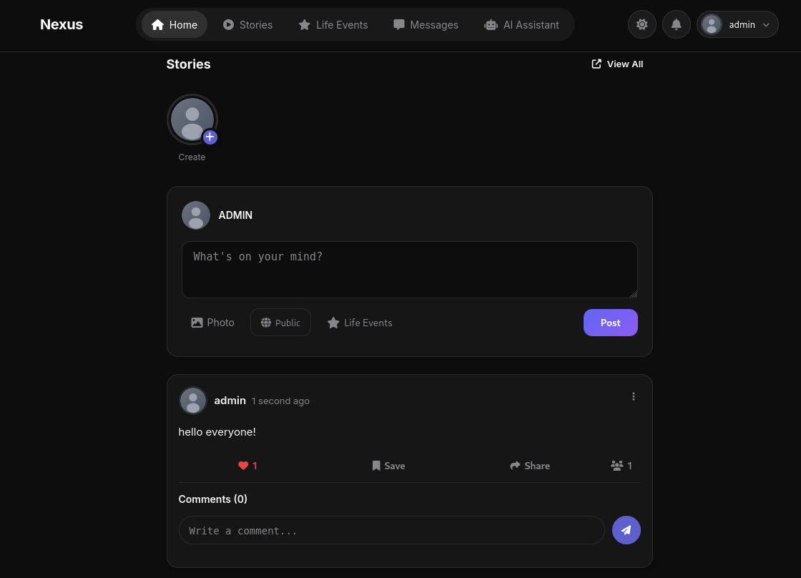

*Home Feed with Posts and Stories*

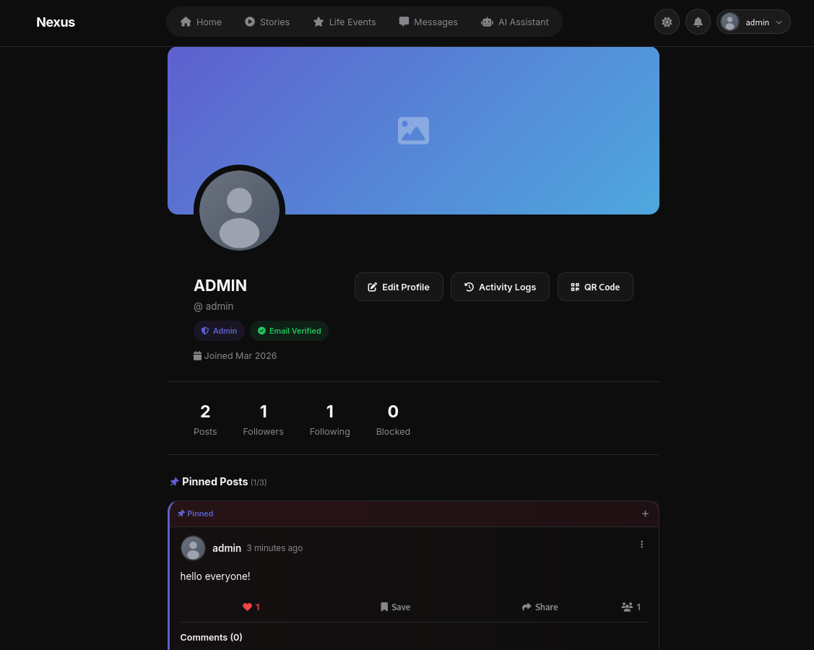

*User Profile Page*

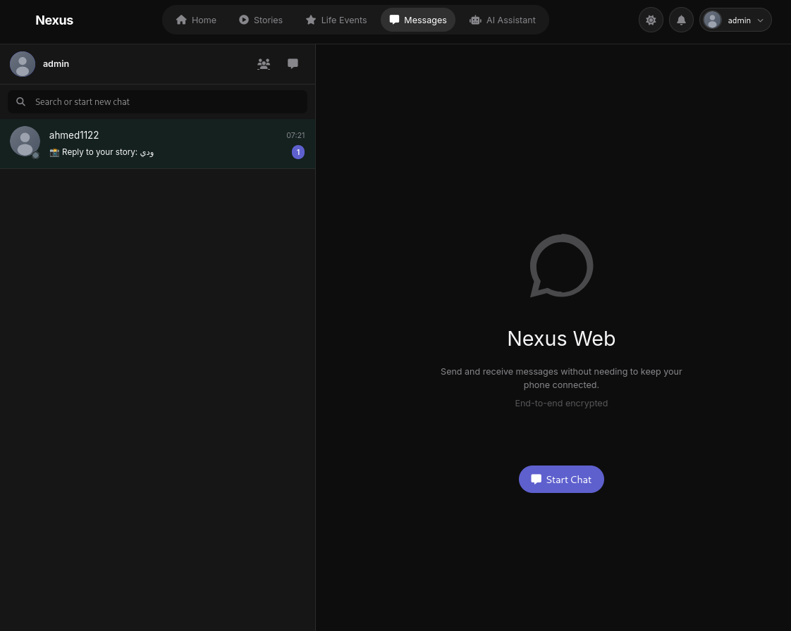

*Real-time Chat & Messaging*

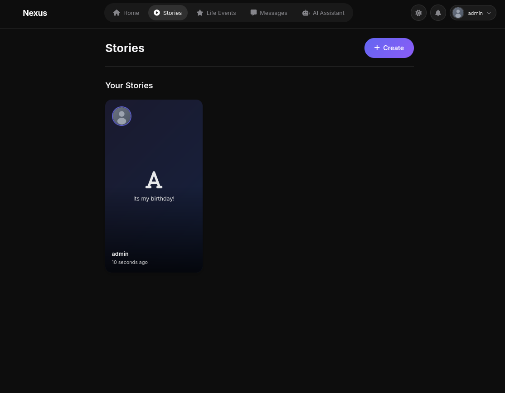

*Stories Viewer*

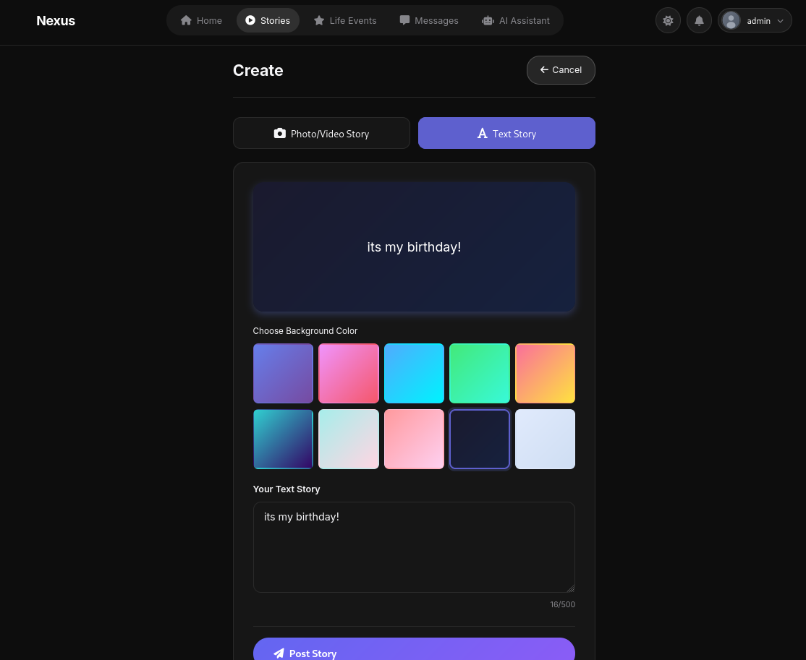

*Create Story Interface*

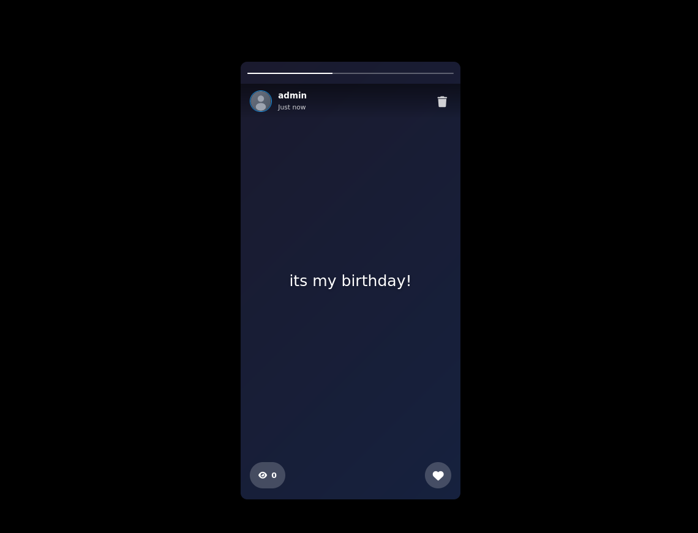

*Story View with Reactions*

</div>

#### Admin & Notifications

<div align="center">

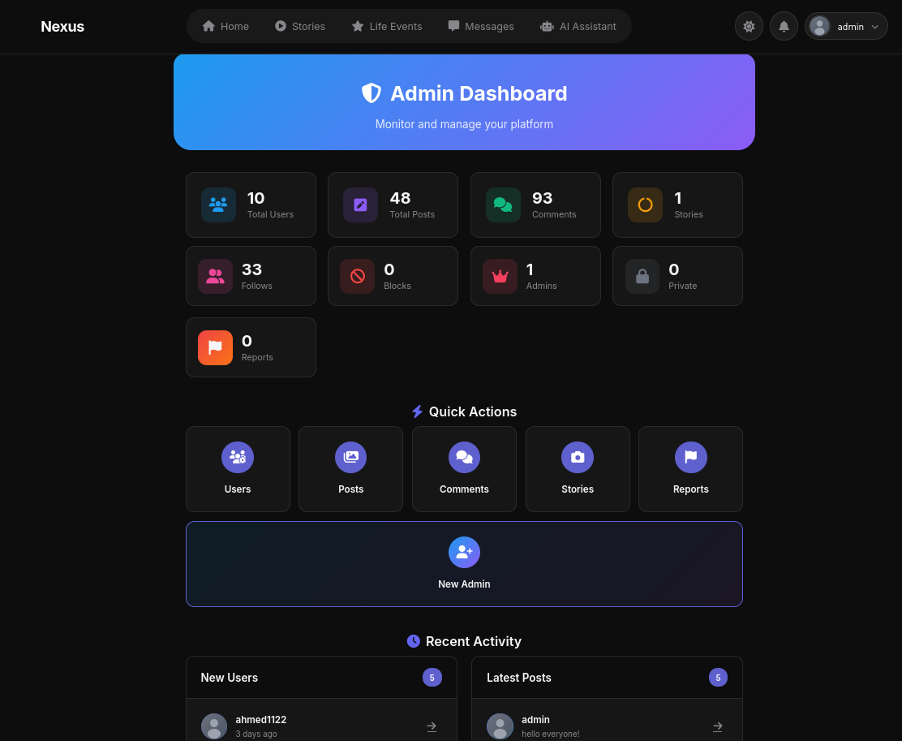

*Admin Dashboard*

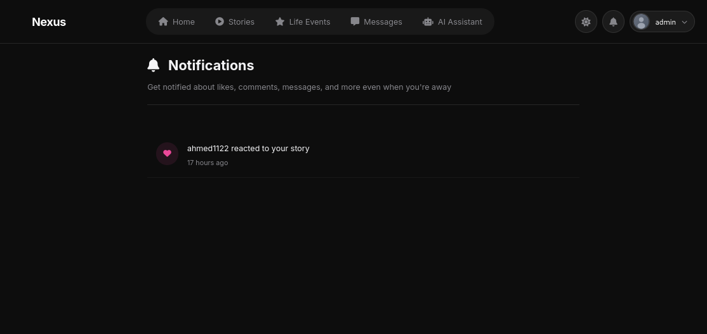

*Notifications Page*

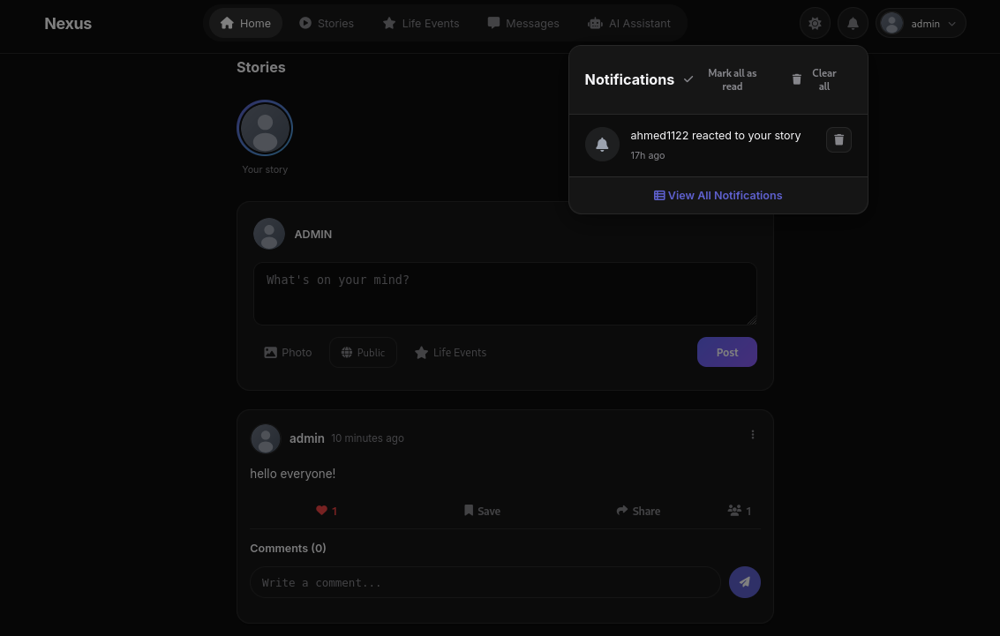

*Notification Toast*

</div>

#### User Interface

<div align="center">

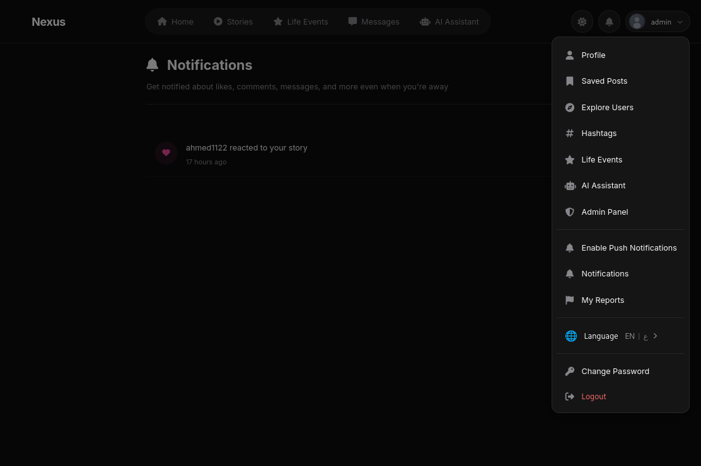

*User Dropdown Menu*

</div>

### Key Capabilities

- **Content Sharing**: Posts with text, images, and videos (up to 30 media files per post)
- **Stories**: Ephemeral 24-hour content with reactions and view tracking
- **Real-time Messaging**: Direct and group chat with typing indicators and read receipts
- **Social Graph**: Follow system, user blocking, and privacy controls
- **Groups**: Create and manage communities with invite links
- **Notifications**: Real-time notifications for all social interactions
- **Admin Panel**: Complete moderation tools for content and user management
- **(Menu-based) AI Assistant**: Built-in AI chatbot for user support

---

## Features

### Authentication & User Management

- **Email/Password Auth**: Traditional registration with 6-digit email verification (10-min expiry)
- **Google OAuth**: Single sign-on via Google OAuth 2.0
- **Password Reset**: Email-based password recovery with secure tokens
- **Email Verification**: Required verification before accessing platform features
- **Account Suspension**: Admin-controlled account suspension system
- **Session Management**: Secure session handling with Remember Me functionality
- **Password Strength**: Requires 3 of 5 criteria: 8+ chars, uppercase, lowercase, digit, special char
- **Reserved Usernames**: 50 blocked names (admin, moderator, system, etc.)
- **Disposable Email Block**: 16 temporary email domains blocked
- **Username Cooldown**: 3-day cooldown between username changes (admins exempt)

### Posts & Content

- **Post Creation**: Text (280 chars) with up to 30 media files (images/videos)
- **Media Upload**: 50MB per file, supports JPG, PNG, GIF, WEBP, MP4, MOV, AVI, WEBM
- **Video Processing**: FFmpeg thumbnails, auto-compression, 60-second max trimming
- **Privacy Controls**: Public or private posts per-post basis
- **Slug URLs**: 24-character unique slugs for SEO-friendly URLs
- **Mentions**: @username mentions with automatic notifications
- **Hashtags**: Automatic hashtag extraction and trending pages
- **Like System**: Like/unlike posts with real-time counter updates
- **Save Posts**: Bookmark posts to personal saved collection
- **Comments**: Nested threaded comments with likes and mentions
- **Post Reports**: User-driven content reporting system
- **Pinned Posts**: Pin up to 3 posts to profile top
- **Soft Deletes**: Recoverable post deletion with cascade cleanup

### Stories

- **24-Hour Expiry**: Auto-delete after 24 hours via scheduled commands
- **Media Types**: Image, video, or text-only stories
- **View Tracking**: Track who viewed your stories
- **Reactions**: Emoji reactions to stories
- **Multiple Stories**: Users can have multiple active stories
- **Story Privacy**: Control who can view your stories

### Chat & Messaging

- **Direct Messages**: One-on-one conversations with any user
- **Group Chat**: Multi-user conversations linked to groups
- **Real-time Updates**: Polling-based (1-second interval) message delivery
- **Typing Indicators**: Real-time "user is typing" status (5-second cache)
- **Read Receipts**: Track when messages are read
- **Delivery Confirmation**: Message delivery status tracking
- **Message Types**: Text, images, videos, voice messages, system messages
- **Message Deletion**: Delete for self or everyone
- **Conversation List**: Real-time updated conversation sidebar

### Groups

- **Group Creation**: Create public or private groups
- **Invite Links**: Unique invite links for easy joining
- **Member Roles**: Admin and member roles with permissions
- **Member Management**: Add/remove members, promote to admin
- **Group Chat**: Automatic conversation for each group
- **Group Posts**: Share content within group
- **Privacy Settings**: Public or private group visibility

### Social Features

- **Follow System**: Follow/unfollow users with notifications
- **User Blocking**: Block users to hide their content
- **Private Accounts**: Require approval for followers
- **User Profiles**: Customizable profiles with avatar, cover, bio
- **Profile QR Code**: Share profiles via QR codes
- **Online Status**: Real-time online/offline indicators (10-second polling)
- **Last Active**: Track user last activity timestamp
- **Explore Page**: Discover new users

### Notifications

- **Real-time Updates**: 2-second polling for new notifications
- **Notification Types**: Likes, comments, follows, mentions, messages, system
- **Unread Badge**: Real-time unread count indicator
- **Mark as Read**: Individual or bulk mark as read
- **Notification Settings**: Push notification preferences

### Admin Panel

- **Dashboard**: Platform statistics and metrics
- **User Management**: View, edit, suspend, delete users
- **Content Moderation**: Delete any post, comment, or story
- **Report Management**: Review and act on user reports
- **Admin Creation**: Create new admin accounts (admin-only)
- **Activity Logs**: View system activity and user actions

### (Menu-based) AI Assistant

- **AI Chat**: Conversational AI assistant for help and support
- **Context Aware**: Remembers conversation context
- **Help System**: Platform guidance and troubleshooting

### Push Notifications

- **Web Push API**: Browser-based push notifications
- **VAPID Keys**: Secure push subscription management
- **Notification Types**: Messages, likes, comments, follows
- **User Preferences**: Granular notification settings

### Activity & Analytics

- **Activity Logs**: Track user actions and sessions
- **Session Management**: View and terminate active sessions
- **Location Tracking**: IP-based location for activity logs
- **Export Data**: Export personal activity data

### Internationalization

- **Multi-language**: Support for English and Arabic
- **Language Switcher**: User-selectable language preference
- **RTL Support**: Right-to-left layout for Arabic

---

## Technologies Stack

### Backend Technologies

- **Laravel** (12.x): Web application framework
- **PHP** (8.2+): Server-side scripting
- **SQLite** (Latest): Default database (development)
- **MySQL** (8.0+): Production database (optional)

### Laravel Packages (Production)

- `laravel/framework` (^12.0): Core framework
- `laravel/sanctum` (^4.0): API authentication
- `laravel/socialite` (^5.24): OAuth authentication (Google)
- `laravel/tinker` (^2.10.1): REPL for database interaction
- `inertiajs/inertia-laravel` (^2.0): Server-driven SPA routing
- `intervention/image` (^3.11): Image processing
- `tightenco/ziggy` (^2.0): Laravel routes in JavaScript
- `minishlink/web-push` (^10.0): Web push notifications
- `simplesoftwareio/simple-qrcode` (^4.2): QR code generation

### Laravel Packages (Development)

- `laravel/breeze` (^2.3): Authentication scaffolding
- `laravel/pail` (^1.2.2): Log monitoring
- `laravel/pint` (^1.24): PHP code formatter
- `laravel/sail` (^1.41): Docker development environment
- `fakerphp/faker` (^1.23): Fake data generation
- `pestphp/pest` (Latest): Testing framework
- `pestphp/pest-plugin-laravel` (Latest): Pest Laravel integration
- `nunomaduro/collision` (^8.6): CLI error handler
- `mockery/mockery` (^1.6): Mocking framework

### Frontend Technologies

- **Vue.js** (^3.4.0): JavaScript framework
- **Vite** (^6.4.1): Frontend build tool
- **Tailwind CSS** (^3.2.1): Utility-first CSS
- **Alpine.js** (Embedded): Lightweight interactivity
- **Axios** (^1.11.0): HTTP client
- **motion-v** (^2.0.0): Vue animations
- **wavesurfer.js** (^7.12.5): Audio waveform visualization

### Build & Development Tools

- `@vitejs/plugin-vue` (^5.0.0): Vue 3 Vite plugin
- `laravel-vite-plugin` (^2.0.0): Laravel Vite integration
- `@tailwindcss/forms` (^0.5.3): Tailwind form plugin
- `autoprefixer` (^10.4.12): CSS vendor prefixing
- `postcss` (^8.4.31): CSS processing
- `eslint` (^8.57.0): JavaScript linting
- `eslint-plugin-vue` (^9.23.0): Vue ESLint plugin
- `prettier` (^3.3.0): Code formatting
- `typescript` (^5.6.3): TypeScript support
- `vue-tsc` (^2.0.24): Vue TypeScript checker

### JavaScript Obfuscation

- `javascript-obfuscator` (^5.3.0): Code obfuscation
- `terser` (^5.46.0): JavaScript minification
- `uglify-js` (^3.19.3): Alternative minification

### Third-Party Services

- **Google OAuth**: Social login (Configuration: `GOOGLE_CLIENT_ID`, `GOOGLE_CLIENT_SECRET`)
- **Cloudflare Tunnel**: Public URL sharing (Auto-configured in tunnel script)
- **VirusTotal API**: Security scanning (Configuration: `VIRUSTOTAL_API_KEY` - optional)

---

## System Requirements

### Required Software

- **PHP** (8.2+): Server-side runtime
- **Composer** (2.x): PHP dependency manager
- **Node.js** (18+ LTS): JavaScript runtime
- **npm** (9+): JavaScript package manager
- **SQLite** (Built-in): Default database
- **Git** (Latest): Version control

### PHP Extensions

Required extensions: `bcmath`, `ctype`, `curl`, `dom`, `fileinfo`, `gd`, `json`, `mbstring`, `mysqli`, `openssl`, `pdo`, `pdo_mysql`, `pdo_sqlite`, `phar`, `tokenizer`, `xml`, `zip`, `ext-ffmpeg` (for video processing)

### Optional (Production)

- **MySQL 8.0+**: Production database
- **Redis**: Cache and sessions
- **FFmpeg**: Video processing (thumbnails, trimming)
- **Apache/Nginx**: Production web server

---

## Installation [Manual Installation or use Installation Script]

### Quick Start (Development)

```bash
# 1. Clone the repository
git clone https://github.com/vd120/nexus.git
cd nexus

# 2. Install PHP dependencies
composer install

# 3. Copy environment file
cp .env.example .env

# 4. Generate application key
php artisan key:generate

# 5. Install Node.js dependencies
npm install

# 6. Create database (SQLite)
touch database/database.sqlite

# 7. Run migrations
php artisan migrate

# 8. Build assets
npm run build

# 9. Start development server
npm run dev
```

### Using Setup Script

```bash
# Windows (Git Bash)
./setup.sh

# Windows (PowerShell)
./setup.ps1

# Windows (CMD)
setup.bat
```

### Development Mode

Run all development services concurrently:

```bash
composer run dev
```

This starts:
- Laravel development server
- Vite development server
- Queue worker
- Log monitor (Pail)

### Manual Setup

#### 1. Database Configuration

**SQLite (Development):**
```env
DB_CONNECTION=sqlite
# DB_HOST=127.0.0.1
# DB_PORT=3306
# DB_DATABASE=laravel
# DB_USERNAME=root
# DB_PASSWORD=
```

**MySQL (Production):**
```env
DB_CONNECTION=mysql
DB_HOST=127.0.0.1
DB_PORT=3306
DB_DATABASE=nexus
DB_USERNAME=root
DB_PASSWORD=your_password
```

#### 2. Google OAuth Setup

1. Go to [Google Cloud Console](https://console.cloud.google.com/)
2. Create a new project
3. Enable Google+ API
4. Create OAuth 2.0 credentials
5. Add authorized redirect URI: `http://localhost/auth/google/callback`
6. Update `.env`:

```env
GOOGLE_CLIENT_ID=your_client_id
GOOGLE_CLIENT_SECRET=your_client_secret
GOOGLE_REDIRECT_URI=http://localhost/auth/google/callback
```

#### 3. Session & Cache Configuration

```env
SESSION_DRIVER=database
CACHE_STORE=database
```

Run migrations to create session and cache tables:
```bash
php artisan session:table
php artisan cache:table
php artisan migrate
```

---

## Project Structure

```
nexus/
├── app/
│   ├── Console/
│   │   └── Commands/
│   │       ├── ActivityService.php
│   │       ├── BackfillIpLocations.php
│   │       ├── CleanupExpiredStories.php
│   │       ├── DeleteExpiredStories.php
│   │       ├── DeleteUnverifiedUsers.php
│   │       ├── ExtractHashtags.php
│   │       ├── GeneratePostSlugs.php
│   │       ├── GenerateVapidKeysCommand.php
│   │       ├── SendBirthdayReminders.php
│   │       ├── SendInactiveUserReminders.php
│   │       └── SendTestEmail.php
│   │
│   ├── Http/
│   │   ├── Controllers/
│   │   │   ├── Api/
│   │   │   │   ├── CommentController.php
│   │   │   │   ├── EventController.php
│   │   │   │   ├── HashtagApiController.php
│   │   │   │   ├── MessageController.php
│   │   │   │   ├── NotificationController.php
│   │   │   │   ├── PasswordController.php
│   │   │   │   ├── PostController.php
│   │   │   │   ├── UserController.php
│   │   │   │   └── UserMentionApiController.php
│   │   │   │
│   │   │   ├── Auth/
│   │   │   │   ├── LoginController.php
│   │   │   │   ├── RegisterController.php
│   │   │   │   ├── PasswordResetLinkController.php
│   │   │   │   ├── ResetPasswordController.php
│   │   │   │   ├── SocialAuthController.php
│   │   │   │   └── PasswordController.php
│   │   │   │
│   │   │   ├── ActivityController.php
│   │   │   ├── AdminController.php
│   │   │   ├── AiController.php
│   │   │   ├── ChatController.php
│   │   │   ├── CommentController.php
│   │   │   ├── Controller.php
│   │   │   ├── EventController.php
│   │   │   ├── GroupController.php
│   │   │   ├── HashtagController.php
│   │   │   ├── LanguageController.php
│   │   │   ├── NotificationController.php
│   │   │   ├── PostController.php
│   │   │   ├── ProfileController.php
│   │   │   ├── PushNotificationController.php
│   │   │   ├── ReportController.php
│   │   │   ├── StoryController.php
│   │   │   └── UserController.php
│   │   │
│   │   ├── Middleware/
│   │   │   ├── AdminMiddleware.php
│   │   │   ├── CheckEmailVerified.php
│   │   │   ├── CheckUserSuspended.php
│   │   │   ├── ForceHttps.php
│   │   │   ├── HandleInertiaRequests.php
│   │   │   ├── LogRealTimeRequests.php
│   │   │   ├── RequirePasswordSet.php
│   │   │   ├── SetLocale.php
│   │   │   └── TrustCloudflare.php
│   │   │
│   │   └── Requests/
│   │       ├── Auth/
│   │       │   └── LoginRequest.php
│   │       └── ProfileUpdateRequest.php
│   │
│   ├── Jobs/
│   │   └── (Queue jobs for background processing)
│   │
│   ├── Listeners/
│   │   └── (Event listeners)
│   │
│   ├── Mail/
│   │   └── VerificationCodeMail.php
│   │
│   ├── Models/
│   │   ├── ActivityLog.php
│   │   ├── Block.php
│   │   ├── Comment.php
│   │   ├── CommentLike.php
│   │   ├── Conversation.php
│   │   ├── Event.php
│   │   ├── EventReaction.php
│   │   ├── Follow.php
│   │   ├── Group.php
│   │   ├── GroupMember.php
│   │   ├── Hashtag.php
│   │   ├── Like.php
│   │   ├── Mention.php
│   │   ├── Message.php
│   │   ├── Notification.php
│   │   ├── Post.php
│   │   ├── PostMedia.php
│   │   ├── PostReport.php
│   │   ├── Profile.php
│   │   ├── PushSubscription.php
│   │   ├── SavedPost.php
│   │   ├── Story.php
│   │   ├── StoryReaction.php
│   │   ├── StoryView.php
│   │   └── User.php
│   │
│   ├── Providers/
│   │   ├── AppServiceProvider.php
│   │   └── ObfuscatorServiceProvider.php
│   │
│   └── Services/
│       ├── ActivityService.php
│       ├── EventService.php
│       ├── FileUploadService.php
│       ├── HashtagService.php
│       ├── JsObfuscator.php
│       ├── MentionService.php
│       ├── PushNotificationService.php
│       ├── QrCodeService.php
│       └── RealtimeService.php
│
├── bootstrap/
│   ├── app.php
│   └── providers.php
│
├── config/
│   ├── app.php
│   ├── auth.php
│   ├── cache.php
│   ├── database.php
│   ├── filesystems.php
│   ├── logging.php
│   ├── mail.php
│   ├── queue.php
│   ├── sanctum.php
│   ├── services.php
│   └── session.php
│
├── database/
│   ├── factories/
│   │   ├── PostFactory.php
│   │   └── UserFactory.php
│   │
│   ├── migrations/
│   │   ├── 0001_01_01_000000_create_users_table.php
│   │   ├── 0001_01_01_000001_create_cache_table.php
│   │   ├── 2025_12_31_183416_create_posts_table.php
│   │   ├── ... (79 migration files)
│   │   └── 2026_03_27_081337_add_metadata_column_to_stories_table.php
│   │
│   └── seeders/
│       └── DatabaseSeeder.php
│
├── public/
│   ├── css/
│   │   ├── app-layout.css
│   │   ├── comments.css
│   │   └── mobile-header.css
│   │
│   ├── images/
│   │   └── default-avatar.svg
│   │
│   ├── .htaccess
│   ├── favicon.ico
│   ├── index.php
│   ├── robots.txt
│   ├── sw.js (Service Worker for push notifications)
│   └── vid.mp4
│
├── resources/
│   ├── css/
│   │   └── app.css
│   │
│   ├── js/
│   │   ├── Components/
│   │   │   ├── ApplicationLogo.vue
│   │   │   ├── Checkbox.vue
│   │   │   ├── DangerButton.vue
│   │   │   ├── Dropdown.vue
│   │   │   ├── DropdownLink.vue
│   │   │   ├── InputError.vue
│   │   │   ├── InputLabel.vue
│   │   │   ├── Modal.vue
│   │   │   ├── NavLink.vue
│   │   │   ├── PrimaryButton.vue
│   │   │   ├── ResponsiveNavLink.vue
│   │   │   ├── SecondaryButton.vue
│   │   │   └── TextInput.vue
│   │   │
│   │   ├── Layouts/
│   │   │   ├── AuthenticatedLayout.vue
│   │   │   └── GuestLayout.vue
│   │   │
│   │   ├── Pages/
│   │   │   ├── Auth/
│   │   │   │   ├── ConfirmPassword.vue
│   │   │   │   ├── ForgotPassword.vue
│   │   │   │   ├── Login.vue
│   │   │   │   ├── Register.vue
│   │   │   │   ├── ResetPassword.vue
│   │   │   │   └── VerifyEmail.vue
│   │   │   ├── Profile/
│   │   │   │   ├── Edit.vue
│   │   │   │   └── Partials/
│   │   │   │       ├── DeleteUserForm.vue
│   │   │   │       ├── UpdatePasswordForm.vue
│   │   │   │       └── UpdateProfileInformationForm.vue
│   │   │   ├── Dashboard.vue
│   │   │   └── Welcome.vue
│   │   │
│   │   ├── legacy/
│   │   │   ├── ai-chat.js
│   │   │   ├── auth-forgot-password.js
│   │   │   ├── auth-login.js
│   │   │   ├── auth-password-change.js
│   │   │   ├── auth-register.js
│   │   │   ├── auth-reset-password.js
│   │   │   ├── auth-set-password.js
│   │   │   ├── auth-suspended.js
│   │   │   ├── auth-verify-email.js
│   │   │   ├── comments.js
│   │   │   ├── groups-edit.js
│   │   │   ├── groups-show.js
│   │   │   ├── home.js
│   │   │   ├── posts.js
│   │   │   ├── realtime.js
│   │   │   └── ui-utils.js
│   │   │
│   │   ├── types/
│   │   │   └── global.d.ts
│   │   │
│   │   ├── app.js
│   │   ├── bootstrap.js
│   │   └── push-notifications.js
│   │
│   ├── lang/
│   │   ├── en/
│   │   │   ├── messages.php
│   │   │   └── validation.php
│   │   └── ar/
│   │       ├── messages.php
│   │       └── validation.php
│   │
│   └── views/
│       ├── activity/
│       │   └── index.blade.php
│       │
│       ├── admin/
│       │   ├── dashboard.blade.php
│       │   ├── users.blade.php
│       │   ├── user-detail.blade.php
│       │   ├── user-edit.blade.php
│       │   ├── posts.blade.php
│       │   ├── comments.blade.php
│       │   └── stories.blade.php
│       │
│       ├── ai/
│       │   └── index.blade.php
│       │
│       ├── auth/
│       │   ├── login.blade.php
│       │   ├── register.blade.php
│       │   ├── verify-email.blade.php
│       │   ├── forgot-password.blade.php
│       │   ├── reset-password.blade.php
│       │   ├── set-password.blade.php
│       │   ├── password-change.blade.php
│       │   └── suspended.blade.php
│       │
│       ├── chat/
│       │   └── index.blade.php
│       │
│       ├── emails/
│       │   └── verification-code.blade.php
│       │
│       ├── errors/
│       │   └── 404.blade.php
│       │
│       ├── events/
│       │   └── (Event views)
│       │
│       ├── groups/
│       │   ├── index.blade.php
│       │   ├── create.blade.php
│       │   ├── show.blade.php
│       │   ├── edit.blade.php
│       │   └── join.blade.php
│       │
│       ├── hashtags/
│       │   ├── index.blade.php
│       │   └── show.blade.php
│       │
│       ├── layouts/
│       │   └── app.blade.php
│       │
│       ├── notifications/
│       │   └── index.blade.php
│       │
│       ├── partials/
│       │   ├── header.blade.php
│       │   ├── sidebar.blade.php
│       │   └── (Reusable components)
│       │
│       ├── posts/
│       │   ├── index.blade.php
│       │   ├── show.blade.php
│       │   ├── create.blade.php
│       │   └── (Post-related views)
│       │
│       ├── reports/
│       │   ├── my-reports.blade.php
│       │   └── show.blade.php
│       │
│       ├── stories/
│       │   ├── index.blade.php
│       │   ├── create.blade.php
│       │   └── show.blade.php
│       │
│       ├── users/
│       │   ├── show.blade.php
│       │   ├── followers.blade.php
│       │   ├── following.blade.php
│       │   ├── blocked.blade.php
│       │   ├── edit.blade.php
│       │   └── qr-code.blade.php
│       │
│       ├── app.blade.php
│       └── home.blade.php
│
├── routes/
│   ├── web.php (Main application routes)
│   ├── api.php (RESTful API routes)
│   └── console.php (Artisan console commands)
│
├── storage/
│   ├── app/
│   │   └── public/
│   │       ├── posts/
│   │       ├── stories/
│   │       ├── avatars/
│   │       ├── covers/
│   │       └── messages/
│   │
│   ├── framework/
│   │   ├── cache/
│   │   ├── sessions/
│   │   └── views/
│   │
│   └── logs/
│
├── tests/
│   ├── Feature/
│   │   └── (Feature tests)
│   │
│   └── Unit/
│       └── (Unit tests)
│
├── .env.example
├── .gitignore
├── artisan
├── composer.json
├── package.json
├── phpunit.xml
├── vite.config.js
├── tailwind.config.js
└── README.md
```

---

## Architecture

### Application Architecture

```
┌─────────────────────────────────────────────────────────────────┐
│                         CLIENT LAYER                             │
│  ┌──────────────┐  ┌──────────────┐  ┌──────────────┐          │
│  │   Desktop    │  │   Mobile     │  │   API        │          │
│  │   Browser    │  │   Browser    │  │   Clients    │          │
│  │   (Blade +   │  │   (Blade +   │  │   (REST)     │          │
│  │    Vue.js)   │  │    Vue.js)   │  │              │          │
│  └──────┬───────┘  └──────┬───────┘  └──────┬───────┘          │
│         │                 │                 │                   │
│         │  HTTP/HTTPS     │  REST API       │  Sanctum Token    │
│         └─────────────────┼─────────────────┘                   │
└───────────────────────────┼─────────────────────────────────────┘
                            │
                            ▼
┌─────────────────────────────────────────────────────────────────┐
│                      APPLICATION LAYER                           │
│  ┌───────────────────────────────────────────────────────────┐  │
│  │                    Laravel 12 Framework                    │  │
│  │                                                            │  │
│  │  ┌─────────────┐  ┌─────────────┐  ┌─────────────────┐   │  │
│  │  │   Routes    │  │ Middleware  │  │   Controllers   │   │  │
│  │  │  web.php    │  │  • Auth     │  │  (39 total)     │   │  │
│  │  │  api.php    │  │  • Admin    │  │                 │   │  │
│  │  │             │  │  • Verified │  │                 │   │  │
│  │  │             │  │  • Suspended│  │                 │   │  │
│  │  │             │  │  • RateLimit│  │                 │   │  │
│  │  └──────┬──────┘  └──────┬──────┘  └────────┬────────┘   │  │
│  │         │                │                  │             │  │
│  │         └────────────────┼──────────────────┘             │  │
│  │                          │                                │  │
│  │                          ▼                                │  │
│  │  ┌─────────────────────────────────────────────────────┐  │  │
│  │  │               Service Layer                          │  │  │
│  │  │  • MentionService    • PushNotificationService      │  │  │
│  │  │  • FileUploadService • RealtimeService              │  │  │
│  │  │  • HashtagService    • ActivityService              │  │  │
│  │  │  • EventService      • QrCodeService                │  │  │
│  │  └────────────────────────────┬─────────────────────────┘  │  │
│  │                               │                             │  │
│  │                               ▼                             │  │
│  │  ┌─────────────────────────────────────────────────────┐  │  │
│  │  │           Model Layer (Eloquent ORM)                │  │  │
│  │  │  User, Post, Comment, Story, Message, Group, etc.   │  │  │
│  │  └────────────────────────────┬─────────────────────────┘  │  │
│  └───────────────────────────────┼─────────────────────────────┘  │
└──────────────────────────────────┼────────────────────────────────┘
                                   │
                                   ▼
┌─────────────────────────────────────────────────────────────────┐
│                        DATA LAYER                                │
│  ┌──────────────┐  ┌──────────────┐  ┌──────────────┐          │
│  │   Database   │  │    Cache     │  │    File      │          │
│  │   (SQLite/   │  │   (Database) │  │   Storage    │          │
│  │    MySQL)    │  │  • Sessions  │  │  • Avatars   │          │
│  │  • Users     │  │  • Cache     │  │  • Posts     │          │
│  │  • Posts     │  │  • RateLimit │  │  • Stories   │          │
│  │  • Comments  │  │  • Typing    │  │  • Messages  │          │
│  │  • Messages  │  │              │  │  • Groups    │          │
│  └──────────────┘  └──────────────┘  └──────────────┘          │
└─────────────────────────────────────────────────────────────────┘
```

### Request Flow

```
1. HTTP Request → public/index.php
2. Bootstrap Application → bootstrap/app.php
3. Load Service Providers
4. HTTP Kernel → app/Http/Kernel.php
5. Middleware Stack:
   - TrustHosts
   - TrustProxies
   - HandleCors
   - ValidateCsrfToken
   - CheckEmailVerified
   - CheckUserSuspended
   - AdminMiddleware (if admin route)
6. Route Matching → routes/web.php or routes/api.php
7. Controller Execution
8. Service Layer (business logic)
9. Model Layer (database operations)
10. Response Generation (Blade view or JSON)
11. Response Middleware
12. Send Response to Client
```

### Real-Time Architecture (Polling-Based)

Nexus uses polling-based real-time updates instead of WebSockets:

**Polling Intervals:**
- Chat Messages: 1 second (Implementation: `realtime.js`)
- Notifications: 2 seconds (Implementation: `realtime.js`)
- Online Status: 10 seconds (Implementation: `ui-utils.js`)
- Typing Indicators: 1 second with 5s cache (Implementation: `RealtimeService.php`)
- Conversation Updates: 1 second (Implementation: `realtime.js`)

**Advantages:**
- No WebSocket server required
- Works with all hosting providers
- Firewall-friendly (standard HTTP/HTTPS)
- Easy to scale (no sticky sessions)

**Trade-offs:**
- 2-10 second latency (configurable)
- More HTTP requests than WebSockets
- Higher battery consumption on mobile

---

## Database Schema

### Database Statistics

- **Total Tables**: 24+
- **Total Migrations**: 79
- **Models**: 25 Eloquent models
- **Relationships**: 50+ defined

### Core Tables

#### users
```sql
CREATE TABLE users (
    id BIGINT UNSIGNED AUTO_INCREMENT PRIMARY KEY,
    name VARCHAR(255) NOT NULL,
    username VARCHAR(255) NOT NULL UNIQUE,
    email VARCHAR(255) NOT NULL UNIQUE,
    email_verified_at TIMESTAMP NULL,
    language VARCHAR(255) DEFAULT 'en',
    password VARCHAR(255) NULL,
    is_admin BOOLEAN DEFAULT FALSE,
    is_suspended BOOLEAN DEFAULT FALSE,
    verification_code VARCHAR(6) NULL,
    verification_code_expires_at TIMESTAMP NULL,
    last_active TIMESTAMP NULL,
    is_online BOOLEAN DEFAULT FALSE,
    username_changed_at TIMESTAMP NULL,
    remember_token VARCHAR(100) NULL,
    created_at TIMESTAMP NULL,
    updated_at TIMESTAMP NULL
);
```

#### posts
```sql
CREATE TABLE posts (
    id BIGINT UNSIGNED AUTO_INCREMENT PRIMARY KEY,
    user_id BIGINT UNSIGNED NOT NULL,
    content TEXT NULL,
    slug VARCHAR(24) NOT NULL UNIQUE,
    is_private BOOLEAN DEFAULT FALSE,
    pinned_at TIMESTAMP NULL,
    deleted_at TIMESTAMP NULL,
    created_at TIMESTAMP NULL,
    updated_at TIMESTAMP NULL,
    
    FOREIGN KEY (user_id) REFERENCES users(id) ON DELETE CASCADE
);
```

#### post_media
```sql
CREATE TABLE post_media (
    id BIGINT UNSIGNED AUTO_INCREMENT PRIMARY KEY,
    post_id BIGINT UNSIGNED NOT NULL,
    media_type ENUM('image', 'video') NOT NULL,
    media_path VARCHAR(255) NOT NULL,
    media_thumbnail VARCHAR(255) NULL,
    sort_order INT DEFAULT 1,
    created_at TIMESTAMP NULL,
    updated_at TIMESTAMP NULL,
    
    FOREIGN KEY (post_id) REFERENCES posts(id) ON DELETE CASCADE
);
```

#### comments
```sql
CREATE TABLE comments (
    id BIGINT UNSIGNED AUTO_INCREMENT PRIMARY KEY,
    user_id BIGINT UNSIGNED NOT NULL,
    post_id BIGINT UNSIGNED NOT NULL,
    parent_id BIGINT UNSIGNED NULL,
    content TEXT NOT NULL,
    created_at TIMESTAMP NULL,
    updated_at TIMESTAMP NULL,
    
    FOREIGN KEY (user_id) REFERENCES users(id) ON DELETE CASCADE,
    FOREIGN KEY (post_id) REFERENCES posts(id) ON DELETE CASCADE,
    FOREIGN KEY (parent_id) REFERENCES comments(id) ON DELETE CASCADE
);
```

#### stories
```sql
CREATE TABLE stories (
    id BIGINT UNSIGNED AUTO_INCREMENT PRIMARY KEY,
    user_id BIGINT UNSIGNED NOT NULL,
    slug VARCHAR(24) NOT NULL UNIQUE,
    media_type ENUM('image', 'video', 'text') NULL,
    media_path VARCHAR(255) NULL,
    content TEXT NULL,
    metadata JSON NULL,
    expires_at TIMESTAMP NOT NULL,
    created_at TIMESTAMP NULL,
    updated_at TIMESTAMP NULL,
    
    FOREIGN KEY (user_id) REFERENCES users(id) ON DELETE CASCADE
);
```

#### conversations
```sql
CREATE TABLE conversations (
    id BIGINT UNSIGNED AUTO_INCREMENT PRIMARY KEY,
    user1_id BIGINT UNSIGNED NOT NULL,
    user2_id BIGINT UNSIGNED NULL,
    is_group BOOLEAN DEFAULT FALSE,
    group_id BIGINT UNSIGNED NULL,
    slug VARCHAR(24) NOT NULL UNIQUE,
    last_message_at TIMESTAMP NULL,
    created_at TIMESTAMP NULL,
    updated_at TIMESTAMP NULL,
    
    FOREIGN KEY (user1_id) REFERENCES users(id) ON DELETE CASCADE,
    FOREIGN KEY (user2_id) REFERENCES users(id) ON DELETE CASCADE,
    FOREIGN KEY (group_id) REFERENCES groups(id) ON DELETE CASCADE
);
```

#### messages
```sql
CREATE TABLE messages (
    id BIGINT UNSIGNED AUTO_INCREMENT PRIMARY KEY,
    conversation_id BIGINT UNSIGNED NOT NULL,
    sender_id BIGINT UNSIGNED NOT NULL,
    content TEXT NULL,
    media_type VARCHAR(50) NULL,
    media_path VARCHAR(255) NULL,
    system_type VARCHAR(50) NULL,
    read_at TIMESTAMP NULL,
    delivered_at TIMESTAMP NULL,
    deleted_for JSON NULL,
    soft_deleted_at TIMESTAMP NULL,
    created_at TIMESTAMP NULL,
    updated_at TIMESTAMP NULL,
    
    FOREIGN KEY (conversation_id) REFERENCES conversations(id) ON DELETE CASCADE,
    FOREIGN KEY (sender_id) REFERENCES users(id) ON DELETE CASCADE
);
```

#### groups
```sql
CREATE TABLE groups (
    id BIGINT UNSIGNED AUTO_INCREMENT PRIMARY KEY,
    creator_id BIGINT UNSIGNED NOT NULL,
    name VARCHAR(255) NOT NULL,
    description TEXT NULL,
    avatar VARCHAR(255) NULL,
    is_private BOOLEAN DEFAULT FALSE,
    slug VARCHAR(24) NOT NULL UNIQUE,
    invite_link VARCHAR(24) NOT NULL UNIQUE,
    created_at TIMESTAMP NULL,
    updated_at TIMESTAMP NULL,
    
    FOREIGN KEY (creator_id) REFERENCES users(id) ON DELETE CASCADE
);
```

#### group_members
```sql
CREATE TABLE group_members (
    id BIGINT UNSIGNED AUTO_INCREMENT PRIMARY KEY,
    group_id BIGINT UNSIGNED NOT NULL,
    user_id BIGINT UNSIGNED NOT NULL,
    role ENUM('admin', 'member') DEFAULT 'member',
    joined_at TIMESTAMP NULL,
    created_at TIMESTAMP NULL,
    updated_at TIMESTAMP NULL,
    
    FOREIGN KEY (group_id) REFERENCES groups(id) ON DELETE CASCADE,
    FOREIGN KEY (user_id) REFERENCES users(id) ON DELETE CASCADE,
    UNIQUE KEY unique_group_member (group_id, user_id)
);
```

### Entity Relationship Diagram

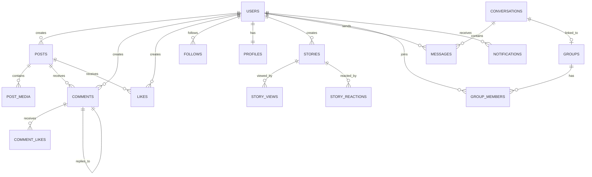

---

## API Documentation

### Authentication Endpoints

- **POST** `/login` - User login (No auth required)
- **POST** `/logout` - User logout (Auth required)
- **POST** `/register` - User registration (No auth required)
- **GET** `/auth/google` - Google OAuth redirect (No auth required)
- **GET** `/auth/google/callback` - Google OAuth callback (No auth required)
- **POST** `/forgot-password` - Request reset link (No auth required)
- **POST** `/reset-password` - Reset password (No auth required)
- **POST** `/email/verification-notification` - Resend verification (Auth required)
- **POST** `/email/verify-code` - Verify email code (Auth required)

### Post Endpoints

- **GET** `/posts` - Get feed (Auth required)
- **POST** `/posts` - Create post (Auth required)
- **GET** `/posts/{slug}` - Get post by slug (Auth required)
- **PUT** `/posts/{slug}` - Update post (Auth required)
- **DELETE** `/posts/{slug}` - Delete post (Auth required)
- **POST** `/posts/{id}/like` - Like/unlike post (Auth required)
- **POST** `/posts/{id}/save` - Save/unsave post (Auth required)
- **GET** `/posts/{id}/likers` - Get post likers (Auth required)
- **GET** `/posts/{id}/report` - Report post form (Auth required)
- **POST** `/posts/{id}/report` - Submit post report (Auth required)

### Comment Endpoints

- **POST** `/comments` - Create comment (Auth required)
- **DELETE** `/comments/{id}` - Delete comment (Auth required)
- **POST** `/comments/{id}/like` - Like/unlike comment (Auth required)

### Story Endpoints

- **GET** `/stories` - Get all stories (Auth required)
- **GET** `/stories/create` - Create story form (Auth required)
- **POST** `/stories` - Create story (Auth required)
- **GET** `/stories/{user}/{slug}` - View story (Auth required)
- **POST** `/stories/{user}/{slug}/react` - React to story (Auth required)
- **DELETE** `/stories/{user}/{slug}/react` - Remove reaction (Auth required)
- **DELETE** `/stories/{user}/{slug}` - Delete story (Auth required)

### User Endpoints

- **GET** `/users/{username}` - View user profile (Auth required)
- **GET** `/users/{username}/followers` - Get followers (Auth required)
- **GET** `/users/{username}/following` - Get following (Auth required)
- **GET** `/users/{username}/blocked` - Get blocked users (Auth required)
- **POST** `/users/{username}/follow` - Follow/unfollow (Auth required)
- **POST** `/users/{username}/block` - Block/unblock (Auth required)
- **GET** `/saved-posts` - Get saved posts (Auth required)
- **GET** `/explore` - Explore users (Auth required)
- **GET** `/search` - Search users (Auth required)
- **GET** `/users/{username}/edit` - Edit profile (Auth required)
- **POST** `/profile/{username}/update` - Update profile (Auth required)
- **DELETE** `/profile/delete-avatar` - Delete avatar (Auth required)
- **DELETE** `/profile/delete-cover` - Delete cover (Auth required)
- **DELETE** `/profile/delete-account` - Delete account (Auth required)

### Chat Endpoints

- **GET** `/chat` - Chat index (Auth required)
- **GET** `/chat/conversations` - Get conversations (Auth required)
- **GET** `/chat/{conversation}` - View conversation (Auth required)
- **POST** `/chat/{conversation}` - Send message (Auth required)
- **DELETE** `/chat/message/{message}` - Delete message (Auth required)
- **DELETE** `/chat/{conversation}/clear` - Clear chat (Auth required)
- **GET** `/chat/start/{userId}` - Start conversation (Auth required)
- **GET** `/chat/{conversation}/messages` - Get messages (Auth required)
- **POST** `/chat/{conversation}/read` - Mark as read (Auth required)
- **POST** `/chat/{conversation}/typing` - Send typing indicator (Auth required)
- **GET** `/chat/{conversation}/typing-status` - Get typing status (Auth required)

### Group Endpoints

- **GET** `/groups` - Groups index (Auth required)
- **GET** `/groups/create` - Create group form (Auth required)
- **POST** `/groups` - Create group (Auth required)
- **GET** `/groups/{slug}` - View group (Auth required)
- **GET** `/groups/{slug}/edit` - Edit group (Auth required)
- **PUT** `/groups/{slug}` - Update group (Auth required)
- **DELETE** `/groups/{slug}` - Delete group (Auth required)
- **POST** `/groups/{slug}/members` - Add members (Auth required)
- **DELETE** `/groups/{slug}/members/{userId}` - Remove member (Auth required)
- **POST** `/groups/{slug}/members/{userId}/admin` - Make admin (Auth required)
- **DELETE** `/groups/{slug}/members/{userId}/admin` - Remove admin (Auth required)
- **POST** `/groups/{slug}/regenerate-invite` - Regenerate invite (Auth required)
- **POST** `/groups/accept-invite/{link}` - Accept invite (Auth required)

### Notification Endpoints

- **GET** `/notifications` - Get notifications (Auth required)
- **GET** `/api/notifications` - API: Get notifications (Auth required)
- **GET** `/api/notifications/unread-count` - Get unread count (Auth required)
- **POST** `/api/notifications/{id}/read` - Mark as read (Auth required)
- **POST** `/api/notifications/mark-all-read` - Mark all as read (Auth required)
- **DELETE** `/api/notifications/{id}` - Delete notification (Auth required)

### Admin Endpoints

- **GET** `/admin` - Admin dashboard (Admin only)
- **GET** `/admin/users` - Manage users (Admin only)
- **GET** `/admin/users/{user}` - View user (Admin only)
- **PUT** `/admin/users/{user}` - Update user (Admin only)
- **DELETE** `/admin/users/{user}` - Delete user (Admin only)
- **GET** `/admin/posts` - Manage posts (Admin only)
- **DELETE** `/admin/posts/{post}` - Delete post (Admin only)
- **GET** `/admin/comments` - Manage comments (Admin only)
- **DELETE** `/admin/comments/{comment}` - Delete comment (Admin only)
- **GET** `/admin/stories` - Manage stories (Admin only)
- **DELETE** `/admin/stories/{story}` - Delete story (Admin only)
- **POST** `/admin/create-admin` - Create admin (Admin only)
- **GET** `/admin/reports` - View reports (Admin only)
- **POST** `/admin/reports/{report}/accept` - Accept report (Admin only)
- **POST** `/admin/reports/{report}/reject` - Reject report (Admin only)

### API Endpoints (REST)

- **GET** `/api/posts` - Get posts (Sanctum auth)
- **POST** `/api/posts` - Create post (Sanctum auth)
- **GET** `/api/posts/{slug}` - Get post (Sanctum auth)
- **PUT** `/api/posts/{slug}` - Update post (Sanctum auth)
- **DELETE** `/api/posts/{slug}` - Delete post (Sanctum auth)
- **POST** `/api/posts/{id}/like` - Like post (Sanctum auth)
- **GET** `/api/check-username` - Check availability (No auth)
- **GET** `/api/hashtags/suggestions` - Hashtag suggestions (No auth)
- **GET** `/api/users/following/suggestions` - User suggestions (Auth required)

---

## Security

### Security Features

- **CSRF Protection**: Automatic on all web routes
- **SQL Injection Prevention**: Eloquent ORM with parameterized queries
- **XSS Prevention**: Blade template auto-escaping
- **Rate Limiting**: Auth (5/min), Posts (30/min), Comments (20/min)
- **Password Hashing**: Bcrypt with 12 rounds
- **Session Security**: HTTP-only, secure cookies, 2-hour lifetime
- **Email Verification**: 6-digit code, 10-minute expiry
- **Account Suspension**: Admin-controlled suspension
- **User Blocking**: User-level blocking system
- **Privacy Controls**: Private accounts and posts
- **File Upload Validation**: MIME type, size limits, isolated storage
- **Input Validation**: Comprehensive validation rules

### Password Requirements

Passwords must meet at least 3 of 5 criteria:
- Minimum 8 characters
- At least one lowercase letter (a-z)
- At least one uppercase letter (A-Z)
- At least one digit (0-9)
- At least one special character (!@#$%^&*)

### Rate Limiting

- **Login**: 5 requests per 1 minute
- **Register**: 5 requests per 1 minute
- **Posts**: 30 requests per 1 minute
- **Comments**: 20 requests per 1 minute
- **Email Verification**: 3 requests per 1 hour
- **Password Reset**: 5 requests per 1 minute

---

## Development

### Development Commands

```bash
# Start development server with all services
composer run dev

# Run tests
composer run test

# Format PHP code
composer run pint

# Build assets
npm run build

# Development mode (Vite)
npm run dev

# Lint JavaScript
npm run lint

# Obfuscate JavaScript
npm run obfuscate
```

### Available Scripts

#### Composer Scripts

- `composer run dev`: Start all development services
- `composer run test`: Run test suite
- `composer run setup`: Full project setup

#### NPM Scripts

- `npm run dev`: Vite development server
- `npm run build`: Build and obfuscate
- `npm run build:terser`: Build with Terser minification
- `npm run build:uglify`: Build with Uglify minification
- `npm run build:no-obf`: Build without obfuscation
- `npm run lint`: ESLint fix
- `npm run obfuscate`: JavaScript obfuscation

### Artisan Commands

- `php artisan serve`: Start Laravel development server
- `php artisan migrate`: Run database migrations
- `php artisan migrate:fresh`: Fresh migrate with seeders
- `php artisan db:seed`: Run database seeders
- `php artisan queue:work`: Start queue worker
- `php artisan pail`: Log monitor
- `php artisan config:clear`: Clear configuration cache
- `php artisan cache:clear`: Clear application cache
- `php artisan view:clear`: Clear compiled views
- `php artisan route:list`: List all routes
- `php artisan storage:link`: Create storage symlink

### Scheduled Commands

- `CleanupExpiredStories` (Hourly): Delete expired stories
- `DeleteUnverifiedUsers` (Daily): Remove unverified accounts
- `SendInactiveUserReminders` (Weekly): Re-engagement emails
- `SendBirthdayReminders` (Daily): Birthday notifications

---

## Testing

### Running Tests

```bash
# Run all tests
php artisan test

# Run with coverage
php artisan test --coverage

# Run specific test file
php artisan test tests/Feature/PostTest.php

# Run Pest tests
./vendor/bin/pest

# Run PHPUnit
./vendor/bin/phpunit
```

### Test Structure

```
tests/
├── Feature/
│   ├── Auth/
│   │   ├── AuthenticationTest.php
│   │   ├── RegistrationTest.php
│   │   └── PasswordResetTest.php
│   ├── PostTest.php
│   ├── CommentTest.php
│   ├── StoryTest.php
│   ├── ChatTest.php
│   └── AdminTest.php
│
└── Unit/
    ├── ModelTest.php
    └── ServiceTest.php
```

---

## Deployment

### Production Checklist

- [ ] Set `APP_ENV=production`
- [ ] Set `APP_DEBUG=false`
- [ ] Set `APP_URL=https://your-domain.com`
- [ ] Enable HTTPS/SSL
- [ ] Configure database (MySQL recommended)
- [ ] Set up Redis for cache/sessions (optional)
- [ ] Configure queue worker
- [ ] Set up scheduled tasks (cron)
- [ ] Enable security headers
- [ ] Configure rate limiting
- [ ] Set up monitoring and logging
- [ ] Optimize autoloader: `composer install --optimize-autoloader`
- [ ] Cache configuration: `php artisan config:cache`
- [ ] Cache routes: `php artisan route:cache`
- [ ] Build assets: `npm run build`

### Server Requirements

- **PHP**: 8.2+
- **Web Server**: Apache 2.4+ or Nginx 1.20+
- **Database**: MySQL 8.0+ or SQLite 3.x
- **Memory**: 2GB RAM minimum, 4GB recommended
- **Storage**: 10GB+ for user uploads
- **Extensions**: bcmath, ctype, curl, dom, fileinfo, gd, mbstring, openssl, pdo, tokenizer, xml, zip, ffmpeg

### Environment Configuration (Production)

```env
APP_ENV=production
APP_DEBUG=false
APP_URL=https://your-domain.com

DB_CONNECTION=mysql
DB_HOST=127.0.0.1
DB_PORT=3306
DB_DATABASE=nexus
DB_USERNAME=nexus_user
DB_PASSWORD=secure_password

SESSION_DRIVER=redis
SESSION_SECURE_COOKIES=true
SESSION_DOMAIN=your-domain.com

CACHE_DRIVER=redis
QUEUE_CONNECTION=database

MAIL_MAILER=smtp
MAIL_HOST=smtp.mailtrap.io
MAIL_PORT=2525
MAIL_USERNAME=your_username
MAIL_PASSWORD=your_password
MAIL_ENCRYPTION=tls
MAIL_FROM_ADDRESS=noreply@your-domain.com
MAIL_FROM_NAME="${APP_NAME}"

GOOGLE_CLIENT_ID=your_client_id
GOOGLE_CLIENT_SECRET=your_client_secret
GOOGLE_REDIRECT_URI=https://your-domain.com/auth/google/callback
```

### Deployment Commands

```bash
# Install dependencies
composer install --optimize-autoloader --no-dev
npm install
npm run build

# Cache configuration
php artisan config:cache
php artisan route:cache
php artisan view:cache

# Run migrations
php artisan migrate --force

# Create storage symlink
php artisan storage:link

# Start queue worker (supervisor recommended)
php artisan queue:work --sleep=3 --tries=3 --max-time=3600
```

### Supervisor Configuration

```ini
[program:nexus-queue]
process_name=%(program_name)s_%(process_num)02d
command=php /path/to/nexus/artisan queue:work --sleep=3 --tries=3 --max-time=3600
autostart=true
autorestart=true
stopasgroup=true
killasgroup=true
user=www-data
numprocs=2
redirect_stderr=true
stdout_logfile=/path/to/nexus/storage/logs/queue.log
```

### Cron Configuration

```bash
# Add to crontab
* * * * * cd /path/to/nexus && php artisan schedule:run >> /dev/null 2>&1
```

---

## Contributing

### Contribution Guidelines

1. **Fork the repository**
2. **Create a feature branch**: `git checkout -b feature/new-feature`
3. **Make your changes**
4. **Run tests**: `composer run test`
5. **Format code**: `composer run pint`
6. **Commit changes**: `git commit -m 'Add new feature'`
7. **Push to branch**: `git push origin feature/new-feature`
8. **Open a Pull Request**

### Code Style

- **PHP**: Follow PSR-12 coding standards
- **JavaScript**: ESLint configuration provided
- **CSS**: Tailwind CSS utility classes
- **Naming**: Laravel conventions (camelCase, snake_case for DB)

### Pull Request Requirements

- [ ] Tests added/updated
- [ ] Documentation updated
- [ ] Code follows style guidelines
- [ ] No linting errors
- [ ] All tests passing

---

## License

Nexus is open-source software licensed under the [MIT License](LICENSE).

---

## Support

### Documentation

- [Features Documentation](docs/FEATURES.md)
- [Architecture Guide](docs/ARCHITECTURE.md)
- [Database Schema](docs/DATABASE.md)
- [API Reference](docs/API.md)
- [Security Report](docs/SECURITY.md)
- [Real-Time Features](docs/REALTIME.md)
- [Installation Guide](docs/INSTALLATION.md)
- [Troubleshooting](docs/TROUBLESHOOTING.md)

### Getting Help

- **Issues**: [GitHub Issues](https://github.com/your-org/nexus/issues)
- **Discussions**: [GitHub Discussions](https://github.com/your-org/nexus/discussions)

---

## Project Statistics (Verified)

- **Models**: 25 Eloquent models
- **Controllers**: 17 main + 9 API + 13 Auth = 39 total
- **Middleware**: 9 middleware classes
- **Services**: 9 service classes
- **Console Commands**: 11 Artisan commands
- **Mail Classes**: 3 mail classes
- **Providers**: 2 service providers
- **Jobs**: 2 job classes
- **Blade Views**: 67 templates
- **Vue Components**: 27 components
- **JavaScript Modules**: 16 modules
- **Database Tables**: 24+ tables
- **Migrations**: 79 migration files
- **Routes**: 100+ defined routes

---

<div align="center">

**Built with love using Laravel 12 and Vue.js**

[Nexus](#nexus---social-networking-platform) • [Features](#features) • [Documentation](#documentation)

</div>
