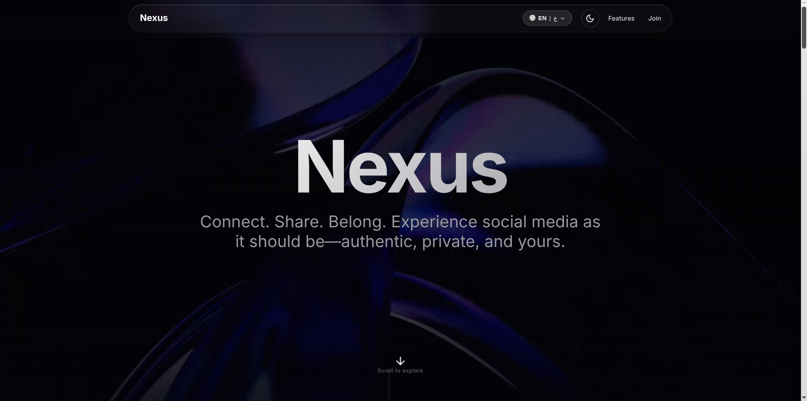
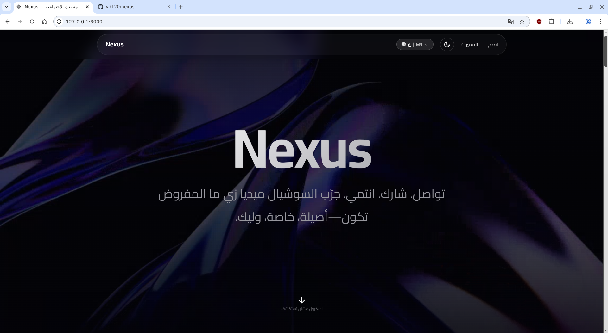

# Nexus - Social Networking Platform

<div align="center">


**A modern, real-time social networking platform built with Laravel 12**

[](https://laravel.com)
[](https://php.net)
[](https://vuejs.org)

[Features](#features) • [Quick Start](#quick-start) • [Documentation](#documentation) • [API Reference](docs/API.md)

</div>

---

## 📖 Table of Contents

- [Overview](#overview)
- [Features](#features)
- [Tech Stack](#tech-stack)
- [Quick Start](#quick-start)
- [Documentation](#documentation)
- [Project Structure](#project-structure)
- [Contributing](#contributing)
- [License](#license)

---

## 🌟 Overview

**Nexus** is a production-ready social networking platform that enables users to connect, share, and communicate in real-time. Built with modern web technologies, it offers a seamless experience for creating posts, sharing stories, messaging, and building communities.

### Platform Preview

<div align="center">



*English Landing Page*



*Arabic Landing Page (RTL Support)*

</div>

### Key Capabilities

| Category | Features |
|----------|----------|
| **Content** | Posts with 30+ media attachments, Comments with threading, 24-hour Stories |
| **Social** | Follow system, Private accounts, User blocking, Mentions |
| **Communication** | Real-time chat, Group conversations, Typing indicators, Read receipts |
| **Communities** | Groups with roles, Member management, Invite links |
| **Safety** | Admin panel, Content moderation, Account suspension, Email verification |
| **UX** | Dark/Light themes, Mobile responsive, Multilingual (EN/AR with RTL) |

---

## ✨ Features

### 📝 Content Management

| Feature | Description |
|---------|-------------|
| **Posts** | Create text posts with up to 30 images/videos (50MB each) |
| **Comments** | Nested replies with @mentions and likes |
| **Reactions** | Like, save, and share posts |
| **Stories** | Ephemeral 24-hour content with view tracking and emoji reactions |
| **Media Processing** | Auto-compression, video thumbnails, FFmpeg processing |

### 💬 Real-Time Communication

| Feature | Description |
|---------|-------------|
| **Direct Messages** | One-on-one conversations with media sharing |
| **Group Chat** | Multi-user conversations via groups |
| **Typing Indicators** | Real-time typing status (5-second cache) |
| **Read Receipts** | Track message delivery and read status |
| **Message Actions** | Delete for me/everyone, edit, reply |

### 👥 Social Network

| Feature | Description |
|---------|-------------|
| **Follow System** | Follow/unfollow users with private account support |
| **User Profiles** | Customizable avatars, cover photos, bio, social links |
| **Privacy Controls** | Private accounts, post-level privacy settings |
| **Block Users** | Block unwanted interactions |
| **Explore** | Discover new users and content |

### 🏢 Groups

| Feature | Description |
|---------|-------------|
| **Create Groups** | Public or private communities |
| **Member Roles** | Admin and member permissions |
| **Invite Links** | Shareable links for quick joining |
| **Group Chat** | Dedicated conversation for each group |
| **Member Management** | Add/remove members, promote to admin |

### 🤖 AI Assistant

| Feature | Description |
|---------|-------------|
| **Menu-Based Chat** | Interactive AI chatbot interface |
| **Context Aware** | Remembers conversation history |
| **Quick Actions** | Pre-defined prompts for common tasks |

### 🛡️ Admin Panel

| Feature | Description |
|---------|-------------|
| **Dashboard** | Platform statistics and analytics |
| **User Management** | View, edit, suspend, or delete users |
| **Content Moderation** | Delete posts, comments, and stories |
| **Admin Creation** | Create new admin accounts |

---

## 🛠️ Tech Stack

### Backend

| Technology | Version | Purpose |
|------------|---------|---------|
| **Laravel** | 12.x | Web application framework |
| **PHP** | 8.2+ | Server-side scripting |
| **SQLite** | Latest | Default database (development) |
| **MySQL** | 8.0+ | Production database (optional) |
| **Laravel Sanctum** | 4.x | API authentication |
| **Laravel Socialite** | 5.24 | OAuth (Google) |
| **Intervention Image** | 3.11 | Image processing |

### Frontend

| Technology | Version | Purpose |
|------------|---------|---------|
| **Blade Templates** | - | Server-side rendering (primary) |
| **Vue.js** | 3.4 | Component framework (optional) |
| **Tailwind CSS** | 3.2 | Utility-first CSS |
| **Alpine.js** | Embedded | Lightweight interactivity |
| **Vite** | 6.4 | Build tool |
| **Axios** | 1.11 | HTTP client for AJAX |

### Services & Tools

| Technology | Version | Purpose |
|------------|---------|---------|
| **FFmpeg** | Latest | Video processing (thumbnails, trimming) |
| **Cloudflare Tunnel** | Latest | Public URL sharing |
| **Google OAuth** | Latest | Social authentication |

> 📋 **Note:** For a complete list of all technologies with versions, see [Technologies Documentation](docs/TECHNOLOGIES.md)

---

## 🚀 Quick Start

### Prerequisites

Ensure you have the following installed:

- **PHP** 8.3 or higher
- **Composer** 2.x
- **Node.js** 18+ (LTS recommended)
- **Git**

### Installation

#### Linux/macOS

```bash
# Clone the repository
git clone https://github.com/vd120/nexus.git
cd laravel_project

# Make setup script executable
chmod +x setup.sh

# Run automated setup
./setup.sh

# Start development server
php artisan serve
```

#### Windows (PowerShell)

```powershell
# Clone the repository
git clone https://github.com/vd120/nexus.git
cd laravel_project

# Run setup script
.\setup.ps1

# Start development server
php artisan serve
```

#### Windows (Command Prompt)

```cmd
REM Clone the repository
git clone https://github.com/vd120/nexus.git
cd laravel_project

REM Run setup script
setup.bat

REM Start development server
php artisan serve
```

### Default Credentials

After setup, login with:

| Field | Value |
|-------|-------|
| **URL** | `http://localhost:8000` |
| **Email** | `admin@example.com` |
| **Password** | `admin123` |

> ⚠️ **Security Notice:** Change the default password immediately after installation!

---

## 📚 Documentation

Comprehensive documentation is available in the [`docs/`](docs/) directory:

| Document | Description |
|----------|-------------|
| [Installation Guide](docs/INSTALLATION.md) | Detailed setup instructions |
| [Architecture](docs/ARCHITECTURE.md) | System design, directory structure, data flow |
| [Features](docs/FEATURES.md) | Complete feature documentation with flow diagrams |
| [API Reference](docs/API.md) | RESTful API endpoints with examples |
| [Database Schema](docs/DATABASE.md) | Entity relationships, table definitions |
| [Diagrams](docs/DIAGRAMS.md) | UML diagrams, use cases, sequence diagrams |
| [Security Report](docs/SECURITY.md) | Security audit, vulnerabilities, best practices |
| [Technologies](docs/TECHNOLOGIES.md) | Complete tech stack with versions |
| [Troubleshooting](docs/TROUBLESHOOTING.md) | Common issues and solutions |
| [Frontend Guide](docs/FRONTEND.md) | Blade templates, JavaScript modules |
| [Multilingual](docs/MULTILINGUAL.md) | English/Arabic support, RTL layout |

---

## 📁 Project Structure

```
laravel_project/
├── app/
│   ├── Console/Commands/      # Artisan commands (6 commands)
│   ├── Http/
│   │   ├── Controllers/       # Request handling (31 files: 30 controllers + 1 base class)
│   │   ├── Middleware/        # Request filtering (8 middleware)
│   │   └── Requests/          # Form validation
│   ├── Mail/                  # Email templates (VerificationCodeMail)
│   ├── Models/                # Eloquent models (19 models)
│   └── Services/              # Business logic (4 services)
├── bootstrap/                 # Application bootstrap
├── config/                    # Configuration files
├── database/
│   ├── factories/             # Test data factories
│   ├── migrations/            # Database migrations (56+)
│   └── seeders/               # Database seeders
├── public/                    # Web root (index.php)
├── resources/
│   ├── css/                   # Stylesheets
│   ├── js/
│   │   ├── Components/        # Vue 3 components
│   │   ├── Pages/             # Inertia pages
│   │   ├── Composables/       # Vue composables
│   │   ├── Layouts/           # Vue layouts
│   │   ├── legacy/            # Legacy JavaScript (18 files)
│   │   └── app.js             # Application entry
│   └── views/                 # Blade templates (primary UI)
├── routes/
│   ├── web.php                # Web routes
│   ├── api.php                # API routes
│   └── console.php            # Console routes
├── storage/
│   ├── app/public/            # User uploads
│   ├── framework/             # Framework cache
│   └── logs/                  # Application logs
├── tests/                     # PHPUnit tests
├── .env.example               # Environment template
├── artisan                    # Laravel CLI
├── composer.json              # PHP dependencies
├── package.json               # Node dependencies
└── vite.config.js             # Vite configuration
```

---

## 🔧 Setup Scripts

The automated setup scripts handle the entire installation process with full MySQL support.

### What It Does

1. ✅ Checks system requirements (PHP, Composer, Node.js, extensions)
2. ✅ Installs PHP dependencies via Composer
3. ✅ Installs JavaScript dependencies via npm
4. ✅ Creates `.env` from `.env.example`
5. ✅ Generates unique application key
6. ✅ **Database Setup** - Choose SQLite or MySQL
7. ✅ **MySQL Options:**
   - Create new database with user
   - Use existing database
   - Automatic privilege configuration
8. ✅ Runs database migrations
9. ✅ Creates admin user with default credentials
10. ✅ Builds frontend assets with Vite
11. ✅ Creates storage symbolic link
12. ✅ Clears all Laravel caches

**Estimated Time:** 3-5 minutes (depending on internet connection)

### Running Setup

**Linux/macOS:**
```bash
chmod +x setup.sh
./setup.sh
```

**Windows PowerShell:**
```powershell
.\setup.ps1
```

**Windows CMD:**
```cmd
setup.bat
```

### Manual Database Setup (Optional)

If you prefer to set up the database manually:

```bash
# MySQL
mysql -u root -p < database/setup_database.sql

# Then run migrations
php artisan migrate
```

---

## 🆘 Troubleshooting

Having setup issues? See the complete [Troubleshooting Guide](docs/TROUBLESHOOTING.md) for:

- Common setup errors and solutions
- Database connection issues
- PHP extension problems
- Permission issues
- Migration failures
- Build errors

---

## 🌐 Public Tunnel

Share your local development environment via Cloudflare Tunnel:

### Linux/macOS
```bash
./start-tunnel.sh
```

### Windows (Git Bash)
```bash
./start-tunnel.sh
```

**Features:**
- Instant public HTTPS URL
- Real-time visitor tracking
- Location detection (city, country)
- Device & browser information

---

## 🤝 Contributing

We welcome contributions! Here's how to help:

### How to Contribute

1. **Fork** the repository
2. **Create a feature branch** (`git checkout -b feature/YourFeature`)
3. **Commit your changes** (`git commit -m 'Add: YourFeature'`)
4. **Push to the branch** (`git push origin feature/YourFeature`)
5. **Open a Pull Request** on GitHub

### What We Need

- 🐛 Bug fixes
- ✨ New features
- 📖 Documentation improvements
- ⚡ Performance optimizations
- 🌍 Translations (especially Arabic)
- ✅ Test coverage

### Development Setup

```bash
git checkout -b feature/YourFeature
composer install
npm install
cp .env.example .env
php artisan key:generate
php artisan migrate --seed
npm run dev
```

---

## 📄 License

This project is proprietary software. All rights reserved.

> **Note:** This project is for demonstration/educational purposes. If you intend to use it commercially, please ensure you have proper licensing for all dependencies and comply with their respective licenses.

---

<div align="center">

**Built with ❤️ using Laravel & Vue.js**

[Documentation](docs/) • [API Reference](docs/API.md) • [Features](docs/FEATURES.md)

</div>
