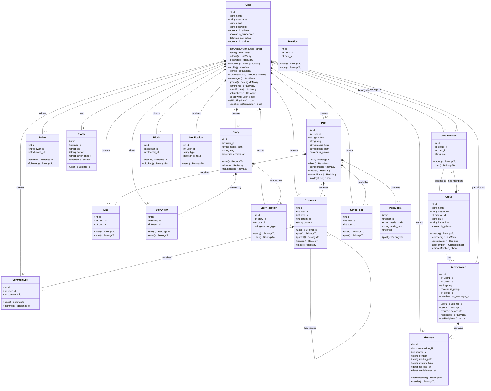
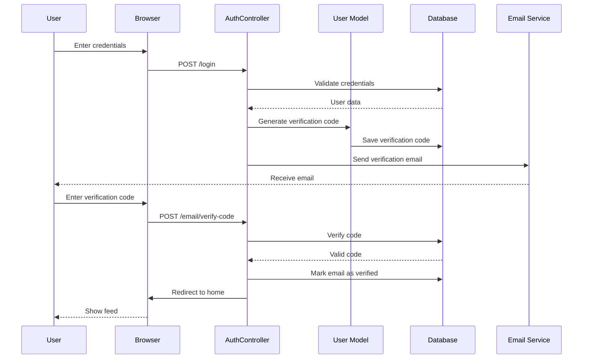
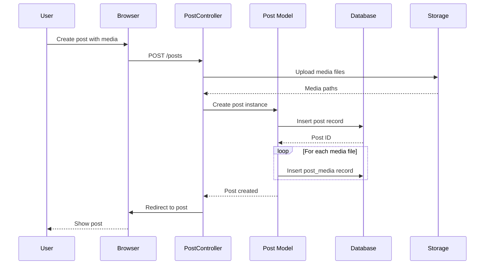
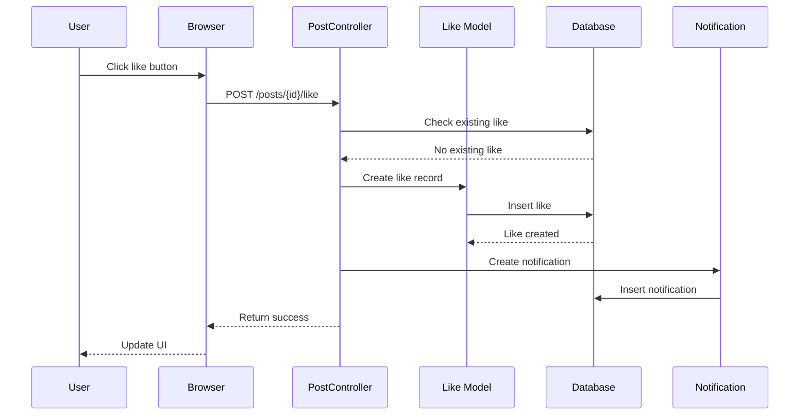
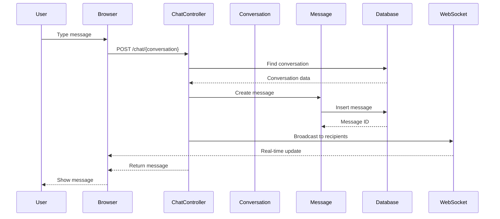
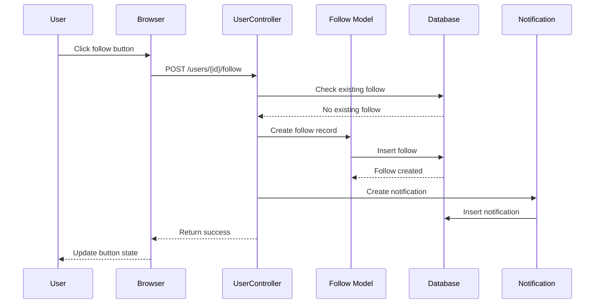
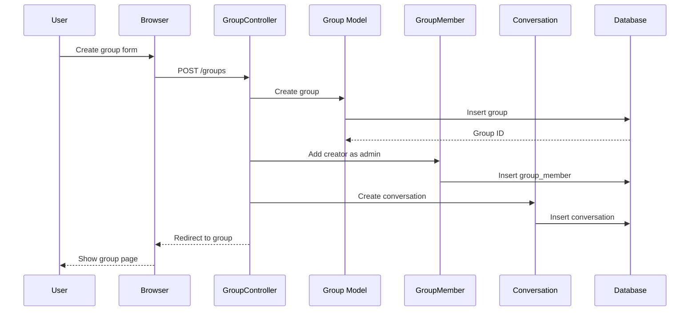
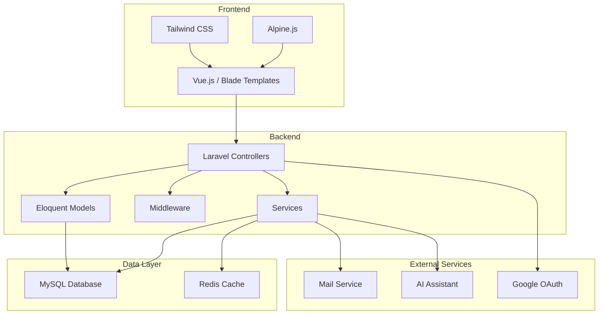

# UML Diagrams

This document contains all UML diagrams for the Laravel Social Media Application.

## Table of Contents

1. [Class Diagram](#class-diagram)
2. [Entity Relationship Diagram (ERD)](#entity-relationship-diagram)
3. [Sequence Diagrams](#sequence-diagrams)
4. [Use Case Diagram](#use-case-diagram)

---

## Class Diagram

This diagram shows the main Eloquent models and their relationships.



---

## Entity Relationship Diagram

This diagram shows the database table relationships.

```mermaid
erDiagram
    USERS ||--o{ POSTS : creates
    USERS ||--o{ COMMENTS : creates
    USERS ||--o{ LIKES : creates
    USERS ||--o{ COMMENT_LIKES : creates
    USERS ||--o{ FOLLOWS : creates
    USERS ||--o{ STORIES : creates
    USERS ||--o{ STORY_VIEWS : creates
    USERS ||--o{ STORY_REACTIONS : creates
    USERS ||--o{ MESSAGES : sends
    USERS ||--o{ GROUP_MEMBERS : joins
    USERS ||--o{ SAVED_POSTS : saves
    USERS ||--o{ BLOCKS : creates
    USERS ||--o{ NOTIFICATIONS : receives
    USERS ||--|| PROFILES : has

    POSTS ||--o{ LIKES : receives
    POSTS ||--o{ COMMENTS : receives
    POSTS ||--o{ POST_MEDIA : contains
    POSTS ||--o{ SAVED_POSTS : saved_by
    POSTS ||--o{ MENTIONS : mentioned_in

    COMMENTS ||--o{ COMMENT_LIKES : receives
    COMMENTS ||--o{ COMMENTS : has_replies

    STORIES ||--o{ STORY_VIEWS : viewed_by
    STORIES ||--o{ STORY_REACTIONS : reacted_by

    CONVERSATIONS ||--o{ MESSAGES : contains
    CONVERSATIONS ||--o{ USERS : participates

    GROUPS ||--o{ GROUP_MEMBERS : has
    GROUPS ||--o| CONVERSATIONS : has

    USERS {
        bigint id PK
        string name
        string username UK
        string email UK
        string password
        boolean is_admin
        boolean is_suspended
        timestamp last_active
        boolean is_online
        timestamp email_verified_at
    }

    POSTS {
        bigint id PK
        bigint user_id FK
        string content
        string slug UK
        string media_type
        string media_path
        boolean is_private
    }

    COMMENTS {
        bigint id PK
        bigint user_id FK
        bigint post_id FK
        bigint parent_id FK
        string content
    }

    LIKES {
        bigint id PK
        bigint user_id FK
        bigint post_id FK
    }

    COMMENT_LIKES {
        bigint id PK
        bigint user_id FK
        bigint comment_id FK
    }

    FOLLOWS {
        bigint id PK
        bigint follower_id FK
        bigint followed_id FK
    }

    PROFILES {
        bigint id PK
        bigint user_id FK UK
        string bio
        string avatar
        string cover_image
        boolean is_private
    }

    STORIES {
        bigint id PK
        bigint user_id FK
        string media_path
        string slug UK
        timestamp expires_at
    }

    STORY_VIEWS {
        bigint id PK
        bigint story_id FK
        bigint user_id FK
    }

    STORY_REACTIONS {
        bigint id PK
        bigint story_id FK
        bigint user_id FK
        string reaction_type
    }

    CONVERSATIONS {
        bigint id PK
        bigint user1_id FK
        bigint user2_id FK
        string slug UK
        boolean is_group
        bigint group_id FK
        timestamp last_message_at
    }

    MESSAGES {
        bigint id PK
        bigint conversation_id FK
        bigint sender_id FK
        string content
        string media_path
        string system_type
        timestamp read_at
        timestamp delivered_at
    }

    GROUPS {
        bigint id PK
        string name
        string description
        bigint creator_id FK
        string slug UK
        string invite_link UK
        boolean is_private
    }

    GROUP_MEMBERS {
        bigint id PK
        bigint group_id FK
        bigint user_id FK
        string role
        timestamp joined_at
    }

    SAVED_POSTS {
        bigint id PK
        bigint user_id FK
        bigint post_id FK
    }

    BLOCKS {
        bigint id PK
        bigint blocker_id FK
        bigint blocked_id FK
    }

    NOTIFICATIONS {
        bigint id PK
        bigint user_id FK
        string type
        boolean is_read
    }

    POST_MEDIA {
        bigint id PK
        bigint post_id FK
        string media_path
        string media_type
        int order
    }

    MENTIONS {
        bigint id PK
        bigint user_id FK
        bigint post_id FK
    }
```

---

## Sequence Diagrams

### 1. User Authentication Flow



### 2. Post Creation Flow



### 3. Like Post Flow



### 4. Send Message Flow



### 5. Follow User Flow



### 6. Create Group Flow



---

## Use Case Diagram

This diagram shows the main actors and their interactions with the system.

```mermaid
usecaseDiagram
    actor "Guest User" as Guest
    actor "Registered User" as User
    actor "Admin" as Admin

    package "Authentication" {
        usecase "Register Account" as UC1
        usecase "Login" as UC2
        usecase "Logout" as UC3
        usecase "Reset Password" as UC4
        usecase "Verify Email" as UC5
        usecase "Login with Google" as UC6
    }

    package "Posts" {
        usecase "Create Post" as UC10
        usecase "View Posts" as UC11
        usecase "Edit Post" as UC12
        usecase "Delete Post" as UC13
        usecase "Like Post" as UC14
        usecase "Save Post" as UC15
        usecase "Comment on Post" as UC16
        usecase "Like Comment" as UC17
    }

    package "Stories" {
        usecase "Create Story" as UC20
        usecase "View Stories" as UC21
        usecase "React to Story" as UC22
        usecase "View Story Viewers" as UC23
        usecase "Delete Story" as UC24
    }

    package "Social Features" {
        usecase "Follow User" as UC30
        usecase "Unfollow User" as UC31
        usecase "Block User" as UC32
        usecase "View Profile" as UC33
        usecase "Edit Profile" as UC34
        usecase "Explore Users" as UC35
    }

    package "Messaging" {
        usecase "Send Message" as UC40
        usecase "View Conversations" as UC41
        usecase "Delete Message" as UC42
        usecase "Mark as Read" as UC43
        usecase "Send Typing Indicator" as UC44
    }

    package "Groups" {
        usecase "Create Group" as UC50
        usecase "Join Group" as UC51
        usecase "Leave Group" as UC52
        usecase "Add Members" as UC53
        usecase "Remove Members" as UC54
        usecase "Make Admin" as UC55
    }

    package "Admin" {
        usecase "View Dashboard" as UC60
        usecase "Manage Users" as UC61
        usecase "Delete Posts" as UC62
        usecase "Delete Comments" as UC63
        usecase "Delete Stories" as UC64
        usecase "Create Admin" as UC65
    }

    package "AI Features" {
        usecase "Chat with AI" as UC70
    }

    Guest --> UC1
    Guest --> UC2
    Guest --> UC4
    Guest --> UC6
    Guest --> UC11
    Guest --> UC21
    Guest --> UC33
    Guest --> UC35

    User --> UC3
    User --> UC5
    User --> UC10
    User --> UC11
    User --> UC12
    User --> UC13
    User --> UC14
    User --> UC15
    User --> UC16
    User --> UC17
    User --> UC20
    User --> UC21
    User --> UC22
    User --> UC23
    User --> UC24
    User --> UC30
    User --> UC31
    User --> UC32
    User --> UC33
    User --> UC34
    User --> UC35
    User --> UC40
    User --> UC41
    User --> UC42
    User --> UC43
    User --> UC44
    User --> UC50
    User --> UC51
    User --> UC52
    User --> UC53
    User --> UC54
    User --> UC55
    User --> UC70

    Admin --> UC60
    Admin --> UC61
    Admin --> UC62
    Admin --> UC63
    Admin --> UC64
    Admin --> UC65
```

---

## System Architecture Overview



---

## Notes

- All diagrams are written in **Mermaid.js** syntax and will render automatically on GitHub
- For local viewing, use a Markdown editor with Mermaid support (VS Code, Obsidian, etc.)
- Diagrams are auto-generated based on the current codebase structure
- Last updated: March 15, 2026
