# Nexus - UML Diagrams

Complete UML diagrams and visual documentation for the Nexus social networking platform.

---

## Table of Contents

1. [Class Diagram](#class-diagram)
2. [Entity Relationship Diagram](#entity-relationship-diagram)
3. [Use Case Diagram](#use-case-diagram)
4. [Sequence Diagrams](#sequence-diagrams)
5. [Activity Diagrams](#activity-diagrams)
6. [Component Diagram](#component-diagram)
7. [Deployment Diagram](#deployment-diagram)
8. [State Machine Diagrams](#state-machine-diagrams)

---

## Class Diagram

This diagram shows all Eloquent models, their attributes, methods, and relationships.


---

## Entity Relationship Diagram

This diagram shows the database table relationships with cardinality.

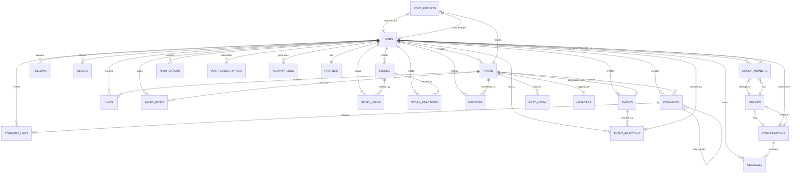

---

## Use Case Diagram

This diagram shows all actors and their interactions with the system.

```mermaid
flowchart TB
    Guest["Guest User"]
    User["Registered User"]
    Admin["Admin User"]

    Guest --> Register[Register Account]
    Guest --> Login[Login]
    Guest --> ResetPwd[Reset Password]
    Guest --> GoogleLogin[Login with Google]
    Guest --> ViewFeed[View Feed]
    Guest --> ViewStories[View Stories]
    Guest --> ViewProfile[View Profile]
    Guest --> ExploreUsers[Explore Users]
    Guest --> SearchUsers[Search Users]

    User --> Logout[Logout]
    User --> VerifyEmail[Verify Email]
    User --> SetPwdOAuth[Set Password OAuth]
    User --> CreatePost[Create Post]
    User --> EditPost[Edit Post]
    User --> DeletePost[Delete Post]
    User --> LikePost[Like Post]
    User --> SavePost[Save Post]
    User --> CommentPost[Comment on Post]
    User --> LikeComment[Like Comment]
    User --> ReportPost[Report Post]
    User --> PinPost[Pin Post]
    User --> AddMedia[Add Media]
    User --> CreateStory[Create Story]
    User --> ReactStory[React to Story]
    User --> ViewStoryViewers[View Story Viewers]
    User --> DeleteStory[Delete Story]
    User --> FollowUser[Follow User]
    User --> UnfollowUser[Unfollow User]
    User --> BlockUser[Block User]
    User --> EditProfile[Edit Profile]
    User --> GenerateQR[Generate QR Code]
    User --> SendMessage[Send Message]
    User --> ViewConversations[View Conversations]
    User --> DeleteMessage[Delete Message]
    User --> MarkRead[Mark as Read]
    User --> SendTyping[Send Typing Indicator]
    User --> SendVoice[Send Voice Message]
    User --> SendMediaMsg[Send Media Message]
    User --> CreateGroup[Create Group]
    User --> JoinGroup[Join Group]
    User --> LeaveGroup[Leave Group]
    User --> AddMembers[Add Members]
    User --> RemoveMembers[Remove Members]
    User --> MakeAdmin[Make Admin]
    User --> RemoveAdmin[Remove Admin]
    User --> GenInvite[Generate Invite Link]
    User --> AcceptInvite[Accept Invite]
    User --> ViewNotif[View Notifications]
    User --> MarkNotifRead[Mark as Read]
    User --> MarkAllRead[Mark All Read]
    User --> DeleteNotif[Delete Notification]
    User --> ViewActivity[View Activity Log]
    User --> ExportActivity[Export Activity]
    User --> TerminateSession[Terminate Session]
    User --> ClearActivity[Clear Old Activity]
    User --> CreateEvent[Create Event]
    User --> EditEvent[Edit Event]
    User --> DeleteEvent[Delete Event]
    User --> ReactEvent[React to Event]
    User --> ViewMemory[View Memory Book]
    User --> ChatAI[Chat with AI]

    Admin --> AdminDashboard[View Dashboard]
    Admin --> ManageUsers[Manage Users]
    Admin --> SuspendUser[Suspend User]
    Admin --> DeleteAnyPost[Delete Any Post]
    Admin --> DeleteAnyComment[Delete Any Comment]
    Admin --> DeleteAnyStory[Delete Any Story]
    Admin --> CreateAdmin[Create Admin]
    Admin --> ReviewReports[Review Reports]
    Admin --> AcceptReport[Accept Report]
    Admin --> RejectReport[Reject Report]
```

---

## Sequence Diagrams

### 1. User Registration Flow

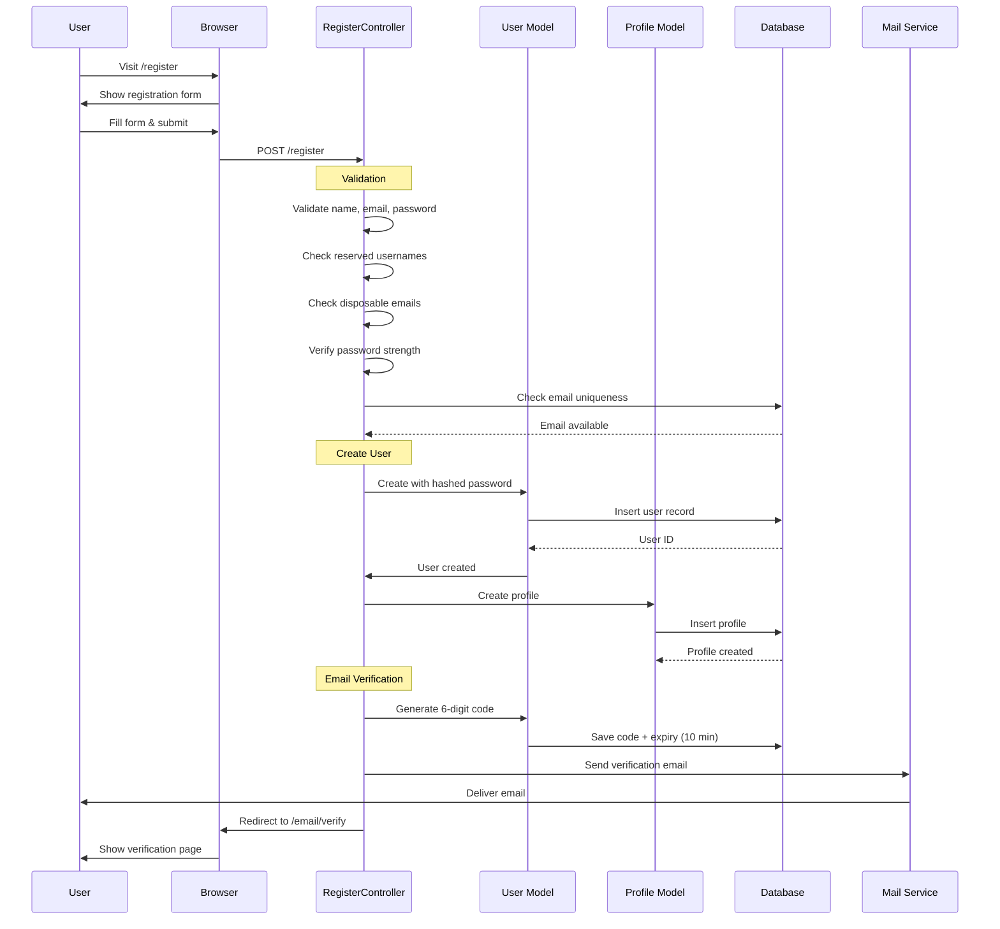

### 2. Login Flow

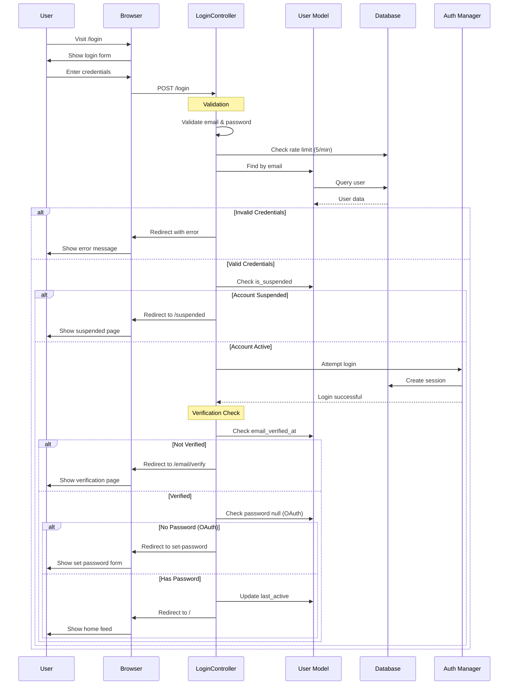

### 3. Create Post Flow

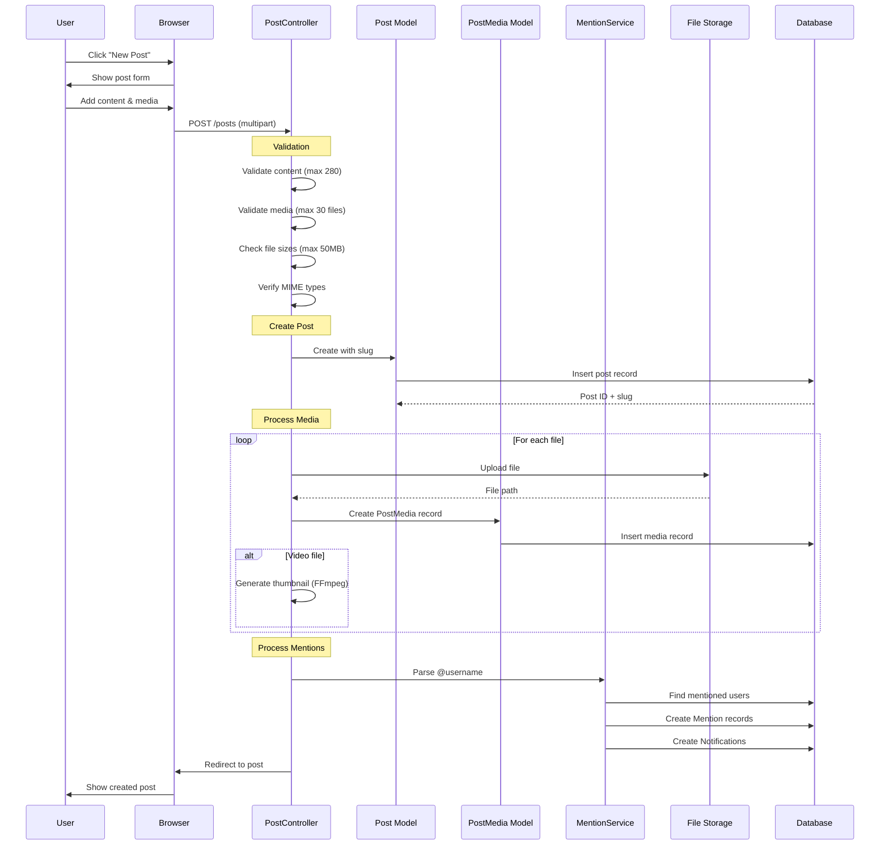

### 4. Like Post Flow

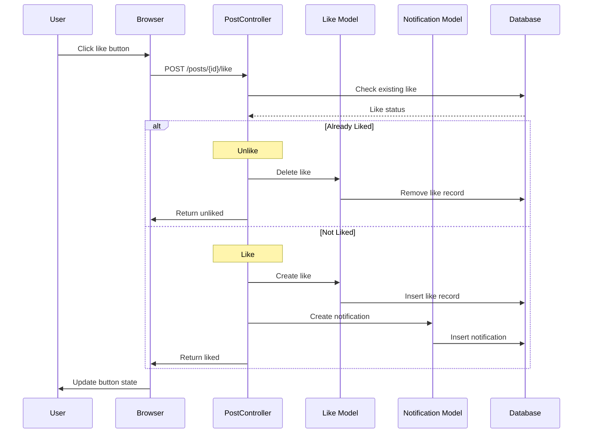

### 5. Send Message Flow

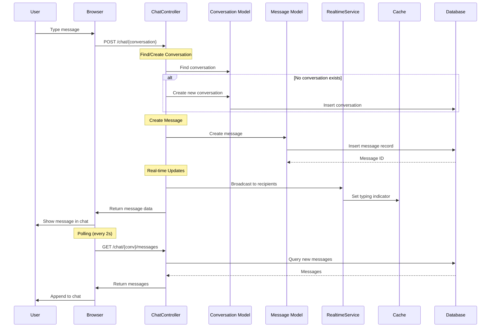

### 6. Follow User Flow

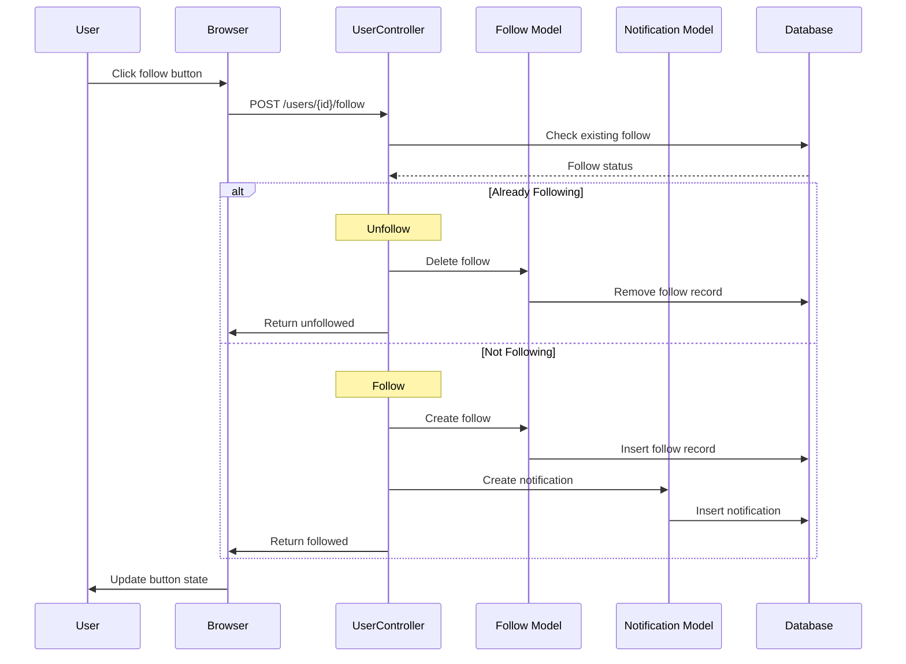

### 7. Create Story Flow

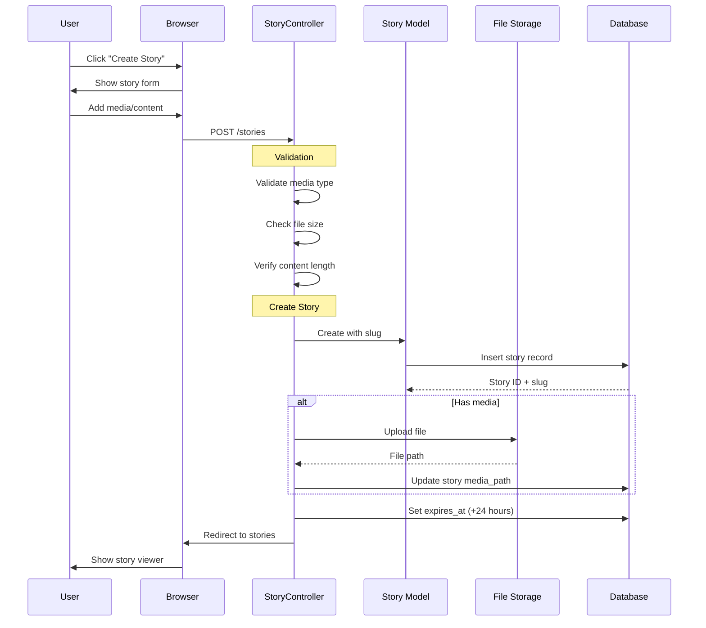

### 8. Admin Delete Post Flow

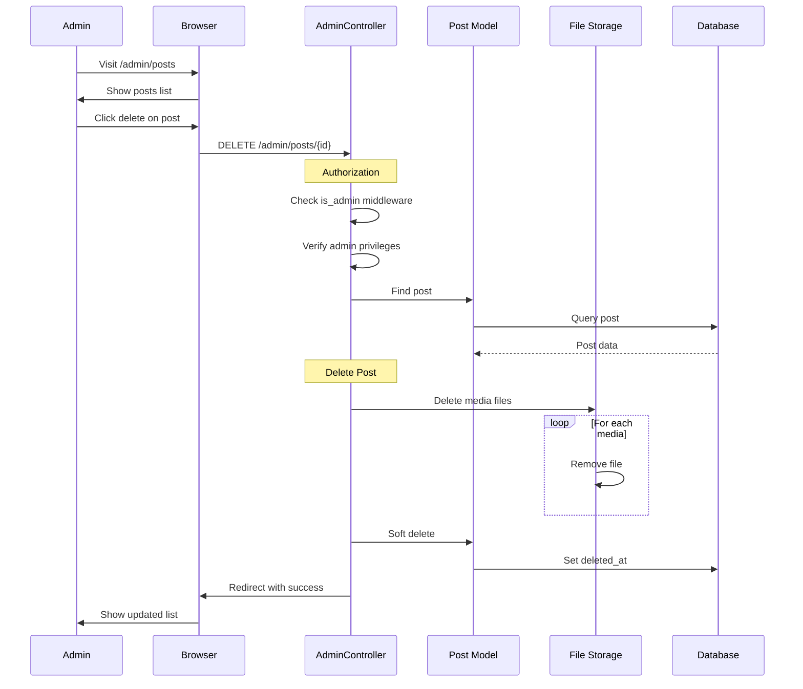

---

## Activity Diagrams

### 1. Post Creation Activity

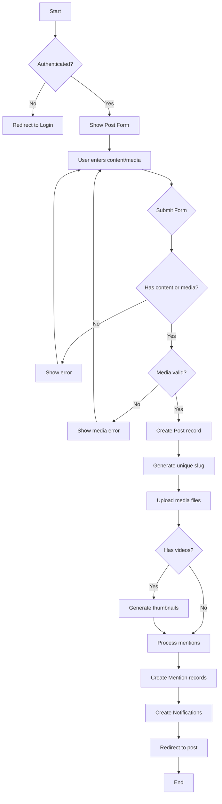

### 2. User Authentication Activity

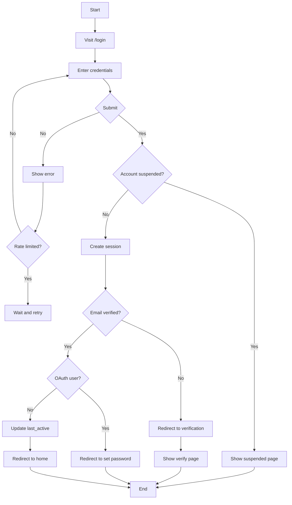

### 3. Message Sending Activity

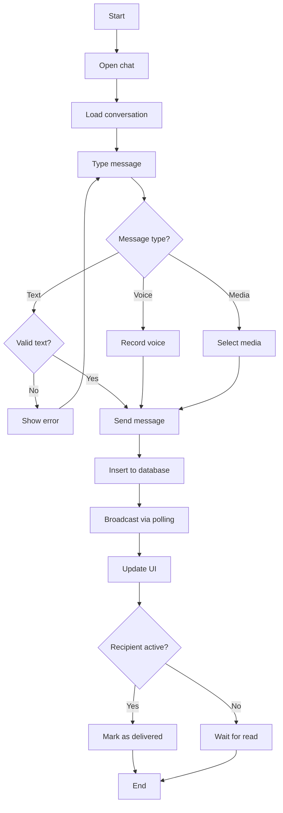

---

## Component Diagram

This diagram shows the high-level architecture components and their relationships.

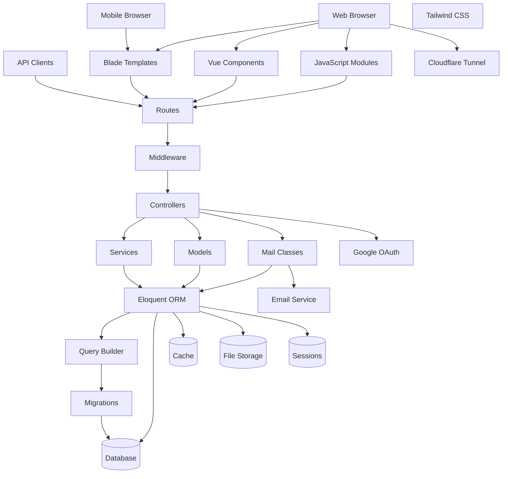

---

## Deployment Diagram

This diagram shows the physical deployment architecture.

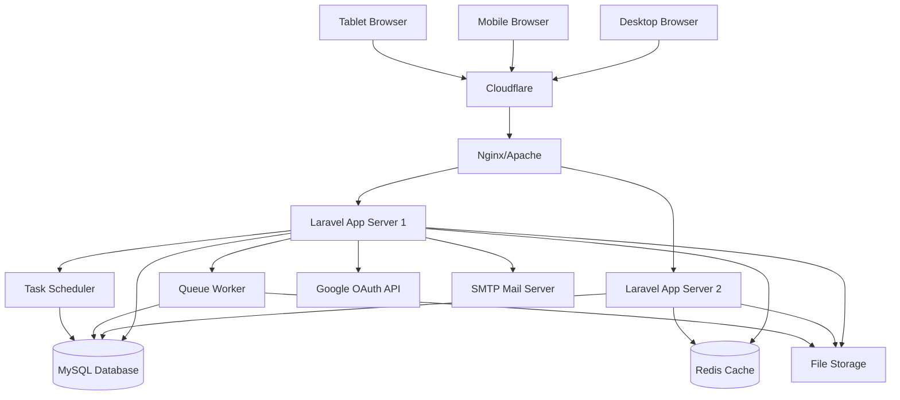

---

## State Machine Diagrams

### 1. User Account State

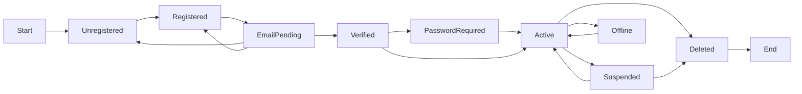

### 2. Post State

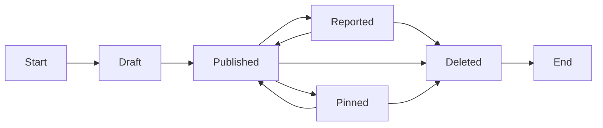

### 3. Story State

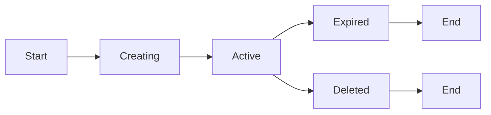

### 4. Message State

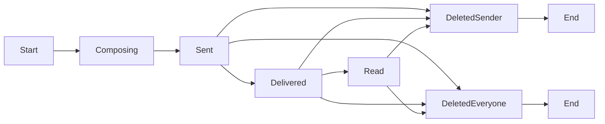

### 5. Conversation State

```mermaid
flowchart LR
    A[Start] --> B[Inactive]
    B --> C[Active]
    C --> B
    C --> D[HasUnread]
    D --> C
    D --> B
    C --> E[Deleted]
    B --> E
    E --> F[End]
```

### 6. Group Member State

```mermaid
flowchart LR
    A[Start] --> B[Invited]
    B --> C[Member]
    B --> D[End]
    C --> E[Admin]
    E --> C
    C --> F[Left]
    E --> F
    C --> G[Removed]
    E --> G
    F --> H[End]
    G --> I[End]
```

---

## Component Interaction Matrix

```mermaid
flowchart LR
    A[Routes] --> B[Controllers]
    A --> C[Services]
    A --> D[Models]
    A --> E[Middleware]
    B --> C
    B --> D
    B --> E
    C --> D
    E --> A
    E --> B
```

---

## Technology Stack Diagram

```mermaid
flowchart LR
    F1[Blade Templates]
    F2[Vue.js 3.4]
    F3[Alpine.js]
    F4[Tailwind CSS 3.2]
    F5[Axios]
    B1[Vite 6.4]
    B2[TypeScript 5.6]
    B3[ESLint]
    B4[Prettier]
    B5[JS Obfuscator]
    BK1[Laravel 12]
    BK2[PHP 8.2+]
    BK3[Eloquent ORM]
    BK4[Sanctum]
    BK5[Socialite]
    D1[SQLite/MySQL]
    D2[Database Cache]
    D3[File System]
    D4[Database Sessions]
    E1[Google OAuth]
    E2[SMTP Server]
    E3[FFmpeg]

    F1 --> B1
    F2 --> B1
    F3 --> B1
    F4 --> B1
    F5 --> B1
    B1 --> BK1
    BK1 --> BK2
    BK1 --> BK3
    BK1 --> BK4
    BK1 --> BK5
    BK3 --> D1
    BK1 --> D2
    BK1 --> D3
    BK1 --> D4
    BK5 --> E1
    BK1 --> E2
    BK1 --> E3
```

---

## Data Flow Diagrams

### 1. Read Operations (Feed Loading)

```mermaid
flowchart LR
    U[User] -->|Request| B[Browser]
    B -->|HTTP GET| LC[Laravel Controller]
    LC -->|Auth Check| M[Middleware]
    M -->|Query| PM[Post Model]
    PM -->|Eloquent Query| DB[(Database)]
    DB -->|Posts Data| PM
    PM -->|Eager Load| UR[User Relations]
    PM -->|Eager Load| MR[Media Relations]
    PM -->|Eager Load| LR[Like Relations]
    UR --> DB
    MR --> DB
    LR --> DB
    DB -->|Related Data| PM
    PM -->|Collection| LC
    LC -->|Blade View| B
    B -->|Render| U
```

### 2. Write Operations (Post Creation)

```mermaid
flowchart LR
    U[User] -->|Submit Form| B[Browser]
    B -->|POST posts| LC[PostController]
    LC -->|Validate| VR[Validation Rules]
    VR -->|Valid| PM[Post Model]
    PM -->|Insert| DB[(Database)]
    DB -->|Post ID| PM
    PM -->|Upload| FS[File Storage]
    FS -->|Paths| PMM[PostMedia Model]
    PMM -->|Insert| DB
    PM -->|Parse| MS[MentionService]
    MS -->|Create| MN[Mention Model]
    MN -->|Insert| DB
    MS -->|Notify| NM[Notification Model]
    NM -->|Insert| DB
    DB -->|Success| LC
    LC -->|Redirect| B
    B -->|Show| U
```

---

## Performance Optimization Diagram

```mermaid
flowchart TB
    C1[Config Cache]
    C2[Route Cache]
    C3[View Cache]
    C4[Query Cache]
    D1[Indexes on columns]
    D2[Composite Indexes]
    D3[Query Optimization]
    D4[Eager Loading]
    F1[Vite Build]
    F2[Code Splitting]
    F3[Lazy Loading]
    F4[Asset Minification]
    R1[Polling Intervals]
    R2[Conditional Polling]
    R3[Batch Requests]
    R4[Cache Typing]

    C1 --> D1
    C2 --> D2
    C3 --> F1
    C4 --> D3
    D4 --> R1
    F2 --> R2
    F3 --> R3
    F4 --> R4
```

---

## Security Architecture Diagram

```mermaid
flowchart TB
    L1[Network Layer]
    L2[Application Layer]
    L3[Data Layer]
    L4[Business Logic]
    A1[Password Hashing]
    A2[Email Verification]
    A3[Rate Limiting]
    A4[Session Security]
    Z1[Middleware Guards]
    Z2[Policy Checks]
    Z3[Privacy Controls]
    Z4[User Blocking]
    P1[CSRF Protection]
    P2[XSS Prevention]
    P3[SQL Injection]
    P4[File Upload]

    L1 --> L2
    L2 --> L3
    L3 --> L4
    A1 --> Z1
    A2 --> Z2
    A3 --> Z3
    A4 --> Z4
    Z1 --> P1
    Z2 --> P2
    Z3 --> P3
    Z4 --> P4
```

---

## Module Dependency Graph

```mermaid
flowchart LR
    C1[User Module]
    C2[Post Module]
    C3[Comment Module]
    S1[Follow Module]
    S2[Block Module]
    S3[Story Module]
    M1[Chat Module]
    M2[Notification Module]
    M3[Group Module]
    A1[Report Module]
    A2[Admin Panel]
    A3[Activity Log]

    C1 --> C2
    C1 --> C3
    C1 --> S1
    C1 --> S2
    C1 --> S3
    C1 --> M1
    C1 --> M2
    C1 --> M3
    C2 --> C3
    C2 --> S3
    C2 --> A1
    C3 --> M2
    S1 --> M2
    S3 --> M2
    M1 --> M2
    M3 --> M1
    M3 --> M2
    A1 --> A2
    A3 --> A2
```

---

<div align="center">

**Nexus - Complete UML Documentation**

Last Updated: March 28, 2026 | Laravel 12.x | PHP 8.2+

</div>
