# Nexus - UML Diagrams

Complete UML diagrams and visual documentation for the Nexus social networking platform.

---

## Table of Contents

1. [Class Diagram](#class-diagram)
2. [Entity Relationship Diagram](#entity-relationship-diagram)
3. [Use Case Diagram](#use-case-diagram)
4. [Sequence Diagrams](#sequence-diagrams)
5. [Activity Diagrams](#activity-diagrams)
6. [Component Diagram](#component-diagram)
7. [Deployment Diagram](#deployment-diagram)
8. [State Machine Diagrams](#state-machine-diagrams)

---

## Class Diagram

This diagram shows all Eloquent models, their attributes, methods, and relationships.

```mermaid
classDiagram
    class User {
        +int id
        +string name
        +string username
        +string email
        +string password
        +bool is_admin
        +bool is_suspended
        +datetime last_active
        +bool is_online
        +string language
        +generateVerificationCode() string
        +verifyCode(string) bool
        +canChangeUsername() bool
        +updateUsername(string)
        +markAsOffline()
        +updateLastActive()
        +isInactiveFor(int) bool
        +posts() HasMany
        +comments() HasMany
        +likes() HasMany
        +follows() HasMany
        +followers() HasMany
        +following() BelongsToMany
        +profile() HasOne
        +stories() HasMany
        +conversations() Custom
        +messages() HasMany
        +groups() BelongsToMany
        +notifications() HasMany
        +savedPosts() HasMany
        +blockedUsers() HasMany
        +isFollowing(User) bool
        +isBlocking(User) bool
    }

    class Profile {
        +int id
        +int user_id
        +string avatar
        +string cover_image
        +string bio
        +string website
        +string location
        +bool is_private
        +json social_links
        +user() BelongsTo
    }

    class Post {
        +int id
        +int user_id
        +string content
        +string slug
        +bool is_private
        +datetime pinned_at
        +user() BelongsTo
        +likes() HasMany
        +comments() HasMany
        +media() HasMany
        +savedPosts() HasMany
        +hashtags() BelongsToMany
        +event() HasOne
        +likedBy(User) bool
        +isPinned() bool
        +pin()
        +unpin()
    }

    class PostMedia {
        +int id
        +int post_id
        +string media_type
        +string media_path
        +string media_thumbnail
        +int sort_order
        +post() BelongsTo
    }

    class Comment {
        +int id
        +int user_id
        +int post_id
        +int parent_id
        +string content
        +user() BelongsTo
        +post() BelongsTo
        +parent() BelongsTo
        +replies() HasMany
        +likes() HasMany
    }

    class CommentLike {
        +int id
        +int user_id
        +int comment_id
        +user() BelongsTo
        +comment() BelongsTo
    }

    class Like {
        +int id
        +int user_id
        +int post_id
        +user() BelongsTo
        +post() BelongsTo
    }

    class Follow {
        +int id
        +int follower_id
        +int followed_id
        +follower() BelongsTo
        +followed() BelongsTo
    }

    class Block {
        +int id
        +int blocker_id
        +int blocked_id
        +blocker() BelongsTo
        +blocked() BelongsTo
    }

    class SavedPost {
        +int id
        +int user_id
        +int post_id
        +user() BelongsTo
        +post() BelongsTo
    }

    class Story {
        +int id
        +int user_id
        +string slug
        +string media_type
        +string media_path
        +string content
        +json metadata
        +datetime expires_at
        +user() BelongsTo
        +views() HasMany
        +reactions() HasMany
        +isActive() bool
    }

    class StoryView {
        +int id
        +int story_id
        +int user_id
        +story() BelongsTo
        +user() BelongsTo
    }

    class StoryReaction {
        +int id
        +int story_id
        +int user_id
        +string reaction_type
        +story() BelongsTo
        +user() BelongsTo
    }

    class Conversation {
        +int id
        +int user1_id
        +int user2_id
        +bool is_group
        +int group_id
        +string slug
        +datetime last_message_at
        +messages() HasMany
        +getRecipients() array
    }

    class Message {
        +int id
        +int conversation_id
        +int sender_id
        +string content
        +string media_type
        +string media_path
        +string system_type
        +datetime read_at
        +datetime delivered_at
        +json deleted_for
        +conversation() BelongsTo
        +sender() BelongsTo
    }

    class Group {
        +int id
        +string name
        +string description
        +string avatar
        +int creator_id
        +string slug
        +string invite_link
        +bool is_private
        +creator() BelongsTo
        +members() HasMany
        +conversation() HasOne
        +addMember() GroupMember
        +removeMember() bool
    }

    class GroupMember {
        +int id
        +int group_id
        +int user_id
        +string role
        +datetime joined_at
        +group() BelongsTo
        +user() BelongsTo
    }

    class Notification {
        +int id
        +int user_id
        +string type
        +json data
        +datetime read_at
        +string related_type
        +int related_id
        +user() BelongsTo
    }

    class Mention {
        +int id
        +int user_id
        +int post_id
        +user() BelongsTo
        +post() BelongsTo
    }

    class Hashtag {
        +int id
        +string name
        +string slug
        +posts() BelongsToMany
    }

    class PostReport {
        +int id
        +int user_id
        +int post_id
        +string reason
        +string description
        +string status
        +datetime reviewed_at
        +int reviewed_by
        +string admin_action
        +string slug
        +user() BelongsTo
        +post() BelongsTo
        +reviewer() BelongsTo
    }

    class PushSubscription {
        +int id
        +int user_id
        +string content
        +string p256dh
        +string auth
        +user() BelongsTo
    }

    class ActivityLog {
        +int id
        +int user_id
        +string action
        +string description
        +string ip_address
        +string user_agent
        +string country
        +string city
        +int session_id
        +user() BelongsTo
    }

    class Event {
        +int id
        +int user_id
        +int post_id
        +string title
        +string type
        +datetime event_date
        +json metadata
        +user() BelongsTo
        +post() BelongsTo
        +reactions() HasMany
    }

    class EventReaction {
        +int id
        +int event_id
        +int user_id
        +string reaction_type
        +event() BelongsTo
        +user() BelongsTo
    }

    User "1" -- "1" Profile : has
    User "1" *-- "0..*" Post : creates
    User "1" *-- "0..*" Comment : creates
    User "1" *-- "0..*" Like : creates
    User "1" *-- "0..*" CommentLike : creates
    User "1" *-- "0..*" Follow : follows
    User "1" *-- "0..*" Block : blocks
    User "1" *-- "0..*" SavedPost : saves
    User "1" *-- "0..*" Story : creates
    User "1" *-- "0..*" StoryView : views
    User "1" *-- "0..*" StoryReaction : reacts
    User "1" *-- "0..*" Message : sends
    User "1" *-- "0..*" GroupMember : joins
    User "1" *-- "0..*" Group : belongs to
    User "1" *-- "0..*" Notification : receives
    User "1" *-- "0..*" Mention : creates
    User "1" *-- "0..*" PushSubscription : subscribes
    User "1" *-- "0..*" ActivityLog : generates
    User "1" *-- "0..*" Event : creates
    User "1" *-- "0..*" EventReaction : reacts

    Post "1" *-- "0..*" PostMedia : contains
    Post "1" *-- "0..*" Like : receives
    Post "1" *-- "0..*" Comment : receives
    Post "1" *-- "0..*" SavedPost : saved by
    Post "1" *-- "0..*" Mention : mentioned in
    Post "1" *-- "0..*" Hashtag : tagged with
    Post "1" -- "0..1" Event : associated with

    Comment "1" *-- "0..*" CommentLike : receives
    Comment "1" -- "0..*" Comment : has replies

    Story "1" *-- "0..*" StoryView : viewed by
    Story "1" *-- "0..*" StoryReaction : reacted by

    Conversation "1" *-- "0..*" Message : contains
    Conversation "2" -- "2" User : participants
    Conversation "0..1" -- "0..1" Group : linked to

    Group "1" *-- "0..*" GroupMember : has members
    Group "1" -- "0..1" Conversation : has conversation
    GroupMember "1" -- "1" User : belongs to
    GroupMember "1" -- "1" Group : belongs to

    PostReport "1" -- "1" User : reported by
    PostReport "1" -- "1" Post : reports
    PostReport "0..1" -- "1" User : reviewed by
```

---

## Entity Relationship Diagram

This diagram shows the database table relationships with cardinality.

```mermaid
erDiagram
    USERS ||--o{ POSTS : creates
    USERS ||--o{ COMMENTS : creates
    USERS ||--o{ LIKES : creates
    USERS ||--o{ COMMENT_LIKES : creates
    USERS ||--o{ FOLLOWS : creates
    USERS ||--o{ BLOCKS : creates
    USERS ||--o{ SAVED_POSTS : saves
    USERS ||--o{ STORIES : creates
    USERS ||--o{ STORY_VIEWS : views
    USERS ||--o{ STORY_REACTIONS : reacts
    USERS ||--o{ MESSAGES : sends
    USERS ||--o{ GROUP_MEMBERS : joins
    USERS ||--o{ NOTIFICATIONS : receives
    USERS ||--o{ MENTIONS : creates
    USERS ||--o{ PUSH_SUBSCRIPTIONS : subscribes
    USERS ||--o{ ACTIVITY_LOGS : generates
    USERS ||--o{ EVENTS : creates
    USERS ||--o{ EVENT_REACTIONS : reacts
    USERS ||--|| PROFILES : has

    POSTS ||--o{ POST_MEDIA : contains
    POSTS ||--o{ LIKES : receives
    POSTS ||--o{ COMMENTS : receives
    POSTS ||--o{ SAVED_POSTS : saved_by
    POSTS ||--o{ MENTIONS : mentioned_in
    POSTS }|--|{ HASHTAGS : tagged_with
    POSTS ||--o| EVENTS : associated_with

    COMMENTS ||--o{ COMMENT_LIKES : receives
    COMMENTS ||--o{ COMMENTS : has_replies

    STORIES ||--o{ STORY_VIEWS : viewed_by
    STORIES ||--o{ STORY_REACTIONS : reacted_by

    CONVERSATIONS ||--o{ MESSAGES : contains
    CONVERSATIONS }|--|| USERS : participants
    CONVERSATIONS }|--o| GROUPS : linked_to

    GROUPS ||--o{ GROUP_MEMBERS : has
    GROUPS ||--o| CONVERSATIONS : has
    GROUP_MEMBERS }|--|| USERS : belongs_to
    GROUP_MEMBERS }|--|| GROUPS : belongs_to

    POST_REPORTS }|--|| USERS : reported_by
    POST_REPORTS }|--|| POSTS : reports
    POST_REPORTS }|--o| USERS : reviewed_by

    EVENTS ||--o{ EVENT_REACTIONS : reacted_by
    EVENT_REACTIONS }|--|| USERS : created_by

    USERS {
        bigint id PK
        varchar name
        varchar username UK
        varchar email UK
        timestamp email_verified_at
        varchar language
        varchar password
        boolean is_admin
        boolean is_suspended
        varchar verification_code
        timestamp verification_code_expires_at
        timestamp last_active
        boolean is_online
        timestamp username_changed_at
        timestamp created_at
        timestamp updated_at
    }

    PROFILES {
        bigint id PK
        bigint user_id FK UK
        varchar avatar
        varchar cover_image
        text bio
        varchar website
        varchar location
        boolean is_private
        json social_links
        timestamp created_at
        timestamp updated_at
    }

    POSTS {
        bigint id PK
        bigint user_id FK
        text content
        varchar slug UK
        boolean is_private
        timestamp pinned_at
        timestamp deleted_at
        timestamp created_at
        timestamp updated_at
    }

    POST_MEDIA {
        bigint id PK
        bigint post_id FK
        varchar media_type
        varchar media_path
        varchar media_thumbnail
        int sort_order
        timestamp created_at
        timestamp updated_at
    }

    COMMENTS {
        bigint id PK
        bigint user_id FK
        bigint post_id FK
        bigint parent_id FK
        text content
        timestamp created_at
        timestamp updated_at
    }

    LIKES {
        bigint id PK
        bigint user_id FK
        bigint post_id FK
        timestamp created_at
    }

    COMMENT_LIKES {
        bigint id PK
        bigint user_id FK
        bigint comment_id FK
        timestamp created_at
    }

    FOLLOWS {
        bigint id PK
        bigint follower_id FK
        bigint followed_id FK
        timestamp created_at
    }

    BLOCKS {
        bigint id PK
        bigint blocker_id FK
        bigint blocked_id FK
        timestamp created_at
    }

    SAVED_POSTS {
        bigint id PK
        bigint user_id FK
        bigint post_id FK
        timestamp created_at
    }

    STORIES {
        bigint id PK
        bigint user_id FK
        varchar slug UK
        varchar media_type
        varchar media_path
        text content
        json metadata
        timestamp expires_at
        timestamp created_at
        timestamp updated_at
    }

    STORY_VIEWS {
        bigint id PK
        bigint story_id FK
        bigint user_id FK
        timestamp created_at
    }

    STORY_REACTIONS {
        bigint id PK
        bigint story_id FK
        bigint user_id FK
        varchar reaction_type
        timestamp created_at
    }

    CONVERSATIONS {
        bigint id PK
        bigint user1_id FK
        bigint user2_id FK
        boolean is_group
        bigint group_id FK
        varchar slug UK
        timestamp last_message_at
        timestamp created_at
        timestamp updated_at
    }

    MESSAGES {
        bigint id PK
        bigint conversation_id FK
        bigint sender_id FK
        text content
        varchar media_type
        varchar media_path
        varchar system_type
        timestamp read_at
        timestamp delivered_at
        json deleted_for
        timestamp soft_deleted_at
        timestamp created_at
        timestamp updated_at
    }

    GROUPS {
        bigint id PK
        bigint creator_id FK
        varchar name
        text description
        varchar avatar
        boolean is_private
        varchar slug UK
        varchar invite_link UK
        timestamp created_at
        timestamp updated_at
    }

    GROUP_MEMBERS {
        bigint id PK
        bigint group_id FK
        bigint user_id FK
        varchar role
        timestamp joined_at
        timestamp created_at
        timestamp updated_at
    }

    NOTIFICATIONS {
        bigint id PK
        bigint user_id FK
        varchar type
        json data
        timestamp read_at
        varchar related_type
        bigint related_id
        timestamp created_at
        timestamp updated_at
    }

    MENTIONS {
        bigint id PK
        bigint user_id FK
        bigint post_id FK
        timestamp created_at
    }

    HASHTAGS {
        bigint id PK
        varchar name
        varchar slug UK
        timestamp created_at
        timestamp updated_at
    }

    POST_REPORTS {
        bigint id PK
        bigint user_id FK
        bigint post_id FK
        varchar reason
        text description
        varchar status
        timestamp reviewed_at
        bigint reviewed_by FK
        varchar admin_action
        varchar slug UK
        timestamp created_at
        timestamp updated_at
    }

    PUSH_SUBSCRIPTIONS {
        bigint id PK
        bigint user_id FK
        text content
        varchar p256dh
        varchar auth
        timestamp created_at
        timestamp updated_at
    }

    ACTIVITY_LOGS {
        bigint id PK
        bigint user_id FK
        varchar action
        text description
        varchar ip_address
        text user_agent
        varchar country
        varchar city
        bigint session_id FK
        timestamp created_at
    }

    EVENTS {
        bigint id PK
        bigint user_id FK
        bigint post_id FK
        varchar title
        varchar type
        datetime event_date
        json metadata
        timestamp created_at
        timestamp updated_at
        timestamp deleted_at
    }

    EVENT_REACTIONS {
        bigint id PK
        bigint event_id FK
        bigint user_id FK
        varchar reaction_type
        timestamp created_at
    }
```

---

## Use Case Diagram

This diagram shows all actors and their interactions with the system.

```mermaid
flowchart TB
    subgraph Actors
        Guest["Guest User"]
        User["Registered User"]
        Admin["Admin User"]
    end

    subgraph Authentication["Authentication"]
        UC1[Register Account]
        UC2[Login]
        UC3[Logout]
        UC4[Reset Password]
        UC5[Verify Email]
        UC6[Login with Google]
        UC7[Set Password OAuth]
    end

    subgraph Posts["Posts"]
        UC10[Create Post]
        UC11[View Feed]
        UC12[Edit Post]
        UC13[Delete Post]
        UC14[Like Post]
        UC15[Save Post]
        UC16[Comment on Post]
        UC17[Like Comment]
        UC18[Report Post]
        UC19[Pin Post]
        UC20[Add Media]
    end

    subgraph Stories["Stories"]
        UC30[Create Story]
        UC31[View Stories]
        UC32[React to Story]
        UC33[View Story Viewers]
        UC34[Delete Story]
    end

    subgraph Social["Social"]
        UC40[Follow User]
        UC41[Unfollow User]
        UC42[Block User]
        UC43[View Profile]
        UC44[Edit Profile]
        UC45[Explore Users]
        UC46[Search Users]
        UC47[Generate QR Code]
    end

    subgraph Messaging["Messaging"]
        UC50[Send Message]
        UC51[View Conversations]
        UC52[Delete Message]
        UC53[Mark as Read]
        UC54[Send Typing Indicator]
        UC55[Send Voice Message]
        UC56[Send Media Message]
    end

    subgraph Groups["Groups"]
        UC60[Create Group]
        UC61[Join Group]
        UC62[Leave Group]
        UC63[Add Members]
        UC64[Remove Members]
        UC65[Make Admin]
        UC66[Remove Admin]
        UC67[Generate Invite Link]
        UC68[Accept Invite]
    end

    subgraph Notifications["Notifications"]
        UC70[View Notifications]
        UC71[Mark as Read]
        UC72[Mark All Read]
        UC73[Delete Notification]
    end

    subgraph Admin["Admin Panel"]
        UC80[View Dashboard]
        UC81[Manage Users]
        UC82[Suspend User]
        UC83[Delete Any Post]
        UC84[Delete Any Comment]
        UC85[Delete Any Story]
        UC86[Create Admin]
        UC87[Review Reports]
        UC88[Accept Report]
        UC89[Reject Report]
    end

    subgraph Activity["Activity"]
        UC90[View Activity Log]
        UC91[Export Activity]
        UC92[Terminate Session]
        UC93[Clear Old Activity]
    end

    subgraph Events["Life Events"]
        UC100[Create Event]
        UC101[Edit Event]
        UC102[Delete Event]
        UC103[React to Event]
        UC104[View Memory Book]
    end

    subgraph AI["AI Assistant"]
        UC110[Chat with AI]
    end

    Guest --> UC1
    Guest --> UC2
    Guest --> UC4
    Guest --> UC6
    Guest --> UC11
    Guest --> UC31
    Guest --> UC43
    Guest --> UC45
    Guest --> UC46

    User --> UC3
    User --> UC5
    User --> UC7
    User --> UC10
    User --> UC11
    User --> UC12
    User --> UC13
    User --> UC14
    User --> UC15
    User --> UC16
    User --> UC17
    User --> UC18
    User --> UC19
    User --> UC20
    User --> UC30
    User --> UC31
    User --> UC32
    User --> UC33
    User --> UC34
    User --> UC40
    User --> UC41
    User --> UC42
    User --> UC43
    User --> UC44
    User --> UC45
    User --> UC46
    User --> UC47
    User --> UC50
    User --> UC51
    User --> UC52
    User --> UC53
    User --> UC54
    User --> UC55
    User --> UC56
    User --> UC60
    User --> UC61
    User --> UC62
    User --> UC63
    User --> UC64
    User --> UC65
    User --> UC66
    User --> UC67
    User --> UC68
    User --> UC70
    User --> UC71
    User --> UC72
    User --> UC73
    User --> UC90
    User --> UC91
    User --> UC92
    User --> UC93
    User --> UC100
    User --> UC101
    User --> UC102
    User --> UC103
    User --> UC104
    User --> UC110

    Admin --> UC80
    Admin --> UC81
    Admin --> UC82
    Admin --> UC83
    Admin --> UC84
    Admin --> UC85
    Admin --> UC86
    Admin --> UC87
    Admin --> UC88
    Admin --> UC89
```

---

## Sequence Diagrams

### 1. User Registration Flow

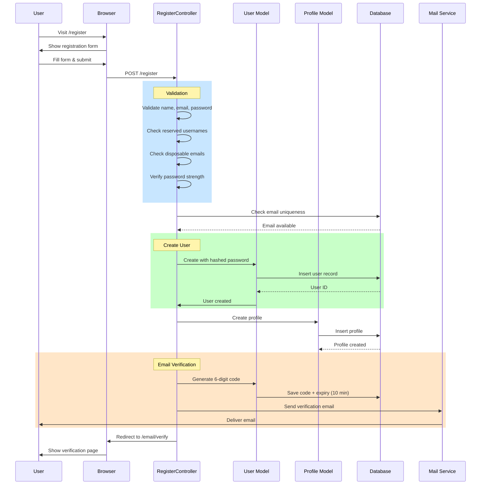
```mermaid
sequenceDiagram
    participant U as User
    participant B as Browser
    participant RC as RegisterController
    participant UserM as User Model
    participant ProfileM as Profile Model
    participant DB as Database
    participant Mail as Mail Service

    U->>B: Visit /register
    B->>U: Show registration form
    U->>B: Fill form & submit
    B->>RC: POST /register

    rect rgb(200, 230, 255)
        Note over RC: Validation
        RC->>RC: Validate name, email, password
        RC->>RC: Check reserved usernames
        RC->>RC: Check disposable emails
        RC->>RC: Verify password strength
    end

    RC->>DB: Check email uniqueness
    DB-->>RC: Email available

    rect rgb(200, 255, 200)
        Note over RC: Create User
        RC->>UserM: Create with hashed password
        UserM->>DB: Insert user record
        DB-->>UserM: User ID
        UserM->>RC: User created
    end

    RC->>ProfileM: Create profile
    ProfileM->>DB: Insert profile
    DB-->>ProfileM: Profile created

    rect rgb(255, 230, 200)
        Note over RC: Email Verification
        RC->>UserM: Generate 6-digit code
        UserM->>DB: Save code + expiry (10 min)
        RC->>Mail: Send verification email
        Mail->>U: Deliver email
    end

    RC->>B: Redirect to /email/verify
    B->>U: Show verification page
```

### 2. Login Flow

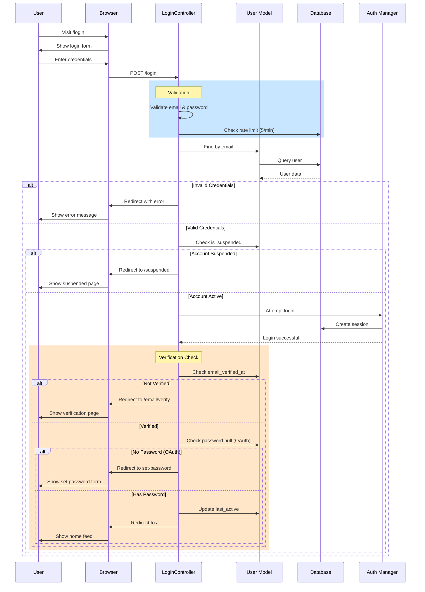
```mermaid
sequenceDiagram
    participant U as User
    participant B as Browser
    participant LC as LoginController
    participant UserM as User Model
    participant DB as Database
    participant Auth as Auth Manager

    U->>B: Visit /login
    B->>U: Show login form
    U->>B: Enter credentials
    B->>LC: POST /login

    rect rgb(200, 230, 255)
        Note over LC: Validation
        LC->>LC: Validate email & password
        LC->>DB: Check rate limit (5/min)
    end

    LC->>UserM: Find by email
    UserM->>DB: Query user
    DB-->>UserM: User data

    alt Invalid Credentials
        LC->>B: Redirect with error
        B->>U: Show error message
    else Valid Credentials
        LC->>UserM: Check is_suspended
        alt Account Suspended
            LC->>B: Redirect to /suspended
            B->>U: Show suspended page
        else Account Active
            LC->>Auth: Attempt login
            Auth->>DB: Create session
            Auth-->>LC: Login successful

            rect rgb(255, 230, 200)
                Note over LC: Verification Check
                LC->>UserM: Check email_verified_at
                alt Not Verified
                    LC->>B: Redirect to /email/verify
                    B->>U: Show verification page
                else Verified
                    LC->>UserM: Check password null (OAuth)
                    alt No Password (OAuth)
                        LC->>B: Redirect to set-password
                        B->>U: Show set password form
                    else Has Password
                        LC->>UserM: Update last_active
                        LC->>B: Redirect to /
                        B->>U: Show home feed
                    end
                end
            end
        end
    end
```

### 3. Create Post Flow

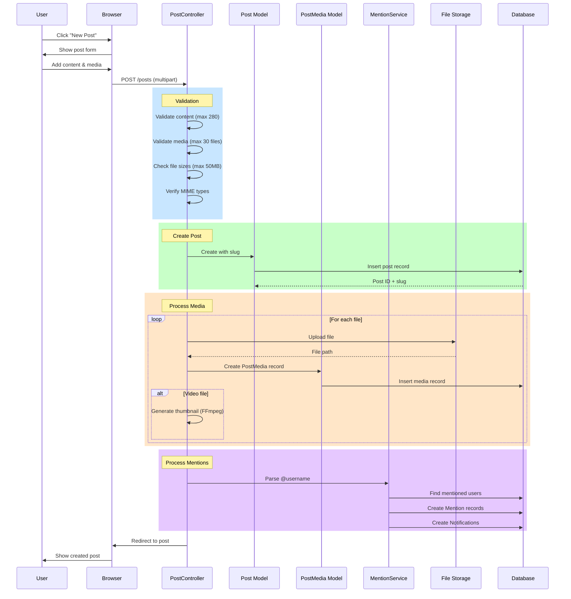
```mermaid
sequenceDiagram
    participant U as User
    participant B as Browser
    participant PC as PostController
    participant PostM as Post Model
    participant MediaM as PostMedia Model
    participant MentionS as MentionService
    participant Storage as File Storage
    participant DB as Database

    U->>B: Click "New Post"
    B->>U: Show post form
    U->>B: Add content & media
    B->>PC: POST /posts (multipart)

    rect rgb(200, 230, 255)
        Note over PC: Validation
        PC->>PC: Validate content (max 280)
        PC->>PC: Validate media (max 30 files)
        PC->>PC: Check file sizes (max 50MB)
        PC->>PC: Verify MIME types
    end

    rect rgb(200, 255, 200)
        Note over PC: Create Post
        PC->>PostM: Create with slug
        PostM->>DB: Insert post record
        DB-->>PostM: Post ID + slug
    end

    rect rgb(255, 230, 200)
        Note over PC: Process Media
        loop For each file
            PC->>Storage: Upload file
            Storage-->>PC: File path
            PC->>MediaM: Create PostMedia record
            MediaM->>DB: Insert media record
            alt Video file
                PC->>PC: Generate thumbnail (FFmpeg)
            end
        end
    end

    rect rgb(230, 200, 255)
        Note over PC: Process Mentions
        PC->>MentionS: Parse @username
        MentionS->>DB: Find mentioned users
        MentionS->>DB: Create Mention records
        MentionS->>DB: Create Notifications
    end

    PC->>B: Redirect to post
    B->>U: Show created post
```

### 4. Like Post Flow

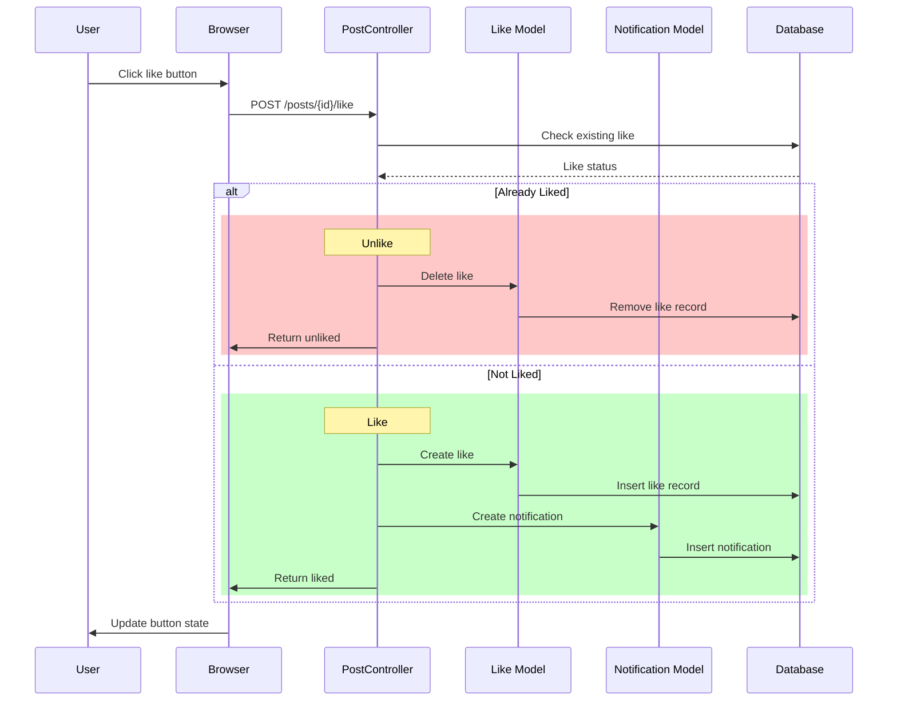
```mermaid
sequenceDiagram
    participant U as User
    participant B as Browser
    participant PC as PostController
    participant LikeM as Like Model
    participant NotifM as Notification Model
    participant DB as Database

    U->>B: Click like button
    B->>PC: POST /posts/{id}/like

    PC->>DB: Check existing like
    DB-->>PC: Like status

    alt Already Liked
        rect rgb(255, 200, 200)
            Note over PC: Unlike
            PC->>LikeM: Delete like
            LikeM->>DB: Remove like record
            PC->>B: Return unliked
        end
    else Not Liked
        rect rgb(200, 255, 200)
            Note over PC: Like
            PC->>LikeM: Create like
            LikeM->>DB: Insert like record
            PC->>NotifM: Create notification
            NotifM->>DB: Insert notification
            PC->>B: Return liked
        end
    end

    B->>U: Update button state
```

### 5. Send Message Flow

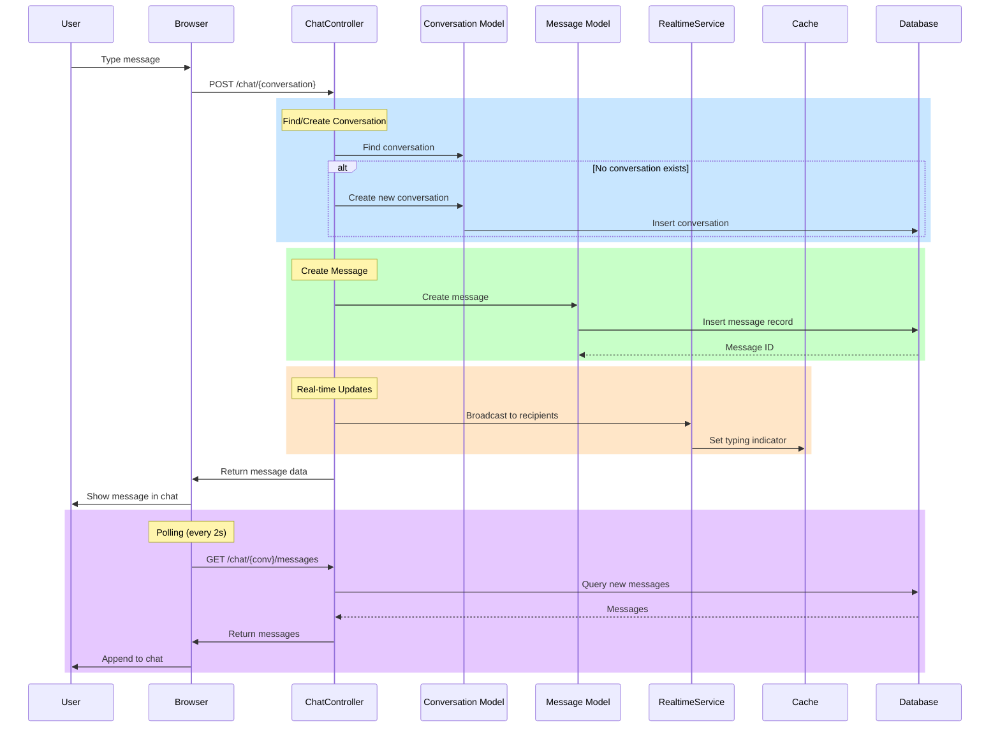
```mermaid
sequenceDiagram
    participant U as User
    participant B as Browser
    participant CC as ChatController
    participant ConvM as Conversation Model
    participant MsgM as Message Model
    participant RealtimeS as RealtimeService
    participant Cache as Cache
    participant DB as Database

    U->>B: Type message
    B->>CC: POST /chat/{conversation}

    rect rgb(200, 230, 255)
        Note over CC: Find/Create Conversation
        CC->>ConvM: Find conversation
        alt No conversation exists
            CC->>ConvM: Create new conversation
            ConvM->>DB: Insert conversation
        end
    end

    rect rgb(200, 255, 200)
        Note over CC: Create Message
        CC->>MsgM: Create message
        MsgM->>DB: Insert message record
        DB-->>MsgM: Message ID
    end

    rect rgb(255, 230, 200)
        Note over CC: Real-time Updates
        CC->>RealtimeS: Broadcast to recipients
        RealtimeS->>Cache: Set typing indicator
    end

    CC->>B: Return message data
    B->>U: Show message in chat

    rect rgb(230, 200, 255)
        Note over B: Polling (every 2s)
        B->>CC: GET /chat/{conv}/messages
        CC->>DB: Query new messages
        DB-->>CC: Messages
        CC->>B: Return messages
        B->>U: Append to chat
    end
```

### 6. Follow User Flow

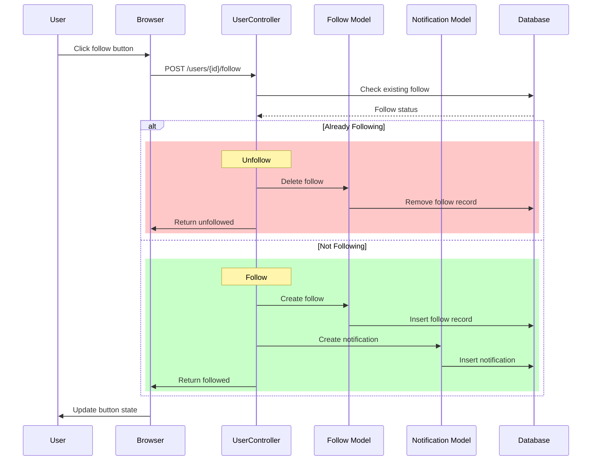
```mermaid
sequenceDiagram
    participant U as User
    participant B as Browser
    participant UC as UserController
    participant FollowM as Follow Model
    participant NotifM as Notification Model
    participant DB as Database

    U->>B: Click follow button
    B->>UC: POST /users/{id}/follow

    UC->>DB: Check existing follow
    DB-->>UC: Follow status

    alt Already Following
        rect rgb(255, 200, 200)
            Note over UC: Unfollow
            UC->>FollowM: Delete follow
            FollowM->>DB: Remove follow record
            UC->>B: Return unfollowed
        end
    else Not Following
        rect rgb(200, 255, 200)
            Note over UC: Follow
            UC->>FollowM: Create follow
            FollowM->>DB: Insert follow record
            UC->>NotifM: Create notification
            NotifM->>DB: Insert notification
            UC->>B: Return followed
        end
    end

    B->>U: Update button state
```

### 7. Create Story Flow

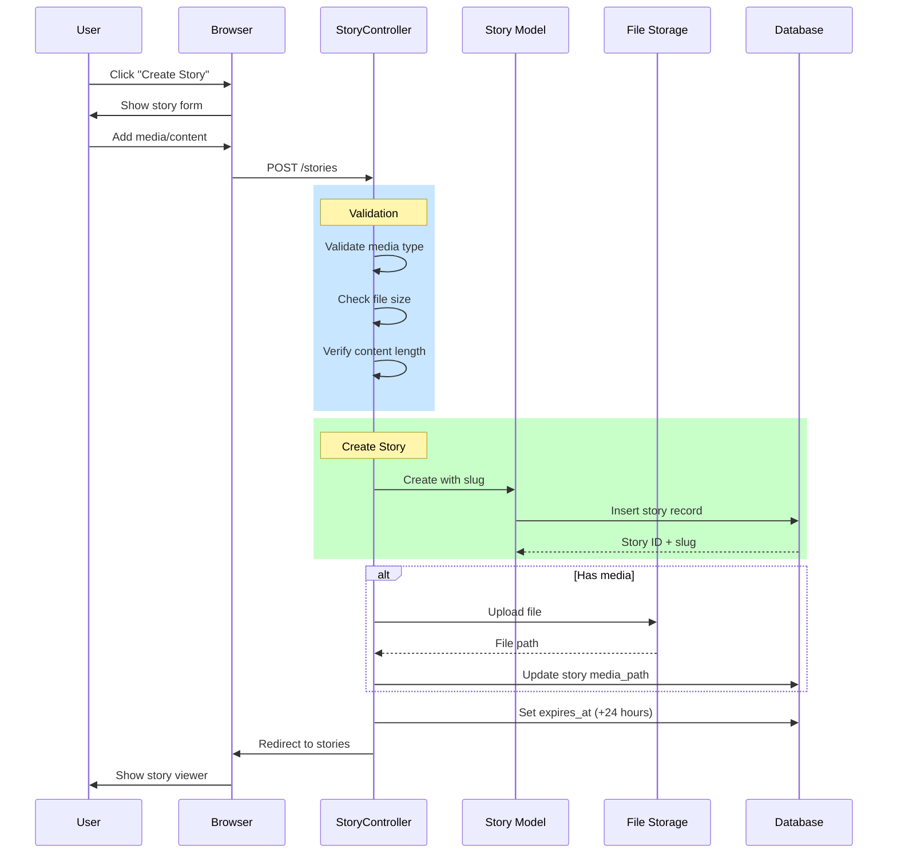
```mermaid
sequenceDiagram
    participant U as User
    participant B as Browser
    participant SC as StoryController
    participant StoryM as Story Model
    participant Storage as File Storage
    participant DB as Database

    U->>B: Click "Create Story"
    B->>U: Show story form
    U->>B: Add media/content
    B->>SC: POST /stories

    rect rgb(200, 230, 255)
        Note over SC: Validation
        SC->>SC: Validate media type
        SC->>SC: Check file size
        SC->>SC: Verify content length
    end

    rect rgb(200, 255, 200)
        Note over SC: Create Story
        SC->>StoryM: Create with slug
        StoryM->>DB: Insert story record
        DB-->>StoryM: Story ID + slug
    end

    alt Has media
        SC->>Storage: Upload file
        Storage-->>SC: File path
        SC->>DB: Update story media_path
    end

    SC->>DB: Set expires_at (+24 hours)
    SC->>B: Redirect to stories
    B->>U: Show story viewer
```

### 8. Admin Delete Post Flow

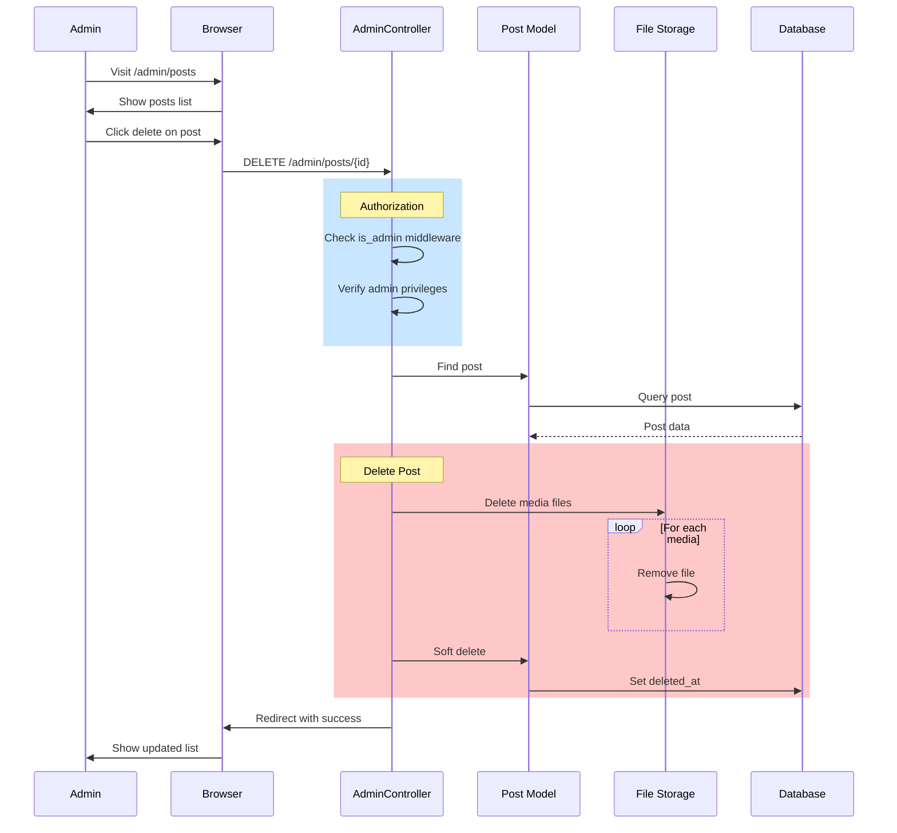
```mermaid
sequenceDiagram
    participant A as Admin
    participant B as Browser
    participant AC as AdminController
    participant PostM as Post Model
    participant Storage as File Storage
    participant DB as Database

    A->>B: Visit /admin/posts
    B->>A: Show posts list
    A->>B: Click delete on post
    B->>AC: DELETE /admin/posts/{id}

    rect rgb(200, 230, 255)
        Note over AC: Authorization
        AC->>AC: Check is_admin middleware
        AC->>AC: Verify admin privileges
    end

    AC->>PostM: Find post
    PostM->>DB: Query post
    DB-->>PostM: Post data

    rect rgb(255, 200, 200)
        Note over AC: Delete Post
        AC->>Storage: Delete media files
        loop For each media
            Storage->>Storage: Remove file
        end
        AC->>PostM: Soft delete
        PostM->>DB: Set deleted_at
    end

    AC->>B: Redirect with success
    B->>A: Show updated list
```

---

## Activity Diagrams

### 1. Post Creation Activity

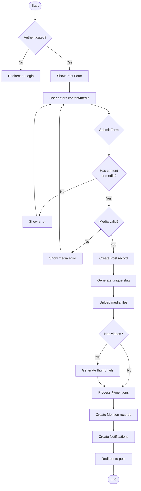
```mermaid
flowchart TD
    Start([Start]) --> CheckAuth{Authenticated?}
    CheckAuth -->|No| RedirectLogin[Redirect to Login]
    CheckAuth -->|Yes| ShowForm[Show Post Form]
    
    ShowForm --> UserInput[User enters content/media]
    UserInput --> Submit{Submit Form}
    
    Submit --> ValidateContent{Has content<br/>or media?}
    ValidateContent -->|No| ShowError1[Show error]
    ShowError1 --> UserInput
    
    ValidateContent -->|Yes| ValidateMedia{Media valid?}
    ValidateMedia -->|No| ShowError2[Show media error]
    ShowError2 --> UserInput
    
    ValidateMedia -->|Yes| CreatePost[Create Post record]
    CreatePost --> GenerateSlug[Generate unique slug]
    GenerateSlug --> UploadMedia[Upload media files]
    
    UploadMedia --> ProcessVideos{Has videos?}
    ProcessVideos -->|Yes| GenerateThumbs[Generate thumbnails]
    ProcessVideos -->|No| ProcessMentions
    GenerateThumbs --> ProcessMentions
    
    ProcessMentions[Process @mentions] --> CreateMentions[Create Mention records]
    CreateMentions --> CreateNotifs[Create Notifications]
    CreateNotifs --> Redirect[Redirect to post]
    Redirect --> End([End])
```

### 2. User Authentication Activity

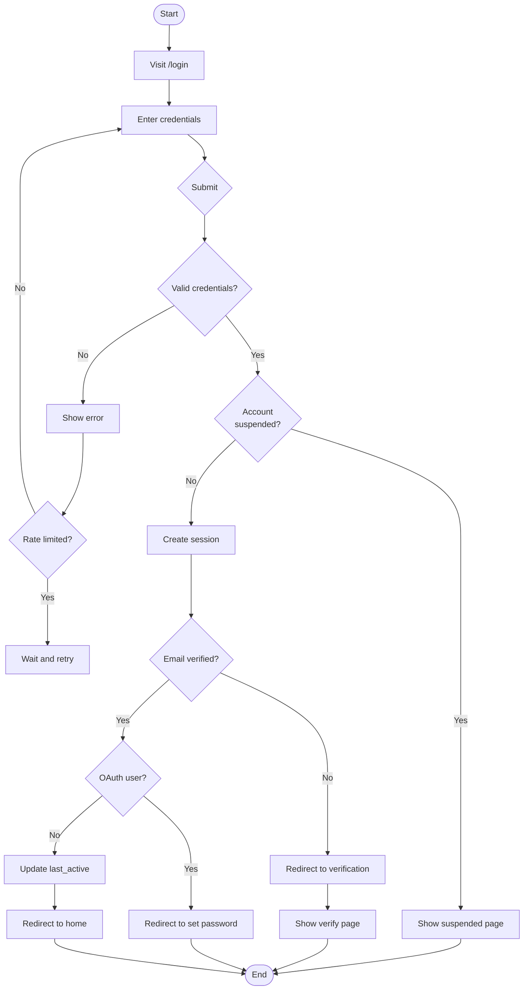
```mermaid
flowchart TD
    Start([Start]) --> VisitLogin[Visit /login]
    VisitLogin --> EnterCreds[Enter credentials]
    EnterCreds --> Submit{Submit}
    
    Submit --> Validate{Valid credentials?}
    Validate -->|No| ShowError[Show error]
    ShowError --> RateLimit{Rate limited?}
    RateLimit -->|Yes| Wait[Wait and retry]
    RateLimit -->|No| EnterCreds
    
    Validate -->|Yes| CheckSuspended{Account<br/>suspended?}
    CheckSuspended -->|Yes| ShowSuspended[Show suspended page]
    ShowSuspended --> End([End])
    
    CheckSuspended -->|No| CreateSession[Create session]
    CreateSession --> CheckVerified{Email verified?}
    
    CheckVerified -->|No| RedirectVerify[Redirect to verification]
    RedirectVerify --> ShowVerify[Show verify page]
    ShowVerify --> End
    
    CheckVerified -->|Yes| CheckOAuth{OAuth user?}
    CheckOAuth -->|Yes| RedirectSetPwd[Redirect to set password]
    RedirectSetPwd --> End
    
    CheckOAuth -->|No| UpdateActive[Update last_active]
    UpdateActive --> RedirectHome[Redirect to home]
    RedirectHome --> End
```

### 3. Message Sending Activity

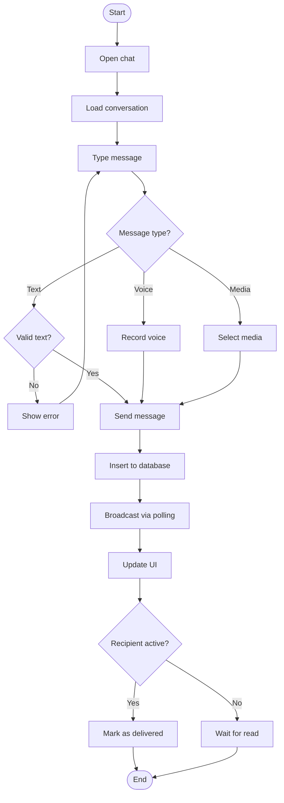
```mermaid
flowchart TD
    Start([Start]) --> OpenChat[Open chat]
    OpenChat --> LoadConv[Load conversation]
    LoadConv --> TypeMsg[Type message]
    
    TypeMsg --> CheckType{Message type?}
    CheckType -->|Text| ValidateText{Valid text?}
    CheckType -->|Voice| RecordVoice[Record voice]
    CheckType -->|Media| SelectMedia[Select media]
    
    ValidateText -->|No| ShowError1[Show error]
    ShowError1 --> TypeMsg
    
    ValidateText -->|Yes| SendMessage[Send message]
    RecordVoice --> SendMessage
    SelectMedia --> SendMessage
    
    SendMessage --> InsertDB[Insert to database]
    InsertDB --> Broadcast[Broadcast via polling]
    Broadcast --> UpdateUI[Update UI]
    
    UpdateUI --> CheckRead{Recipient active?}
    CheckRead -->|Yes| MarkDelivered[Mark as delivered]
    CheckRead -->|No| WaitRead[Wait for read]
    
    MarkDelivered --> End([End])
    WaitRead --> End
```

---

## Component Diagram

This diagram shows the high-level architecture components and their relationships.

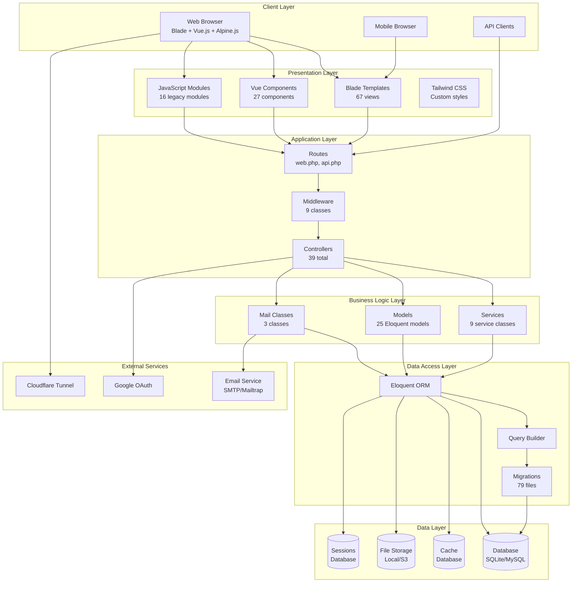
```mermaid
flowchart TB
    subgraph "Client Layer"
        Browser[Web Browser<br/>Blade + Vue.js + Alpine.js]
        Mobile[Mobile Browser]
        API[API Clients]
    end

    subgraph "Presentation Layer"
        Blade[Blade Templates<br/>67 views]
        Vue[Vue Components<br/>27 components]
        JS[JavaScript Modules<br/>16 legacy modules]
        CSS[Tailwind CSS<br/>Custom styles]
    end

    subgraph "Application Layer"
        Routes[Routes<br/>web.php, api.php]
        Middleware[Middleware<br/>9 classes]
        Controllers[Controllers<br/>39 total]
    end

    subgraph "Business Logic Layer"
        Services[Services<br/>9 service classes]
        Models[Models<br/>25 Eloquent models]
        Mail[Mail Classes<br/>3 classes]
    end

    subgraph "Data Access Layer"
        Eloquent[Eloquent ORM]
        QueryBuilder[Query Builder]
        Migrations[Migrations<br/>79 files]
    end

    subgraph "Data Layer"
        Database[(Database<br/>SQLite/MySQL)]
        Cache[(Cache<br/>Database)]
        Storage[(File Storage<br/>Local/S3)]
        Sessions[(Sessions<br/>Database)]
    end

    subgraph "External Services"
        Google[Google OAuth]
        MailService[Email Service<br/>SMTP/Mailtrap]
        Cloudflare[Cloudflare Tunnel]
    end

    Browser --> Blade
    Browser --> Vue
    Browser --> JS
    Mobile --> Blade
    API --> Routes

    Blade --> Routes
    Vue --> Routes
    JS --> Routes

    Routes --> Middleware
    Middleware --> Controllers

    Controllers --> Services
    Controllers --> Models
    Controllers --> Mail

    Services --> Eloquent
    Models --> Eloquent
    Mail --> Eloquent

    Eloquent --> QueryBuilder
    QueryBuilder --> Migrations

    Migrations --> Database
    Eloquent --> Database
    Eloquent --> Cache
    Eloquent --> Storage
    Eloquent --> Sessions

    Controllers --> Google
    Mail --> MailService
    Browser --> Cloudflare
```

---

## Deployment Diagram

This diagram shows the physical deployment architecture.

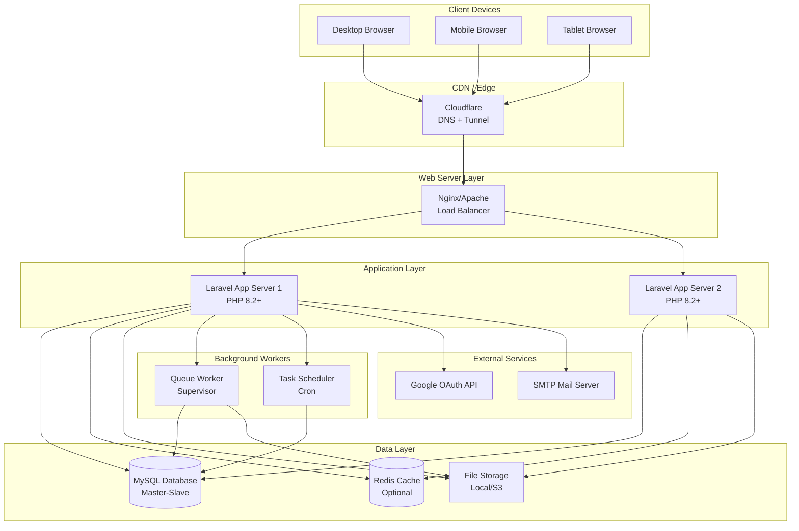
```mermaid
flowchart TB
    subgraph "Client Devices"
        Desktop[Desktop Browser]
        Mobile[Mobile Browser]
        Tablet[Tablet Browser]
    end

    subgraph "CDN / Edge"
        Cloudflare[Cloudflare<br/>DNS + Tunnel]
    end

    subgraph "Web Server Layer"
        Nginx[Nginx/Apache<br/>Load Balancer]
    end

    subgraph "Application Layer"
        AppServer1[Laravel App Server 1<br/>PHP 8.2+]
        AppServer2[Laravel App Server 2<br/>PHP 8.2+]
    end

    subgraph "Background Workers"
        QueueWorker[Queue Worker<br/>Supervisor]
        Scheduler[Task Scheduler<br/>Cron]
    end

    subgraph "Data Layer"
        MySQL[(MySQL Database<br/>Master-Slave)]
        Redis[(Redis Cache<br/>Optional)]
        FileStorage[File Storage<br/>Local/S3]
    end

    subgraph "External Services"
        Google[Google OAuth API]
        SMTP[SMTP Mail Server]
    end

    Desktop --> Cloudflare
    Mobile --> Cloudflare
    Tablet --> Cloudflare

    Cloudflare --> Nginx

    Nginx --> AppServer1
    Nginx --> AppServer2

    AppServer1 --> MySQL
    AppServer1 --> Redis
    AppServer1 --> FileStorage
    AppServer1 --> QueueWorker
    AppServer1 --> Scheduler

    AppServer2 --> MySQL
    AppServer2 --> Redis
    AppServer2 --> FileStorage

    QueueWorker --> MySQL
    QueueWorker --> FileStorage

    Scheduler --> MySQL

    AppServer1 --> Google
    AppServer1 --> SMTP
```

---

## State Machine Diagrams

### 1. User Account State

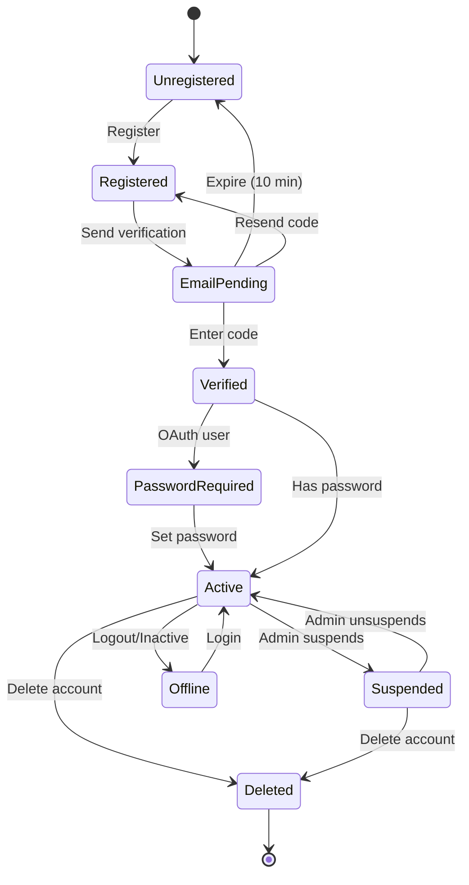
```mermaid
stateDiagram-v2
    [*] --> Unregistered

    Unregistered --> Registered: Register
    Registered --> EmailPending: Send verification
    EmailPending --> Verified: Enter code
    EmailPending --> Unregistered: Expire (10 min)
    EmailPending --> Registered: Resend code
    
    Verified --> PasswordRequired: OAuth user
    PasswordRequired --> Active: Set password
    
    Verified --> Active: Has password
    Active --> Suspended: Admin suspends
    Suspended --> Active: Admin unsuspends
    
    Active --> Offline: Logout/Inactive
    Offline --> Active: Login
    
    Active --> Deleted: Delete account
    Suspended --> Deleted: Delete account
    
    Deleted --> [*]
```

### 2. Post State

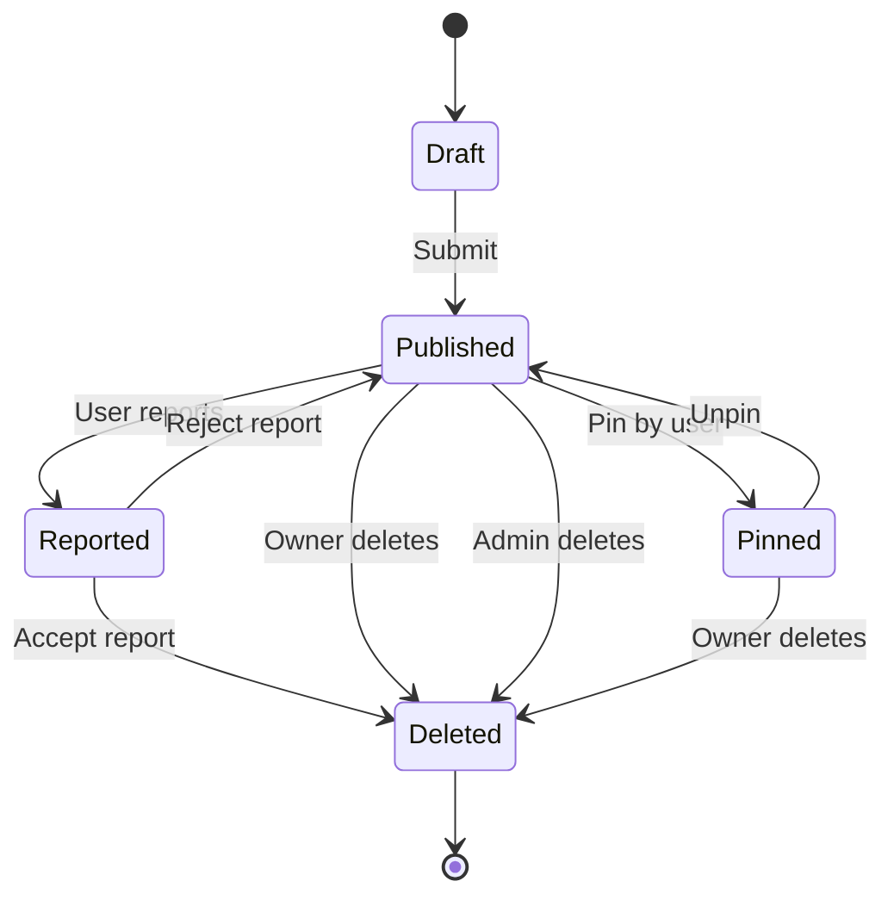
```mermaid
stateDiagram-v2
    [*] --> Draft

    Draft --> Published: Submit
    Published --> Pinned: Pin by user
    Pinned --> Published: Unpin
    Published --> Reported: User reports
    Reported --> Published: Reject report
    Reported --> Deleted: Accept report
    Published --> Deleted: Owner deletes
    Published --> Deleted: Admin deletes
    Pinned --> Deleted: Owner deletes
    
    Deleted --> [*]
```

### 3. Story State

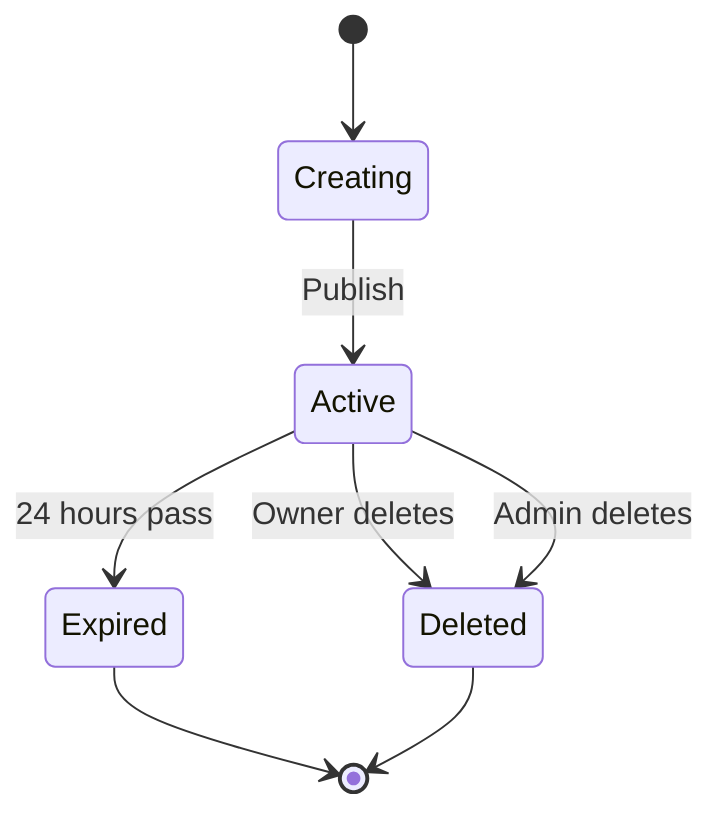
```mermaid
stateDiagram-v2
    [*] --> Creating

    Creating --> Active: Publish
    Active --> Expired: 24 hours pass
    Active --> Deleted: Owner deletes
    Active --> Deleted: Admin deletes
    
    Expired --> [*]
    Deleted --> [*]
```

### 4. Message State

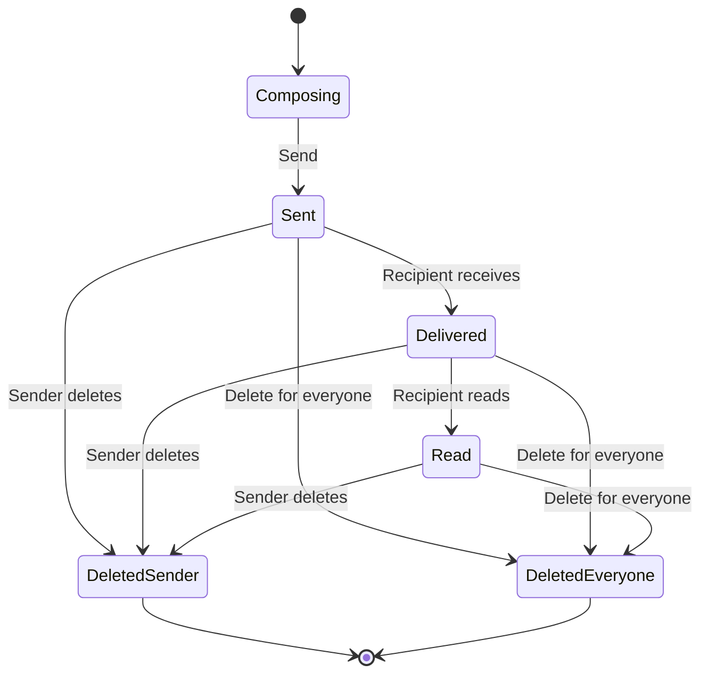
```mermaid
stateDiagram-v2
    [*] --> Composing

    Composing --> Sent: Send
    Sent --> Delivered: Recipient receives
    Delivered --> Read: Recipient reads
    
    Sent --> DeletedSender: Sender deletes
    Delivered --> DeletedSender: Sender deletes
    Read --> DeletedSender: Sender deletes
    
    Sent --> DeletedEveryone: Delete for everyone
    Delivered --> DeletedEveryone: Delete for everyone
    Read --> DeletedEveryone: Delete for everyone
    
    DeletedSender --> [*]
    DeletedEveryone --> [*]
```

### 5. Conversation State

```mermaid
stateDiagram-v2
    [*] --> Inactive

    Inactive --> Active: First message
    Active --> Inactive: No activity
    
    Active --> HasUnread: New message
    HasUnread --> Active: Message read
    HasUnread --> Inactive: Message read + no activity
    
    Active --> Deleted: All participants delete
    Inactive --> Deleted: All participants delete
```

### 6. Group Member State

```mermaid
stateDiagram-v2
    [*] --> Invited: Receive invite

    Invited --> Member: Accept invite
    Invited --> [*]: Decline/Expire
    
    Member --> Admin: Promoted by admin
    Admin --> Member: Demoted by admin
    
    Member --> Left: Leave group
    Admin --> Left: Leave group
    Member --> Removed: Removed by admin
    Admin --> Removed: Removed by admin
    
    Left --> [*]
    Removed --> [*]
```

---

## Component Interaction Matrix

| Component | Routes | Controllers | Services | Models | Middleware |
|-----------|--------|-------------|----------|--------|------------|
| **Routes** | - | ✓ | ✓ | ✓ | ✓ |
| **Controllers** | ✓ | - | ✓ | ✓ | ✓ |
| **Services** | - | ✓ | - | ✓ | - |
| **Models** | - | ✓ | ✓ | - | - |
| **Middleware** | ✓ | ✓ | - | - | - |

---

## Technology Stack Diagram

```mermaid
flowchart LR
    subgraph "Frontend Stack"
        direction TB
        F1[Blade Templates<br/>Server-side rendering]
        F2[Vue.js 3.4<br/>Reactive components]
        F3[Alpine.js<br/>Lightweight interactivity]
        F4[Tailwind CSS 3.2<br/>Utility classes]
        F5[Axios<br/>HTTP client]
    end

    subgraph "Build Tools"
        direction TB
        B1[Vite 6.4<br/>Build tool]
        B2[TypeScript 5.6<br/>Type checking]
        B3[ESLint<br/>Linting]
        B4[Prettier<br/>Formatting]
        B5[JS Obfuscator<br/>Code protection]
    end

    subgraph "Backend Stack"
        direction TB
        BK1[Laravel 12<br/>Framework]
        BK2[PHP 8.2+<br/>Runtime]
        BK3[Eloquent ORM<br/>Database]
        BK4[Sanctum<br/>API Auth]
        BK5[Socialite<br/>OAuth]
    end

    subgraph "Data Storage"
        direction TB
        D1[SQLite/MySQL<br/>Primary DB]
        D2[Database Cache<br/>Caching]
        D3[File System<br/>Media storage]
        D4[Database Sessions<br/>Session mgmt]
    end

    subgraph "External Services"
        direction TB
        E1[Google OAuth<br/>Social login]
        E2[SMTP Server<br/>Email delivery]
        E3[FFmpeg<br/>Video processing]
    end

    F1 --> B1
    F2 --> B1
    F3 --> B1
    F4 --> B1
    F5 --> B1

    B1 --> BK1
    BK1 --> BK2
    BK1 --> BK3
    BK1 --> BK4
    BK1 --> BK5

    BK3 --> D1
    BK1 --> D2
    BK1 --> D3
    BK1 --> D4

    BK5 --> E1
    BK1 --> E2
    BK1 --> E3
```

---

## Data Flow Diagrams

### 1. Read Operations (Feed Loading)

```mermaid
flowchart LR
    U[User] -->|Request| B[Browser]
    B -->|HTTP GET /| LC[Laravel Controller]
    LC -->|Auth Check| M[Middleware]
    M -->|Query| PM[Post Model]
    PM -->|Eloquent Query| DB[(Database)]
    DB -->|Posts Data| PM
    PM -->|Eager Load| UR[User Relations]
    PM -->|Eager Load| MR[Media Relations]
    PM -->|Eager Load| LR[Like Relations]
    UR --> DB
    MR --> DB
    LR --> DB
    DB -->|Related Data| PM
    PM -->|Collection| LC
    LC -->|Blade View| B
    B -->|Render| U
```

### 2. Write Operations (Post Creation)

```mermaid
flowchart LR
    U[User] -->|Submit Form| B[Browser]
    B -->|POST /posts| LC[PostController]
    LC -->|Validate| VR[Validation Rules]
    VR -->|Valid| PM[Post Model]
    PM -->|Insert| DB[(Database)]
    DB -->|Post ID| PM
    PM -->|Upload| FS[File Storage]
    FS -->|Paths| PMM[PostMedia Model]
    PMM -->|Insert| DB
    PM -->|Parse| MS[MentionService]
    MS -->|Create| MN[Mention Model]
    MN -->|Insert| DB
    MS -->|Notify| NM[Notification Model]
    NM -->|Insert| DB
    DB -->|Success| LC
    LC -->|Redirect| B
    B -->|Show| U
```

---

## Performance Optimization Diagram

```mermaid
flowchart TB
    subgraph "Caching Strategy"
        C1[Config Cache<br/>php artisan config:cache]
        C2[Route Cache<br/>php artisan route:cache]
        C3[View Cache<br/>php artisan view:cache]
        C4[Query Cache<br/>Database cache driver]
    end

    subgraph "Database Optimization"
        D1[Indexes on FKs]
        D2[Composite Indexes]
        D3[Query Optimization]
        D4[Eager Loading]
    end

    subgraph "Frontend Optimization"
        F1[Vite Build]
        F2[Code Splitting]
        F3[Lazy Loading]
        F4[Asset Minification]
    end

    subgraph "Real-time Optimization"
        R1[Polling Intervals<br/>1-10 seconds]
        R2[Conditional Polling<br/>Page visibility]
        R3[Batch Requests<br/>User status]
        R4[Cache Typing<br/>5 second TTL]
    end

    C1 --> D1
    C2 --> D2
    C3 --> F1
    C4 --> D3
    D4 --> R1
    F2 --> R2
    F3 --> R3
    F4 --> R4
```

---

## Security Architecture Diagram

```mermaid
flowchart TB
    subgraph "Security Layers"
        L1[Network Layer<br/>HTTPS, Cloudflare]
        L2[Application Layer<br/>Middleware, Rate Limiting]
        L3[Data Layer<br/>Validation, ORM]
        L4[Business Logic<br/>Authorization, Privacy]
    end

    subgraph "Authentication Security"
        A1[Password Hashing<br/>Bcrypt 12 rounds]
        A2[Email Verification<br/>6-digit code]
        A3[Rate Limiting<br/>5 attempts/min]
        A4[Session Security<br/>HTTP-only cookies]
    end

    subgraph "Authorization"
        Z1[Middleware Guards<br/>auth, admin, verified]
        Z2[Policy Checks<br/>Owner or Admin]
        Z3[Privacy Controls<br/>Private accounts]
        Z4[User Blocking<br/>Content filtering]
    end

    subgraph "Data Protection"
        P1[CSRF Protection<br/>Token validation]
        P2[XSS Prevention<br/>Blade escaping]
        P3[SQL Injection<br/>Eloquent ORM]
        P4[File Upload<br/>MIME validation]
    end

    L1 --> L2
    L2 --> L3
    L3 --> L4

    A1 --> Z1
    A2 --> Z2
    A3 --> Z3
    A4 --> Z4

    Z1 --> P1
    Z2 --> P2
    Z3 --> P3
    Z4 --> P4
```

---

## Module Dependency Graph

```mermaid
flowchart LR
    subgraph "Core Modules"
        C1[User Module]
        C2[Post Module]
        C3[Comment Module]
    end

    subgraph "Social Modules"
        S1[Follow Module]
        S2[Block Module]
        S3[Story Module]
    end

    subgraph "Communication Modules"
        M1[Chat Module]
        M2[Notification Module]
        M3[Group Module]
    end

    subgraph "Admin Modules"
        A1[Report Module]
        A2[Admin Panel]
        A3[Activity Log]
    end

    C1 --> C2
    C1 --> C3
    C1 --> S1
    C1 --> S2
    C1 --> S3
    C1 --> M1
    C1 --> M2
    C1 --> M3

    C2 --> C3
    C2 --> S3
    C2 --> A1

    C3 --> M2

    S1 --> M2
    S3 --> M2

    M1 --> M2
    M3 --> M1
    M3 --> M2

    A1 --> A2
    A3 --> A2
```

---

**Nexus - Complete UML Documentation**

Last Updated: March 27, 2026 | Laravel 12.x | PHP 8.2+

