# Nexus - Complete Feature Flows & Diagrams

Every function and feature flow documented with detailed step-by-step processes and visual diagrams.

---

## Table of Contents

1. [Authentication Flows](#1-authentication-flows)
2. [Post Flows](#2-post-flows)
3. [Story Flows](#3-story-flows)
4. [Chat & Messaging Flows](#4-chat--messaging-flows)
5. [Comment Flows](#5-comment-flows)
6. [Social Interaction Flows](#6-social-interaction-flows)
7. [Group Flows](#7-group-flows)
8. [Notification Flows](#8-notification-flows)
9. [Admin Flows](#9-admin-flows)
10. [AI Assistant Flows](#10-ai-assistant-flows)

---

## 1. Authentication Flows

### 1.1 Registration Flow

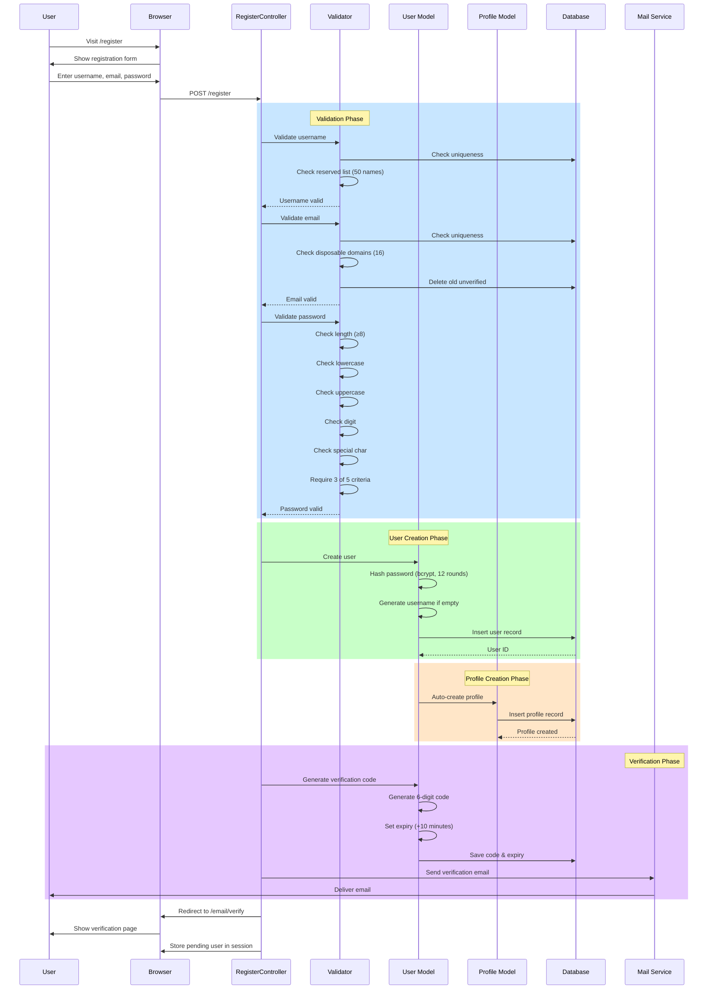
```mermaid
sequenceDiagram
    participant U as User
    participant B as Browser
    participant RC as RegisterController
    participant V as Validator
    participant UM as User Model
    participant PM as Profile Model
    participant DB as Database
    participant M as Mail Service

    U->>B: Visit /register
    B->>U: Show registration form
    
    U->>B: Enter username, email, password
    B->>RC: POST /register
    
    rect rgb(200, 230, 255)
        Note over V: Validation Phase
        RC->>V: Validate username
        V->>DB: Check uniqueness
        V->>V: Check reserved list (50 names)
        V-->>RC: Username valid
        
        RC->>V: Validate email
        V->>DB: Check uniqueness
        V->>V: Check disposable domains (16)
        V->>DB: Delete old unverified
        V-->>RC: Email valid
        
        RC->>V: Validate password
        V->>V: Check length (≥8)
        V->>V: Check lowercase
        V->>V: Check uppercase
        V->>V: Check digit
        V->>V: Check special char
        V->>V: Require 3 of 5 criteria
        V-->>RC: Password valid
    end
    
    rect rgb(200, 255, 200)
        Note over UM: User Creation Phase
        RC->>UM: Create user
        UM->>UM: Hash password (bcrypt, 12 rounds)
        UM->>UM: Generate username if empty
        UM->>DB: Insert user record
        DB-->>UM: User ID
    end
    
    rect rgb(255, 230, 200)
        Note over PM: Profile Creation Phase
        UM->>PM: Auto-create profile
        PM->>DB: Insert profile record
        DB-->>PM: Profile created
    end
    
    rect rgb(230, 200, 255)
        Note over M: Verification Phase
        RC->>UM: Generate verification code
        UM->>UM: Generate 6-digit code
        UM->>UM: Set expiry (+10 minutes)
        UM->>DB: Save code & expiry
        RC->>M: Send verification email
        M->>U: Deliver email
    end
    
    RC->>B: Redirect to /email/verify
    B->>U: Show verification page
    RC->>B: Store pending user in session
```

**Code Implementation:**
```php
// app/Http/Controllers/Auth/RegisterController.php
public function store(Request $request)
{
    // 1. Validation (50 reserved usernames, 16 blocked domains)
    $validated = $request->validate([
        'username' => ['required', 'unique:users', 'regex:/^[a-zA-Z0-9_-]+$/'],
        'email' => ['required', 'unique:users', 'email'],
        'password' => ['required', 'min:8', 'confirmed', 'strength:3/5'],
    ]);
    
    // 2. Create user with hashed password
    $user = User::create([
        'username' => $validated['username'],
        'email' => $validated['email'],
        'password' => Hash::make($validated['password']),
    ]);
    
    // 3. Auto-create profile (User model boot)
    // Profile::create(['user_id' => $user->id]);
    
    // 4. Generate & send verification code
    $code = $user->generateVerificationCode(); // 6 digits, 10 min expiry
    Mail::to($user->email)->send(new VerificationCodeMail($code));
    
    // 5. Redirect to verification
    session(['pending_verification_user_id' => $user->id]);
    return redirect()->route('verification.notice');
}
```

---

### 1.2 Login Flow

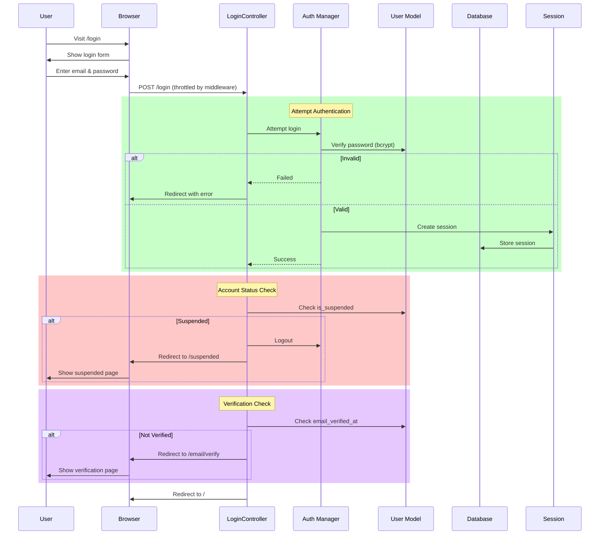
```mermaid
sequenceDiagram
    participant U as User
    participant B as Browser
    participant LC as LoginController
    participant Auth as Auth Manager
    participant UM as User Model
    participant DB as Database
    participant S as Session

    U->>B: Visit /login
    B->>U: Show login form
    
    U->>B: Enter email & password
    B->>LC: POST /login (throttled by middleware)

    rect rgb(200, 255, 200)
        Note over Auth: Attempt Authentication
        LC->>Auth: Attempt login
        Auth->>UM: Verify password (bcrypt)
        alt Invalid
            Auth-->>LC: Failed
            LC->>B: Redirect with error
        else Valid
            Auth->>S: Create session
            S->>DB: Store session
            Auth-->>LC: Success
        end
    end

    rect rgb(255, 200, 200)
        Note over LC: Account Status Check
        LC->>UM: Check is_suspended
        alt Suspended
            LC->>Auth: Logout
            LC->>B: Redirect to /suspended
            B->>U: Show suspended page
        end
    end

    rect rgb(230, 200, 255)
        Note over LC: Verification Check
        LC->>UM: Check email_verified_at
        alt Not Verified
            LC->>B: Redirect to /email/verify
            B->>U: Show verification page
        end
    end

    LC->>B: Redirect to /
```

**Code Implementation:**
```php
// app/Http/Controllers/Auth/LoginController.php
public function store(Request $request)
{
    // Note: Rate limiting (5 attempts/min) is handled by middleware
    
    $request->validate([
        'email' => 'required|email',
        'password' => 'required',
    ]);

    // Attempt authentication
    if (Auth::attempt($request->only('email', 'password'), $request->boolean('remember'))) {
        $request->session()->regenerate();
        $user = Auth::user();
        
        // Check suspension after login
        if ($user->is_suspended) {
            Auth::logout();
            $request->session()->invalidate();
            $request->session()->regenerateToken();
            return redirect()->route('login.view')->with('suspended', true);
        }
        
        // Check verification
        if (!$user->hasVerifiedEmail()) {
            return redirect()->route('verification.notice');
        }
        
        return redirect()->intended('/');
    }
    
    return back()->withErrors(['email' => 'Invalid credentials']);
}
```

---

### 1.3 Email Verification Flow

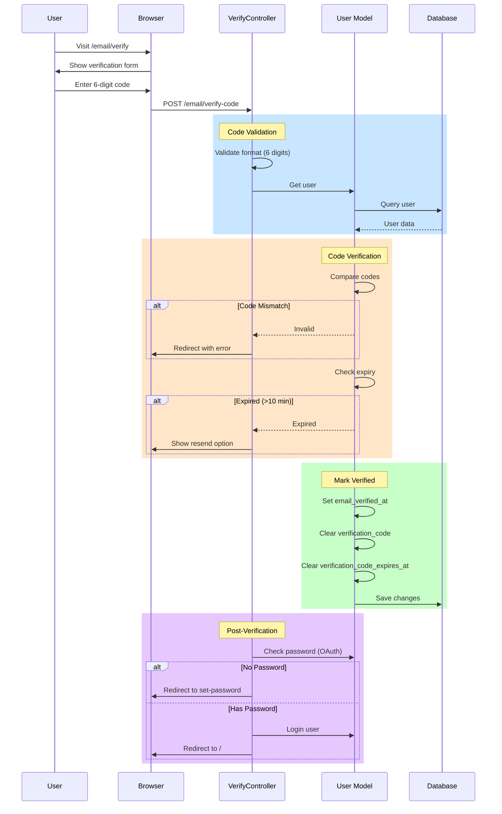
```mermaid
sequenceDiagram
    participant U as User
    participant B as Browser
    participant VC as VerifyController
    participant UM as User Model
    participant DB as Database

    U->>B: Visit /email/verify
    B->>U: Show verification form
    
    U->>B: Enter 6-digit code
    B->>VC: POST /email/verify-code
    
    rect rgb(200, 230, 255)
        Note over VC: Code Validation
        VC->>VC: Validate format (6 digits)
        VC->>UM: Get user
        UM->>DB: Query user
        DB-->>UM: User data
    end
    
    rect rgb(255, 230, 200)
        Note over UM: Code Verification
        UM->>UM: Compare codes
        alt Code Mismatch
            UM-->>VC: Invalid
            VC->>B: Redirect with error
        end
        
        UM->>UM: Check expiry
        alt Expired (>10 min)
            UM-->>VC: Expired
            VC->>B: Show resend option
        end
    end
    
    rect rgb(200, 255, 200)
        Note over UM: Mark Verified
        UM->>UM: Set email_verified_at
        UM->>UM: Clear verification_code
        UM->>UM: Clear verification_code_expires_at
        UM->>DB: Save changes
    end
    
    rect rgb(230, 200, 255)
        Note over VC: Post-Verification
        VC->>UM: Check password (OAuth)
        alt No Password
            VC->>B: Redirect to set-password
        else Has Password
            VC->>UM: Login user
            VC->>B: Redirect to /
        end
    end
```

**Code Implementation:**
```php
// app/Models/User.php
public function verifyCode($code)
{
    // 1. Check code match
    if ($this->verification_code !== $code) {
        return false;
    }
    
    // 2. Check expiry (10 minutes)
    if (now()->isAfter($this->verification_code_expires_at)) {
        return false;
    }
    
    // 3. Mark as verified
    $this->email_verified_at = now();
    $this->verification_code = null;
    $this->verification_code_expires_at = null;
    $this->save();
    
    return true;
}

// routes/web.php
Route::post('/email/verify-code', function (Request $request) {
    $request->validate(['code' => 'required|string|size:6|regex:/^\d{6}$/']);
    
    $user = auth()->user() ?? User::find(session('pending_verification_user_id'));
    
    if ($user->verifyCode($request->code)) {
        session()->forget('pending_verification_user_id');
        
        if (!$user->password) {
            return redirect()->route('password.set-password');
        }
        
        auth()->login($user);
        return redirect('/')->with('message', 'Email verified!');
    }
    
    return back()->withErrors(['code' => 'Invalid code']);
});
```

---

### 1.4 Google OAuth Flow

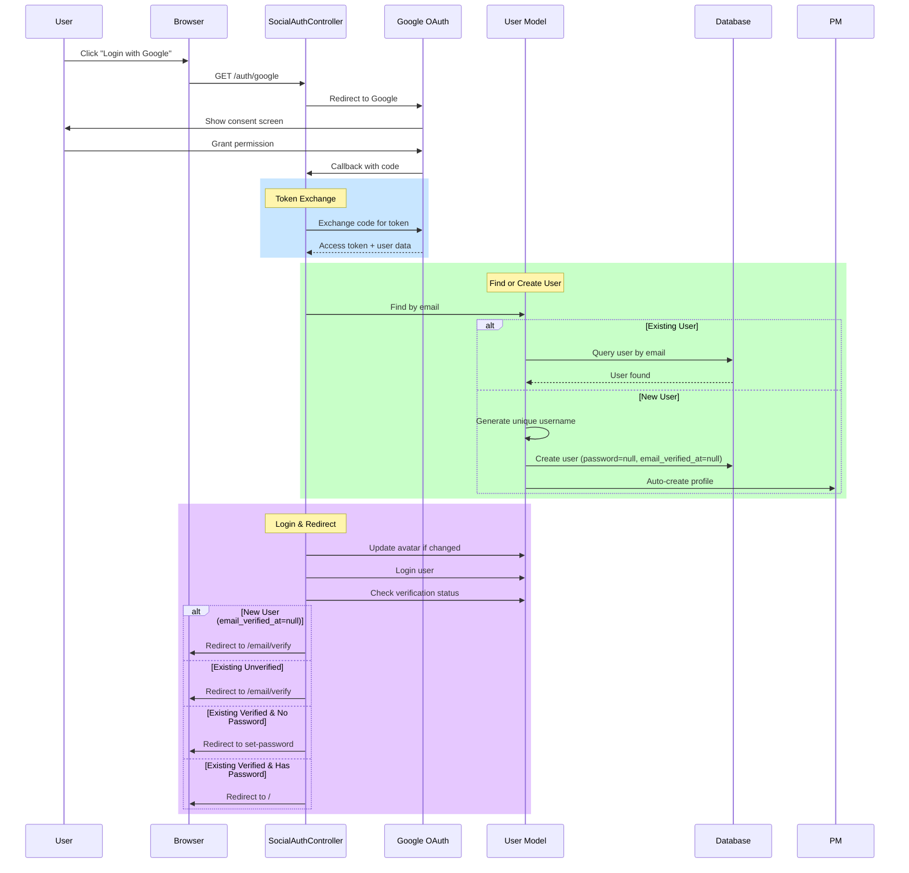
```mermaid
sequenceDiagram
    participant U as User
    participant B as Browser
    participant SA as SocialAuthController
    participant G as Google OAuth
    participant UM as User Model
    participant DB as Database

    U->>B: Click "Login with Google"
    B->>SA: GET /auth/google
    SA->>G: Redirect to Google
    
    G->>U: Show consent screen
    U->>G: Grant permission
    G->>SA: Callback with code
    
    rect rgb(200, 230, 255)
        Note over SA: Token Exchange
        SA->>G: Exchange code for token
        G-->>SA: Access token + user data
    end
    
    rect rgb(200, 255, 200)
        Note over UM: Find or Create User
        SA->>UM: Find by email
        alt Existing User
            UM->>DB: Query user by email
            DB-->>UM: User found
        else New User
            UM->>UM: Generate unique username
            UM->>DB: Create user (password=null, email_verified_at=null)
            UM->>PM: Auto-create profile
        end
    end

    rect rgb(230, 200, 255)
        Note over SA: Login & Redirect
        SA->>UM: Update avatar if changed
        SA->>UM: Login user
        SA->>UM: Check verification status
        alt New User (email_verified_at=null)
            SA->>B: Redirect to /email/verify
        else Existing Unverified
            SA->>B: Redirect to /email/verify
        else Existing Verified & No Password
            SA->>B: Redirect to set-password
        else Existing Verified & Has Password
            SA->>B: Redirect to /
        end
    end
```

**Code Implementation:**
```php
// app/Http/Controllers/Auth/SocialAuthController.php
public function handleGoogleCallback()
{
    // 1. Get Google user data
    $googleUser = Socialite::driver('google')->user();

    // 2. Find or create user
    $user = User::where('email', $googleUser->email)->first();

    if (!$user) {
        // Generate username from name
        $baseUsername = strtolower(preg_replace('/[^a-zA-Z0-9]/', '', $googleUser->name));
        if (empty($baseUsername)) {
            $baseUsername = strtolower(preg_replace('/[^a-zA-Z0-9]/', '', explode('@', $googleUser->email)[0]));
        }
        $baseUsername = substr($baseUsername, 0, 20);
        if (empty($baseUsername)) {
            $baseUsername = 'user';
        }

        // Ensure uniqueness
        $username = $baseUsername;
        $counter = 1;
        while (User::where('username', $username)->exists() || strlen($username) < 3) {
            $username = strlen($baseUsername) < 3 ? $baseUsername . $counter : substr($baseUsername, 0, 20 - strlen($counter)) . $counter;
            $counter++;
        }

        // Create user (needs verification)
        $user = User::create([
            'username' => $username,
            'name' => $googleUser->getName(),
            'email' => $googleUser->getEmail(),
            'password' => null,
            'email_verified_at' => null, // Needs verification
        ]);

        // Login and redirect to verification
        Auth::login($user);
        session(['pending_verification_user_id' => $user->id]);
        return redirect()->route('verification.notice');
    }

    // Existing user - check verification status
    if (is_null($user->email_verified_at)) {
        // Check suspension
        if ($user->is_suspended) {
            return redirect()->route('login')->with('suspended', true);
        }
        session(['pending_verification_user_id' => $user->id]);
        return redirect()->route('verification.notice');
    }

    // Verified user - check suspension
    if ($user->is_suspended) {
        return redirect()->route('login')->with('suspended', true);
    }

    // Login verified user
    Auth::login($user);

    // Redirect based on password
    if ($user->password === null) {
        return redirect()->route('password.set-password');
    }

    return redirect('/');
}
```

---

## 2. Post Flows

### 2.1 Create Post Flow

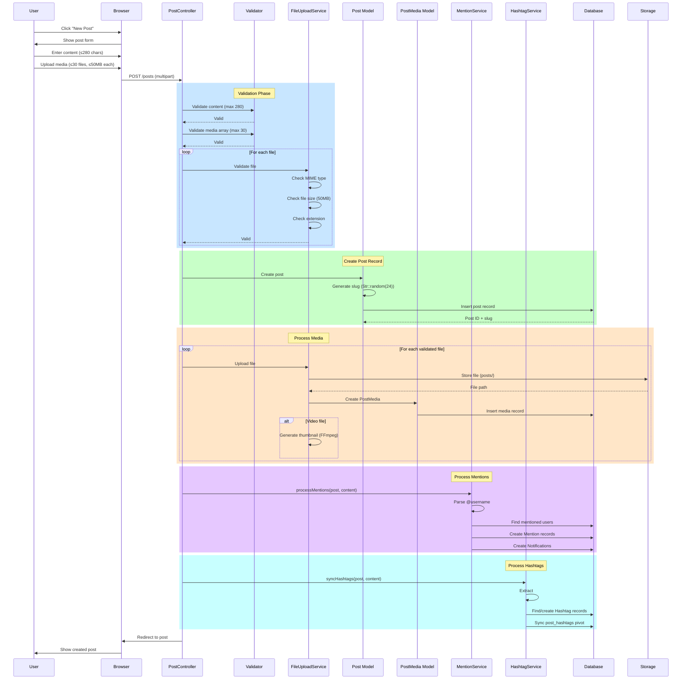
```mermaid
sequenceDiagram
    participant U as User
    participant B as Browser
    participant PC as PostController
    participant V as Validator
    participant FUS as FileUploadService
    participant PM as Post Model
    participant PMM as PostMedia Model
    participant MS as MentionService
    participant HS as HashtagService
    participant DB as Database
    participant S as Storage

    U->>B: Click "New Post"
    B->>U: Show post form
    
    U->>B: Enter content (≤280 chars)
    U->>B: Upload media (≤30 files, ≤50MB each)
    B->>PC: POST /posts (multipart)
    
    rect rgb(200, 230, 255)
        Note over V: Validation Phase
        PC->>V: Validate content (max 280)
        V-->>PC: Valid
        
        PC->>V: Validate media array (max 30)
        V-->>PC: Valid
        
        loop For each file
            PC->>FUS: Validate file
            FUS->>FUS: Check MIME type
            FUS->>FUS: Check file size (50MB)
            FUS->>FUS: Check extension
            FUS-->>PC: Valid
        end
    end
    
    rect rgb(200, 255, 200)
        Note over PM: Create Post Record
        PC->>PM: Create post
        PM->>PM: Generate slug (Str::random(24))
        PM->>DB: Insert post record
        DB-->>PM: Post ID + slug
    end
    
    rect rgb(255, 230, 200)
        Note over FUS: Process Media
        loop For each validated file
            PC->>FUS: Upload file
            FUS->>S: Store file (posts/)
            S-->>FUS: File path
            FUS->>PMM: Create PostMedia
            PMM->>DB: Insert media record
            alt Video file
                FUS->>FUS: Generate thumbnail (FFmpeg)
            end
        end
    end
    
    rect rgb(230, 200, 255)
        Note over MS: Process Mentions
        PC->>MS: processMentions(post, content)
        MS->>MS: Parse @username
        MS->>DB: Find mentioned users
        MS->>DB: Create Mention records
        MS->>DB: Create Notifications
    end
    
    rect rgb(200, 255, 255)
        Note over HS: Process Hashtags
        PC->>HS: syncHashtags(post, content)
        HS->>HS: Extract #hashtags
        HS->>DB: Find/create Hashtag records
        HS->>DB: Sync post_hashtags pivot
    end
    
    PC->>B: Redirect to post
    B->>U: Show created post
```

**Code Implementation:**
```php
// app/Http/Controllers/PostController.php
public function store(Request $request, FileUploadService $fileService)
{
    // 1. Validation
    $validated = $request->validate([
        'content' => 'nullable|string|max:280',
        'media' => 'nullable|array|max:30',
        'media.*' => 'file|mimes:jpeg,png,jpg,gif,mp4,mov,avi,webm|max:51200',
    ]);
    
    // 2. Validate files
    $validatedFiles = [];
    if ($request->hasFile('media')) {
        foreach ($request->file('media') as $index => $file) {
            $validation = $fileService->validateFile($file, $allowedMimeTypes);
            if (!$validation['valid']) {
                return back()->withErrors(['media.' . $index => $validation['errors']]);
            }
            $validatedFiles[] = $file;
        }
    }
    
    // 3. Create post
    $post = auth()->user()->posts()->create([
        'content' => $validated['content'] ?? '',
        'is_private' => $request->boolean('is_private'),
        'slug' => Str::random(24),
    ]);
    
    // 4. Process mentions
    if ($post->content) {
        app(MentionService::class)->processMentions($post, $post->content, auth()->id());
    }
    
    // 5. Process hashtags
    if ($post->content) {
        app(HashtagService::class)->syncHashtags($post, $post->content);
    }
    
    // 6. Upload media
    if ($validatedFiles) {
        $sortOrder = 0;
        foreach ($validatedFiles as $file) {
            $path = $file->store('posts', 'public');
            $mediaType = str_starts_with($file->getMimeType(), 'video') ? 'video' : 'image';
            
            $thumbnail = null;
            if ($mediaType === 'video') {
                $thumbnail = $this->generateVideoThumbnail($file);
            }
            
            $post->media()->create([
                'media_type' => $mediaType,
                'media_path' => $path,
                'media_thumbnail' => $thumbnail,
                'sort_order' => $sortOrder++,
            ]);
        }
    }
    
    return redirect()->route('posts.show', $post);
}
```

---

### 2.2 Post Feed Flow

```mermaid
sequenceDiagram
    participant U as User
    participant B as Browser
    participant PC as PostController
    participant PM as Post Model
    participant DB as Database

    U->>B: Visit / (home)
    B->>PC: GET /
    
    rect rgb(200, 230, 255)
        Note over PC: Build Feed Query
        PC->>PM: with(['user', 'media', 'likes', 'comments'])
        
        PM->>PM: where(function() {
            Note over PM: Include:
            Note over PM: - Own posts
            Note over PM: - Followed users' posts
            Note over PM: - Public accounts' posts
        })
        
        PM->>PM: whereDoesntHave('user.blockedBy')
        PM->>PM: whereDoesntHave('user.blockedUsers')
        
        PM->>PM: latest()
        PM->>PM: paginate(15)
    end
    
    PM->>DB: Execute query
    DB-->>PM: Posts collection
    
    rect rgb(200, 255, 200)
        Note over PC: Load Stories
        PC->>DB: Get followed users with active stories
        DB-->>PC: Stories data
        PC->>DB: Get my active stories
        DB-->>PC: My stories
    end
    
    PC->>B: Return view (posts.index)
    B->>U: Render feed with stories
```

**Code Implementation:**
```php
// app/Http/Controllers/PostController.php
public function index(Request $request)
{
    $user = auth()->user();
    
    if ($user) {
        // Build feed query
        $posts = Post::with(['user', 'media', 'likes', 'comments'])
            ->where(function($query) use ($user) {
                // Own posts
                $query->where(function($q) use ($user) {
                    $q->where('user_id', $user->id);
                })
                // Followed users' posts
                ->orWhere(function($q) use ($user) {
                    $q->whereHas('user.followers', function($fq) use ($user) {
                        $fq->where('follower_id', $user->id);
                    });
                })
                // Public accounts
                ->orWhere(function($q) use ($user) {
                    $q->where('is_private', false);
                });
            })
            // Exclude blocked users
            ->whereDoesntHave('user.blockedBy', function($q) use ($user) {
                $q->where('blocker_id', $user->id);
            })
            ->whereDoesntHave('user.blockedUsers', function($q) use ($user) {
                $q->where('blocked_id', $user->id);
            })
            ->latest()
            ->paginate(15);
        
        // Load stories
        $followedUsersWithStories = User::whereHas('followers', function($q) use ($user) {
            $q->where('follower_id', $user->id);
        })->whereHas('activeStories')->with(['activeStories'])->get();
        
        $myStories = $user->activeStories;
    }
    
    return view('posts.index', compact('posts', 'followedUsersWithStories', 'myStories'));
}
```

---

### 2.3 Like Post Flow

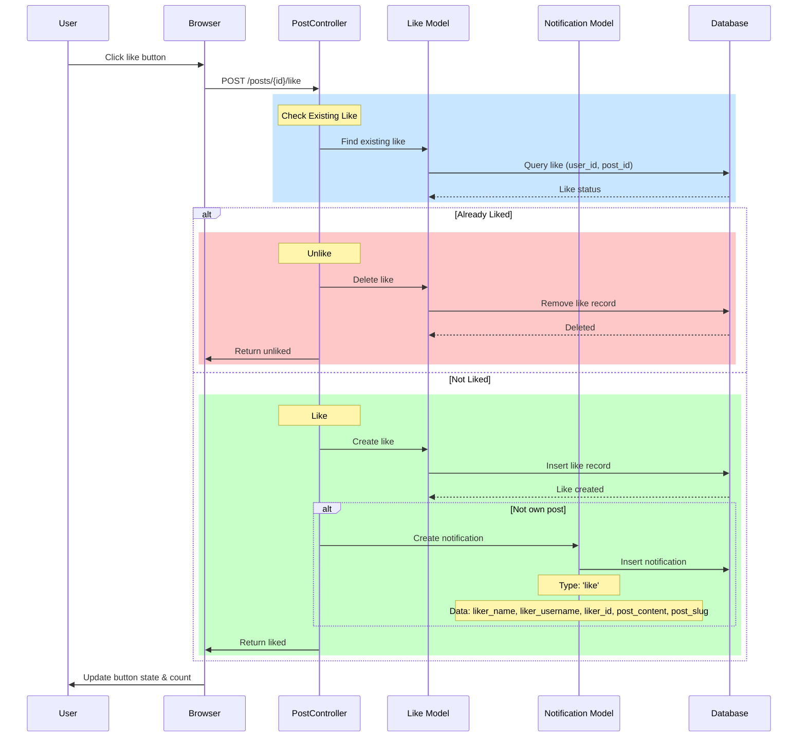
```mermaid
sequenceDiagram
    participant U as User
    participant B as Browser
    participant PC as PostController
    participant LM as Like Model
    participant NM as Notification Model
    participant DB as Database

    U->>B: Click like button
    B->>PC: POST /posts/{id}/like
    
    rect rgb(200, 230, 255)
        Note over PC: Check Existing Like
        PC->>LM: Find existing like
        LM->>DB: Query like (user_id, post_id)
        DB-->>LM: Like status
    end
    
    alt Already Liked
        rect rgb(255, 200, 200)
            Note over PC: Unlike
            PC->>LM: Delete like
            LM->>DB: Remove like record
            DB-->>LM: Deleted
            PC->>B: Return unliked
        end
    else Not Liked
        rect rgb(200, 255, 200)
            Note over PC: Like
            PC->>LM: Create like
            LM->>DB: Insert like record
            DB-->>LM: Like created
            
            alt Not own post
                PC->>NM: Create notification
                NM->>DB: Insert notification
                Note over NM: Type: 'like'
                Note over NM: Data: liker_name, liker_username, liker_id, post_content, post_slug
            end
            
            PC->>B: Return liked
        end
    end
    
    B->>U: Update button state & count
```

**Code Implementation:**
```php
// app/Http/Controllers/PostController.php
public function like(Post $post)
{
    $user = auth()->user();

    // Check existing like
    $like = $post->likes()->where('user_id', $user->id)->first();

    if ($like) {
        // Unlike
        $like->delete();
        $liked = false;
    } else {
        // Like
        $post->likes()->create(['user_id' => $user->id]);
        $liked = true;

        // Create notification (if not own post)
        if ($post->user_id !== $user->id) {
            Notification::create([
                'user_id' => $post->user_id,
                'type' => 'like',
                'data' => [
                    'liker_name' => $user->username ?? $user->name ?? 'Someone',
                    'liker_username' => $user->username ?? 'Unknown',
                    'liker_id' => $user->id,
                    'post_content' => substr($post->content ?? 'Image post', 0, 50),
                    'post_slug' => $post->slug,
                ],
                'related_type' => Post::class,
                'related_id' => $post->id,
            ]);
        }
    }

    return back()->with('success', $liked ? 'Post liked!' : 'Post unliked.');
}
```

---

## 3. Story Flows

### 3.1 Create Story Flow

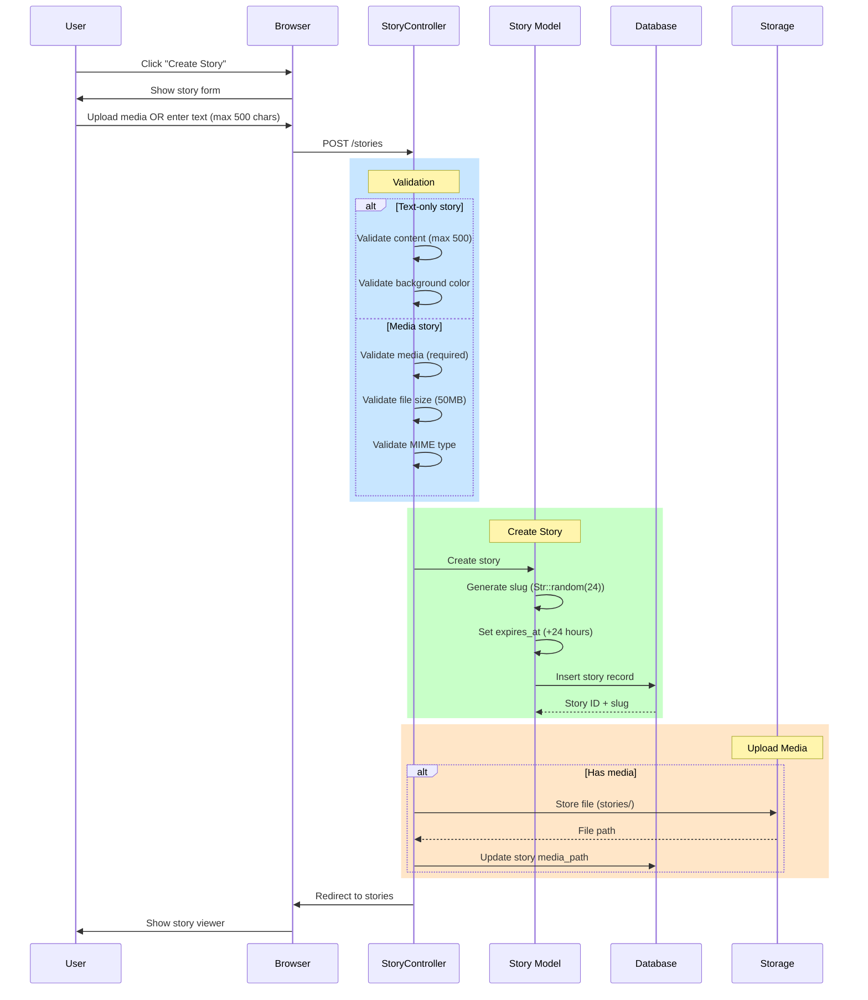
```mermaid
sequenceDiagram
    participant U as User
    participant B as Browser
    participant SC as StoryController
    participant SM as Story Model
    participant DB as Database
    participant S as Storage

    U->>B: Click "Create Story"
    B->>U: Show story form

    U->>B: Upload media OR enter text (max 500 chars)
    B->>SC: POST /stories

    rect rgb(200, 230, 255)
        Note over SC: Validation
        alt Text-only story
            SC->>SC: Validate content (max 500)
            SC->>SC: Validate background color
        else Media story
            SC->>SC: Validate media (required)
            SC->>SC: Validate file size (50MB)
            SC->>SC: Validate MIME type
        end
    end
    
    rect rgb(200, 255, 200)
        Note over SM: Create Story
        SC->>SM: Create story
        SM->>SM: Generate slug (Str::random(24))
        SM->>SM: Set expires_at (+24 hours)
        SM->>DB: Insert story record
        DB-->>SM: Story ID + slug
    end
    
    rect rgb(255, 230, 200)
        Note over S: Upload Media
        alt Has media
            SC->>S: Store file (stories/)
            S-->>SC: File path
            SC->>DB: Update story media_path
        end
    end
    
    SC->>B: Redirect to stories
    B->>U: Show story viewer
```

**Code Implementation:**
```php
// app/Http/Controllers/StoryController.php
public function store(Request $request)
{
    // Text-only story
    if ($request->has('text_only') && $request->text_only) {
        $validated = $request->validate([
            'content' => 'required|string|max:500',
            'bg_color' => 'nullable|string',
        ]);
        
        Story::create([
            'user_id' => auth()->id(),
            'media_type' => 'text',
            'content' => $validated['content'],
            'expires_at' => now()->addHours(24),
            'metadata' => ['bg_color' => $validated['bg_color'] ?? 'default'],
        ]);
        return redirect()->route('stories.index');
    }

    // Media story
    $validated = $request->validate([
        'media' => 'required|file|mimes:jpeg,png,jpg,gif,mp4,mov,avi,webm|max:51200',
        'content' => 'nullable|string|max:280',
    ]);

    // Compress image if needed (Intervention Image)
    if (str_contains($validated['media']->getMimeType(), 'image/')) {
        $manager = new ImageManager(new Driver());
        $compressedImage = $manager->read($validated['media']);
        $compressedImage->scale(width: 1080, height: 1920);
        $path = 'stories/images/' . time() . '_' . uniqid() . '.jpg';
        $compressedImage->toJpeg(85)->save(storage_path('app/public/' . $path));
    } else {
        $path = $validated['media']->store('stories', 'public');
    }

    // Create story with 24-hour expiry
    $story = auth()->user()->stories()->create([
        'slug' => Str::random(24),
        'media_type' => str_starts_with($validated['media']->getMimeType(), 'video') ? 'video' : 'image',
        'content' => $validated['content'] ?? null,
        'media_path' => $path,
        'expires_at' => now()->addHours(24),
    ]);

    return redirect()->route('stories.show', ['user' => auth()->user(), 'story' => $story]);
}
```

---

### 3.2 View Story Flow

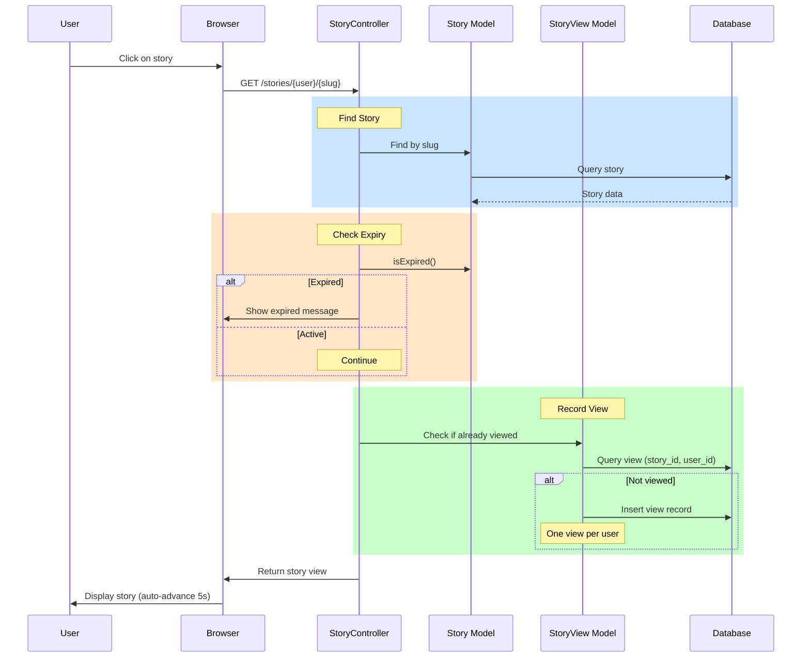
```mermaid
sequenceDiagram
    participant U as User
    participant B as Browser
    participant SC as StoryController
    participant SM as Story Model
    participant SVM as StoryView Model
    participant DB as Database

    U->>B: Click on story
    B->>SC: GET /stories/{user}/{slug}
    
    rect rgb(200, 230, 255)
        Note over SC: Find Story
        SC->>SM: Find by slug
        SM->>DB: Query story
        DB-->>SM: Story data
    end
    
    rect rgb(255, 230, 200)
        Note over SC: Check Expiry
        SC->>SM: isExpired()
        alt Expired
            SC->>B: Show expired message
        else Active
            Note over SC: Continue
        end
    end
    
    rect rgb(200, 255, 200)
        Note over SVM: Record View
        SC->>SVM: Check if already viewed
        SVM->>DB: Query view (story_id, user_id)
        alt Not viewed
            SVM->>DB: Insert view record
            Note over SVM: One view per user
        end
    end
    
    SC->>B: Return story view
    B->>U: Display story (auto-advance 5s)
```

**Code Implementation:**
```php
// app/Http/Controllers/StoryController.php
public function show(User $user, Story $story)
{
    // Check expiry
    if ($story->isExpired()) {
        abort(404, 'Story expired');
    }
    
    // Record view (one per user)
    $existingView = StoryView::where('story_id', $story->id)
        ->where('user_id', auth()->id())
        ->first();
    
    if (!$existingView) {
        StoryView::create([
            'story_id' => $story->id,
            'user_id' => auth()->id(),
        ]);
    }
    
    return view('stories.show', compact('story'));
}
```

---

## 4. Chat & Messaging Flows

### 4.1 Send Message Flow

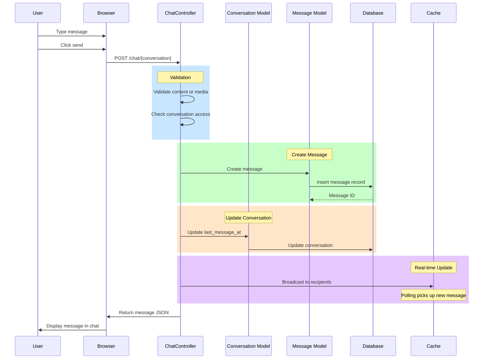
```mermaid
sequenceDiagram
    participant U as User
    participant B as Browser
    participant CC as ChatController
    participant CM as Conversation Model
    participant MM as Message Model
    participant DB as Database
    participant C as Cache

    U->>B: Type message
    U->>B: Click send
    B->>CC: POST /chat/{conversation}
    
    rect rgb(200, 230, 255)
        Note over CC: Validation
        CC->>CC: Validate content or media
        CC->>CC: Check conversation access
    end
    
    rect rgb(200, 255, 200)
        Note over MM: Create Message
        CC->>MM: Create message
        MM->>DB: Insert message record
        DB-->>MM: Message ID
    end
    
    rect rgb(255, 230, 200)
        Note over CM: Update Conversation
        CC->>CM: Update last_message_at
        CM->>DB: Update conversation
    end
    
    rect rgb(230, 200, 255)
        Note over C: Real-time Update
        CC->>C: Broadcast to recipients
        Note over C: Polling picks up new message
    end
    
    CC->>B: Return message JSON
    B->>U: Display message in chat
```

**Code Implementation:**
```php
// app/Http/Controllers/ChatController.php
public function store(Conversation $conversation, Request $request)
{
    $validated = $request->validate([
        'content' => 'required_without:media|max:1000',
        'media' => 'nullable|file|max:51200',
    ]);
    
    // Create message
    $message = $conversation->messages()->create([
        'sender_id' => auth()->id(),
        'content' => $validated['content'] ?? '',
        'media_type' => $validated['media']?->getClientMimeType(),
        'media_path' => $validated['media']?->store('messages', 'public'),
    ]);
    
    // Update conversation
    $conversation->update(['last_message_at' => now()]);
    
    return response()->json([
        'success' => true,
        'message' => $message->load('sender'),
    ]);
}
```

---

### 4.2 Typing Indicator Flow

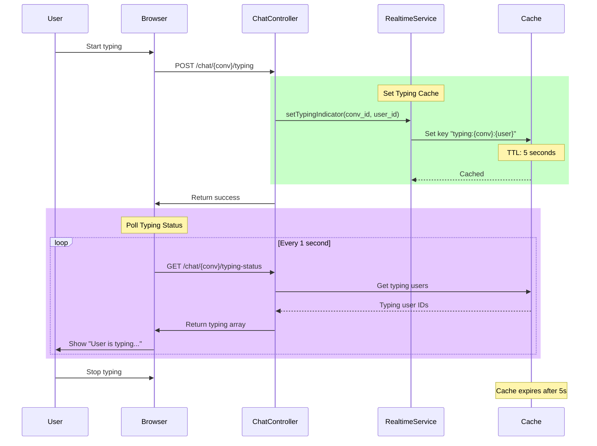
```mermaid
sequenceDiagram
    participant U as User
    participant B as Browser
    participant CC as ChatController
    participant RTS as RealtimeService
    participant C as Cache

    U->>B: Start typing
    B->>CC: POST /chat/{conv}/typing
    
    rect rgb(200, 255, 200)
        Note over RTS: Set Typing Cache
        CC->>RTS: setTypingIndicator(conv_id, user_id)
        RTS->>C: Set key "typing:{conv}:{user}"
        Note over C: TTL: 5 seconds
        C-->>RTS: Cached
    end
    
    CC->>B: Return success
    
    rect rgb(230, 200, 255)
        Note over B: Poll Typing Status
        loop Every 1 second
            B->>CC: GET /chat/{conv}/typing-status
            CC->>C: Get typing users
            C-->>CC: Typing user IDs
            CC->>B: Return typing array
            B->>U: Show "User is typing..."
        end
    end
    
    U->>B: Stop typing
    Note over C: Cache expires after 5s
```

**Code Implementation:**
```php
// app/Services/RealtimeService.php
public function setTypingIndicator(int $conversationId, int $userId): void
{
    $key = "typing:{$conversationId}:{$userId}";
    Cache::set($key, now()->timestamp, 5); // 5 second TTL
}

public function getTypingUsers(int $conversationId, int $excludeUserId): array
{
    $typingUsers = [];
    $pattern = "typing:{$conversationId}:*";
    
    foreach (Cache::getMultiple($pattern) as $key => $timestamp) {
        if (now()->timestamp - $timestamp < 5) {
            $userId = (int) last(explode(':', $key));
            if ($userId !== $excludeUserId) {
                $typingUsers[] = $userId;
            }
        }
    }
    
    return $typingUsers;
}

// app/Http/Controllers/ChatController.php
public function sendTypingIndicator(Conversation $conversation, Request $request)
{
    app(RealtimeService::class)->setTypingIndicator(
        $conversation->id,
        auth()->id()
    );
    
    return response()->json(['success' => true]);
}
```

---

## 5. Comment Flows

### 5.1 Create Comment Flow

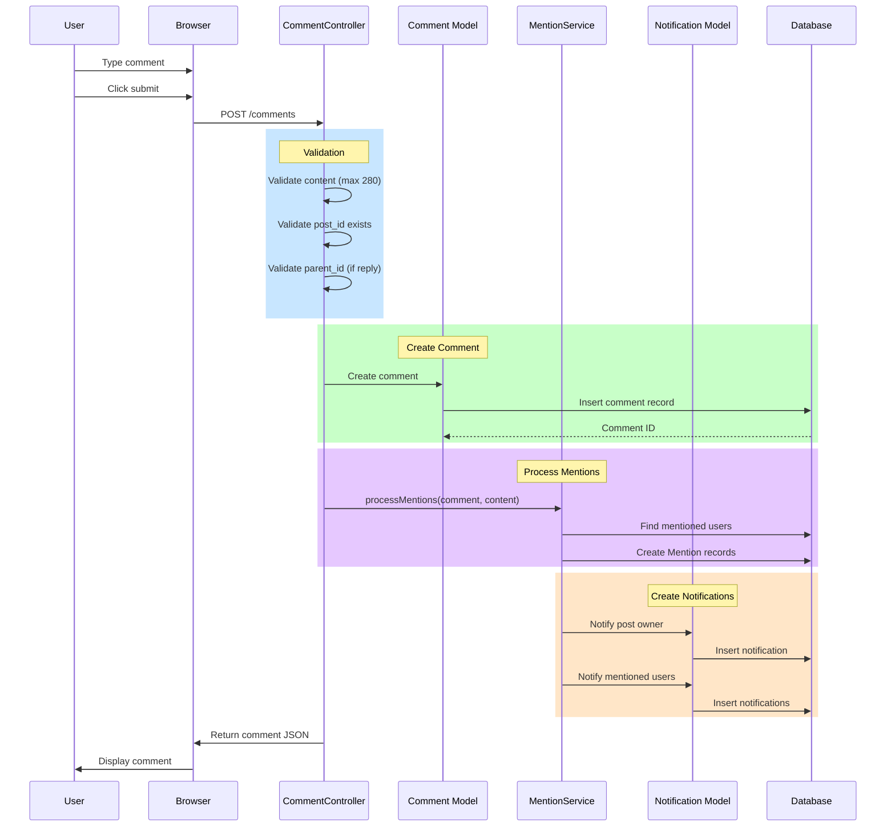
```mermaid
sequenceDiagram
    participant U as User
    participant B as Browser
    participant CC as CommentController
    participant CM as Comment Model
    participant MS as MentionService
    participant NM as Notification Model
    participant DB as Database

    U->>B: Type comment
    U->>B: Click submit
    B->>CC: POST /comments
    
    rect rgb(200, 230, 255)
        Note over CC: Validation
        CC->>CC: Validate content (max 280)
        CC->>CC: Validate post_id exists
        CC->>CC: Validate parent_id (if reply)
    end
    
    rect rgb(200, 255, 200)
        Note over CM: Create Comment
        CC->>CM: Create comment
        CM->>DB: Insert comment record
        DB-->>CM: Comment ID
    end
    
    rect rgb(230, 200, 255)
        Note over MS: Process Mentions
        CC->>MS: processMentions(comment, content)
        MS->>DB: Find mentioned users
        MS->>DB: Create Mention records
    end
    
    rect rgb(255, 230, 200)
        Note over NM: Create Notifications
        MS->>NM: Notify post owner
        NM->>DB: Insert notification
        MS->>NM: Notify mentioned users
        NM->>DB: Insert notifications
    end
    
    CC->>B: Return comment JSON
    B->>U: Display comment
```

**Code Implementation:**
```php
// app/Http/Controllers/CommentController.php
public function store(Request $request)
{
    $validated = $request->validate([
        'post_id' => 'required|exists:posts,id',
        'content' => 'required|string|max:280',
        'parent_id' => 'nullable|exists:comments,id',
    ]);
    
    // Create comment
    $comment = auth()->user()->comments()->create([
        'post_id' => $validated['post_id'],
        'parent_id' => $validated['parent_id'] ?? null,
        'content' => $validated['content'],
    ]);
    
    // Process mentions
    if ($comment->content) {
        app(MentionService::class)->processMentions(
            $comment,
            $comment->content,
            auth()->id()
        );
    }
    
    // Notify post owner
    $post = Post::find($validated['post_id']);
    if ($post->user_id !== auth()->id()) {
        Notification::create([
            'user_id' => $post->user_id,
            'type' => 'comment',
            'data' => [
                'commenter_name' => auth()->user()->name,
                'post_id' => $post->id,
            ],
            'related_type' => Comment::class,
            'related_id' => $comment->id,
        ]);
    }
    
    return response()->json([
        'success' => true,
        'comment' => $comment->load('user'),
    ]);
}
```

---

## 6. Social Interaction Flows

### 6.1 Follow User Flow

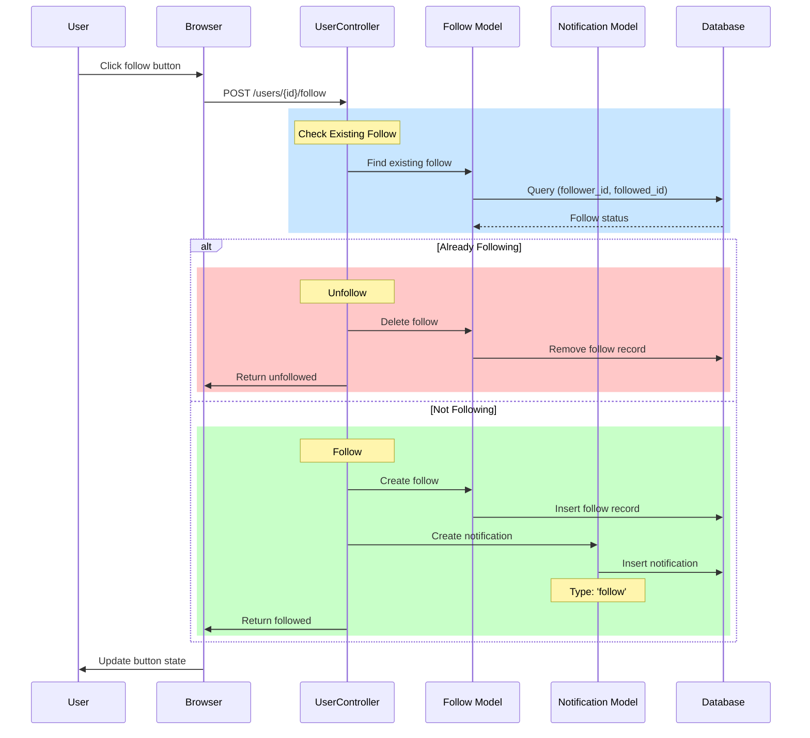
```mermaid
sequenceDiagram
    participant U as User
    participant B as Browser
    participant UC as UserController
    participant FM as Follow Model
    participant NM as Notification Model
    participant DB as Database

    U->>B: Click follow button
    B->>UC: POST /users/{id}/follow
    
    rect rgb(200, 230, 255)
        Note over UC: Check Existing Follow
        UC->>FM: Find existing follow
        FM->>DB: Query (follower_id, followed_id)
        DB-->>FM: Follow status
    end
    
    alt Already Following
        rect rgb(255, 200, 200)
            Note over UC: Unfollow
            UC->>FM: Delete follow
            FM->>DB: Remove follow record
            UC->>B: Return unfollowed
        end
    else Not Following
        rect rgb(200, 255, 200)
            Note over UC: Follow
            UC->>FM: Create follow
            FM->>DB: Insert follow record
            
            UC->>NM: Create notification
            NM->>DB: Insert notification
            Note over NM: Type: 'follow'
            
            UC->>B: Return followed
        end
    end
    
    B->>U: Update button state
```

**Code Implementation:**
```php
// app/Http/Controllers/UserController.php
public function follow(User $user)
{
    $follower = auth()->user();
    
    // Check existing follow
    $follow = $follower->follows()->where('followed_id', $user->id)->first();
    
    if ($follow) {
        // Unfollow
        $follow->delete();
        $following = false;
    } else {
        // Follow
        $follower->follows()->create(['followed_id' => $user->id]);
        $following = true;
        
        // Create notification
        Notification::create([
            'user_id' => $user->id,
            'type' => 'follow',
            'data' => [
                'follower_id' => $follower->id,
                'follower_name' => $follower->name,
            ],
            'related_type' => User::class,
            'related_id' => $follower->id,
        ]);
    }
    
    return back()->with('success', $following ? 'Following!' : 'Unfollowed.');
}
```

---

## 7. Group Flows

### 7.1 Create Group Flow

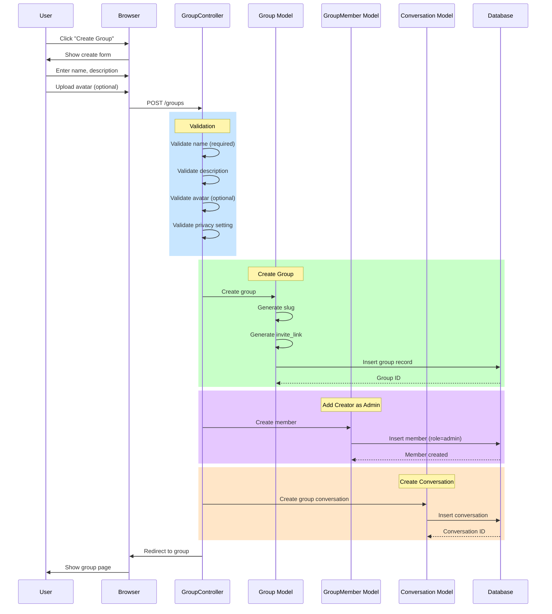
```mermaid
sequenceDiagram
    participant U as User
    participant B as Browser
    participant GC as GroupController
    participant GM as Group Model
    participant GMM as GroupMember Model
    participant CM as Conversation Model
    participant DB as Database

    U->>B: Click "Create Group"
    B->>U: Show create form
    
    U->>B: Enter name, description
    U->>B: Upload avatar (optional)
    B->>GC: POST /groups
    
    rect rgb(200, 230, 255)
        Note over GC: Validation
        GC->>GC: Validate name (required)
        GC->>GC: Validate description
        GC->>GC: Validate avatar (optional)
        GC->>GC: Validate privacy setting
    end
    
    rect rgb(200, 255, 200)
        Note over GM: Create Group
        GC->>GM: Create group
        GM->>GM: Generate slug
        GM->>GM: Generate invite_link
        GM->>DB: Insert group record
        DB-->>GM: Group ID
    end
    
    rect rgb(230, 200, 255)
        Note over GMM: Add Creator as Admin
        GC->>GMM: Create member
        GMM->>DB: Insert member (role=admin)
        DB-->>GMM: Member created
    end
    
    rect rgb(255, 230, 200)
        Note over CM: Create Conversation
        GC->>CM: Create group conversation
        CM->>DB: Insert conversation
        DB-->>CM: Conversation ID
    end
    
    GC->>B: Redirect to group
    B->>U: Show group page
```

**Code Implementation:**
```php
// app/Http/Controllers/GroupController.php
public function store(Request $request)
{
    $validated = $request->validate([
        'name' => 'required|string|max:255',
        'description' => 'nullable|string',
        'avatar' => 'nullable|image|max:5120',
        'is_private' => 'boolean',
    ]);
    
    // Create group
    $group = auth()->user()->createdGroups()->create([
        'name' => $validated['name'],
        'description' => $validated['description'] ?? null,
        'is_private' => $validated['is_private'] ?? false,
        'slug' => Str::random(24),
        'invite_link' => Str::random(24),
    ]);
    
    // Upload avatar
    if ($request->hasFile('avatar')) {
        $path = $request->file('avatar')->store('groups', 'public');
        $group->update(['avatar' => $path]);
    }
    
    // Add creator as admin
    $group->members()->create([
        'user_id' => auth()->id(),
        'role' => 'admin',
    ]);
    
    // Create group conversation
    Conversation::create([
        'is_group' => true,
        'group_id' => $group->id,
        'slug' => Str::random(24),
    ]);
    
    return redirect()->route('groups.show', $group);
}
```

---

## 8. Notification Flows

### 8.1 Real-time Notification Polling Flow

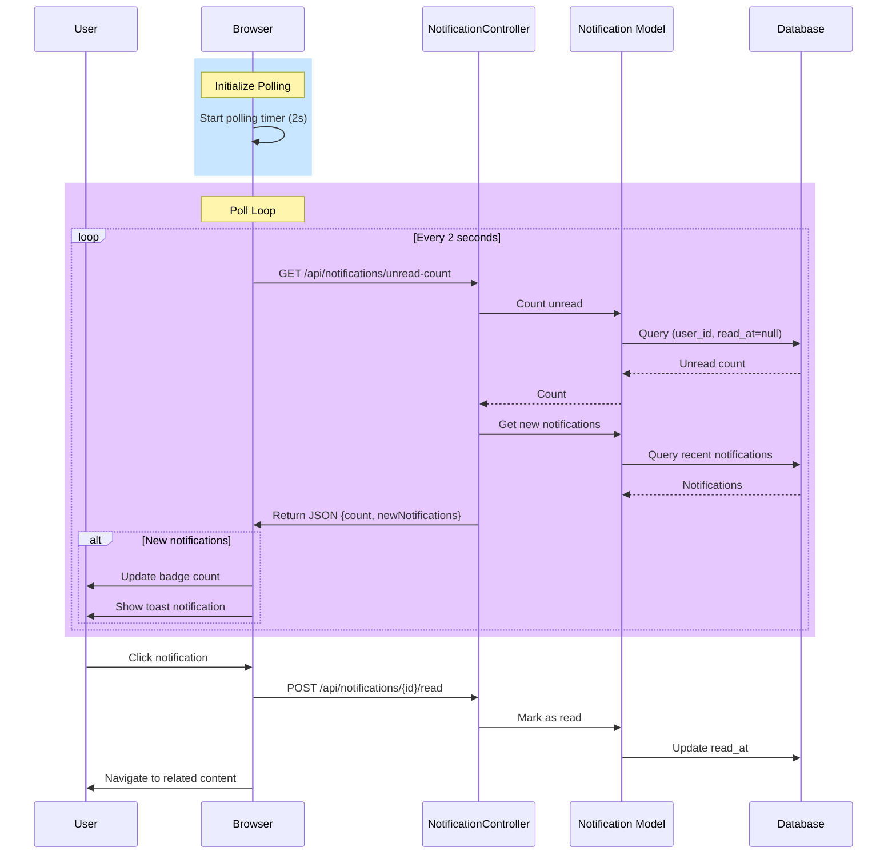
```mermaid
sequenceDiagram
    participant U as User
    participant B as Browser
    participant NC as NotificationController
    participant NM as Notification Model
    participant DB as Database

    rect rgb(200, 230, 255)
        Note over B: Initialize Polling
        B->>B: Start polling timer (2s)
    end

    rect rgb(230, 200, 255)
        Note over B: Poll Loop
        loop Every 2 seconds
            B->>NC: GET /api/notifications/unread-count
            NC->>NM: Count unread
            NM->>DB: Query (user_id, read_at=null)
            DB-->>NM: Unread count
            NM-->>NC: Count
            NC->>NM: Get new notifications
            NM->>DB: Query recent notifications
            DB-->>NM: Notifications
            NC->>B: Return JSON {count, newNotifications}
            
            alt New notifications
                B->>U: Update badge count
                B->>U: Show toast notification
            end
        end
    end
    
    U->>B: Click notification
    B->>NC: POST /api/notifications/{id}/read
    NC->>NM: Mark as read
    NM->>DB: Update read_at
    B->>U: Navigate to related content
```

**Code Implementation:**
```javascript
// resources/js/legacy/realtime.js
function pollNotifications() {
    setInterval(() => {
        fetch('/api/notifications/unread-count')
            .then(response => response.json())
            .then(data => {
                // Update badge
                updateNotificationBadge(data.count);
                
                // Show toast for new notifications
                if (data.count > 0 && data.newNotifications) {
                    showNotificationToast(data.newNotifications);
                }
            });
    }, 2000); // 2 second polling
}
```

```php
// app/Http/Controllers/Api/NotificationController.php
public function unreadCount()
{
    $count = auth()->user()->notifications()
        ->whereNull('read_at')
        ->count();
    
    $newNotifications = auth()->user()->notifications()
        ->whereNull('read_at')
        ->where('created_at', '>', now()->subSeconds(2))
        ->with('user')
        ->latest()
        ->limit(5)
        ->get();
    
    return response()->json([
        'count' => $count,
        'newNotifications' => $newNotifications,
    ]);
}
```

---

## 9. Admin Flows

### 9.1 Delete Post Flow (Admin)

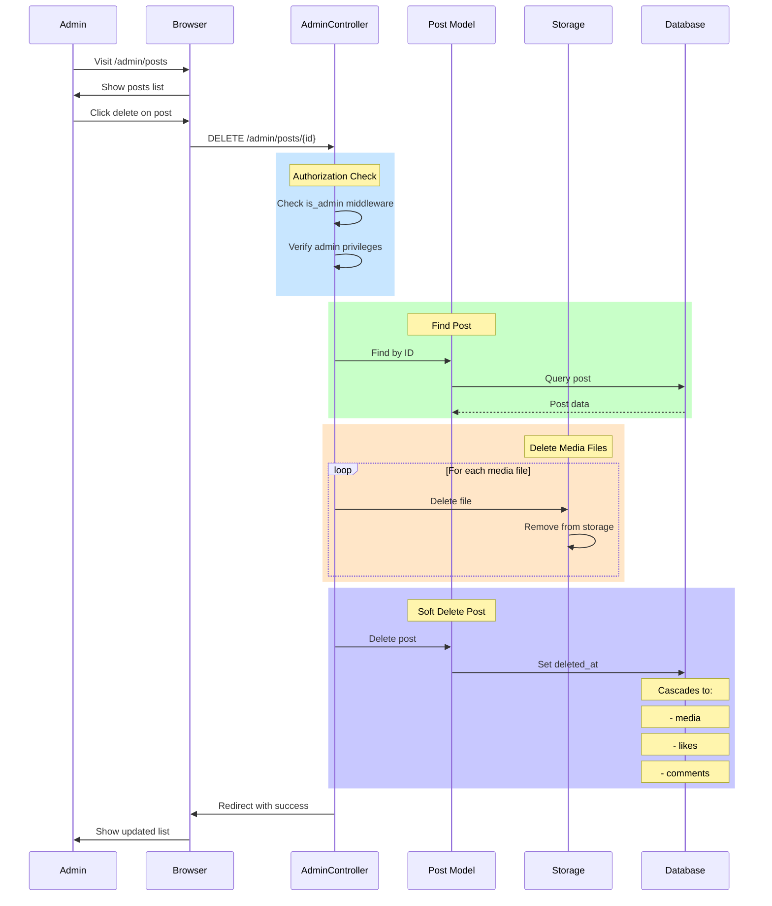
```mermaid
sequenceDiagram
    participant A as Admin
    participant B as Browser
    participant AC as AdminController
    participant PM as Post Model
    participant S as Storage
    participant DB as Database

    A->>B: Visit /admin/posts
    B->>A: Show posts list
    
    A->>B: Click delete on post
    B->>AC: DELETE /admin/posts/{id}
    
    rect rgb(200, 230, 255)
        Note over AC: Authorization Check
        AC->>AC: Check is_admin middleware
        AC->>AC: Verify admin privileges
    end
    
    rect rgb(200, 255, 200)
        Note over PM: Find Post
        AC->>PM: Find by ID
        PM->>DB: Query post
        DB-->>PM: Post data
    end
    
    rect rgb(255, 230, 200)
        Note over S: Delete Media Files
        loop For each media file
            AC->>S: Delete file
            S->>S: Remove from storage
        end
    end
    
    rect rgb(200, 200, 255)
        Note over PM: Soft Delete Post
        AC->>PM: Delete post
        PM->>DB: Set deleted_at
        Note over DB: Cascades to:
        Note over DB: - media
        Note over DB: - likes
        Note over DB: - comments
    end
    
    AC->>B: Redirect with success
    B->>A: Show updated list
```

**Code Implementation:**
```php
// app/Http/Controllers/AdminController.php
public function deletePost(Post $post)
{
    // Authorization handled by admin middleware
    
    // Delete media files
    foreach ($post->media as $media) {
        Storage::disk('public')->delete($media->media_path);
        if ($media->media_thumbnail) {
            Storage::disk('public')->delete($media->media_thumbnail);
        }
    }
    
    // Soft delete post (cascades to related)
    $post->delete();
    
    return redirect()->route('admin.posts')
        ->with('success', 'Post deleted successfully');
}
```

---

## 10. AI Assistant Flows

### 10.1 AI Chat Flow

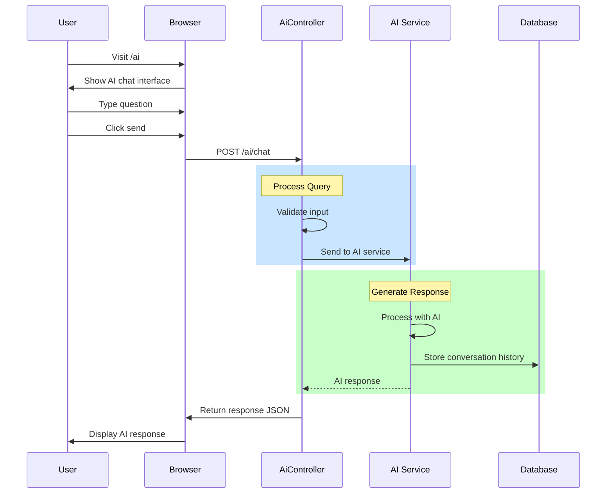
```mermaid
sequenceDiagram
    participant U as User
    participant B as Browser
    participant AIC as AiController
    participant AI as AI Service
    participant DB as Database

    U->>B: Visit /ai
    B->>U: Show AI chat interface
    
    U->>B: Type question
    U->>B: Click send
    B->>AIC: POST /ai/chat
    
    rect rgb(200, 230, 255)
        Note over AIC: Process Query
        AIC->>AIC: Validate input
        AIC->>AI: Send to AI service
    end
    
    rect rgb(200, 255, 200)
        Note over AI: Generate Response
        AI->>AI: Process with AI
        AI->>DB: Store conversation history
        AI-->>AIC: AI response
    end
    
    AIC->>B: Return response JSON
    B->>U: Display AI response
```

**Code Implementation:**
```php
// app/Http/Controllers/AiController.php
public function chat(Request $request)
{
    $validated = $request->validate([
        'message' => 'required|string|max:1000',
    ]);
    
    // Send to AI service (implementation depends on AI provider)
    $response = app(AiService::class)->chat($validated['message']);
    
    // Store conversation
    ConversationHistory::create([
        'user_id' => auth()->id(),
        'message' => $validated['message'],
        'response' => $response,
    ]);
    
    return response()->json([
        'success' => true,
        'response' => $response,
    ]);
}
```

---

<div align="center">

**Nexus - Complete Feature Flows Documentation**

Last Updated: March 27, 2026 | Laravel 12.x | PHP 8.2+

</div>
