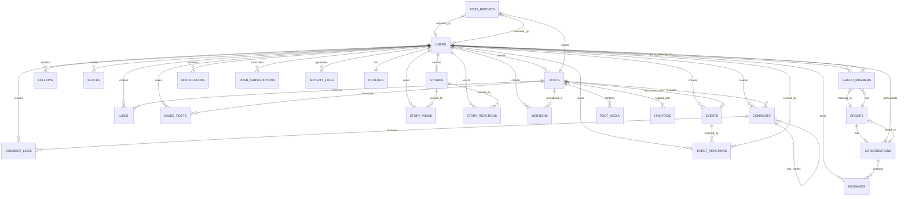

# Nexus - Database Schema

Complete database schema documentation for Nexus social networking platform.

---

## Table of Contents

1. [Overview](#overview)
2. [Entity Relationship Diagram](#entity-relationship-diagram)
3. [Table Definitions](#table-definitions)
4. [Indexes](#indexes)
5. [Foreign Key Relationships](#foreign-key-relationships)
6. [Migrations](#migrations)

---

## Overview

### Database Statistics

| Metric | Count |
|--------|-------|
| **Total Tables** | 24+ |
| **Total Migrations** | 79 |
| **Database Type** | SQLite (Dev) / MySQL (Prod) |
| **ORM** | Eloquent (Laravel) |
| **Models** | 25 Eloquent models |

### Core Entities

```
┌─────────────────────────────────────────────────────────────────┐
│                      Core Entities                               │
├─────────────────────────────────────────────────────────────────┤
│                                                                  │
│  ┌──────────┐  ┌──────────┐  ┌──────────┐  ┌──────────┐       │
│  │  User    │  │  Post    │  │ Comment  │  │  Story   │       │
│  └──────────┘  └──────────┘  └──────────┘  └──────────┘       │
│                                                                  │
│  ┌──────────┐  ┌──────────┐  ┌──────────┐  ┌──────────┐       │
│  │ Message  │  │  Group   │  │Conversation│ │Notification│     │
│  └──────────┘  └──────────┘  └──────────┘  └──────────┘       │
│                                                                  │
│  ┌──────────┐  ┌──────────┐  ┌──────────┐  ┌──────────┐       │
│  │ Profile  │  │  Follow  │  │  Like    │  │  Block   │       │
│  └──────────┘  └──────────┘  └──────────┘  └──────────┘       │
│                                                                  │
└─────────────────────────────────────────────────────────────────┘
```

---

## Entity Relationship Diagram



---

## Table Definitions

### users

Stores user account information and authentication credentials.

```sql
CREATE TABLE users (
    id BIGINT UNSIGNED AUTO_INCREMENT PRIMARY KEY,
    name VARCHAR(255) NOT NULL,
    username VARCHAR(255) NOT NULL UNIQUE,
    email VARCHAR(255) NOT NULL UNIQUE,
    email_verified_at TIMESTAMP NULL,
    language VARCHAR(255) NOT NULL DEFAULT 'en',
    password VARCHAR(255) NULL,
    is_admin BOOLEAN NOT NULL DEFAULT FALSE,
    is_suspended BOOLEAN NOT NULL DEFAULT FALSE,
    verification_code VARCHAR(6) NULL,
    verification_code_expires_at TIMESTAMP NULL,
    last_active TIMESTAMP NULL,
    inactive_reminder_sent_at TIMESTAMP NULL,
    is_online BOOLEAN NOT NULL DEFAULT FALSE,
    username_changed_at TIMESTAMP NULL,
    remember_token VARCHAR(100) NULL,
    created_at TIMESTAMP NULL,
    updated_at TIMESTAMP NULL,

    INDEX idx_email (email),
    INDEX idx_username (username),
    INDEX idx_last_active (last_active)
);
```

| Column | Type | Nullable | Default | Description |
|--------|------|----------|---------|-------------|
| id | BIGINT UNSIGNED | NO | AUTO_INCREMENT | Primary key |
| name | VARCHAR(255) | NO | - | User's display name |
| username | VARCHAR(255) | NO | - | Unique username |
| email | VARCHAR(255) | NO | - | Unique email address |
| email_verified_at | TIMESTAMP | YES | NULL | Email verification timestamp |
| language | VARCHAR(255) | NO | 'en' | User's language preference |
| password | VARCHAR(255) | YES | NULL | Bcrypt hashed password |
| is_admin | BOOLEAN | NO | FALSE | Admin privilege flag |
| is_suspended | BOOLEAN | NO | FALSE | Account suspension flag |
| verification_code | VARCHAR(6) | YES | NULL | 6-digit email verification code |
| verification_code_expires_at | TIMESTAMP | YES | NULL | Verification code expiry |
| last_active | TIMESTAMP | YES | NULL | Last activity timestamp |
| inactive_reminder_sent_at | TIMESTAMP | YES | NULL | Last inactive reminder sent |
| is_online | BOOLEAN | NO | FALSE | Current online status |
| username_changed_at | TIMESTAMP | YES | NULL | Last username change time |
| remember_token | VARCHAR(100) | YES | NULL | Remember me token |
| created_at | TIMESTAMP | YES | NULL | Record creation time |
| updated_at | TIMESTAMP | YES | NULL | Record update time |

---

### profiles

Extended user profile information.

```sql
CREATE TABLE profiles (
    id BIGINT UNSIGNED AUTO_INCREMENT PRIMARY KEY,
    user_id BIGINT UNSIGNED NOT NULL UNIQUE,
    avatar VARCHAR(255) NULL,
    cover_image VARCHAR(255) NULL,
    bio TEXT NULL,
    website VARCHAR(255) NULL,
    location VARCHAR(255) NULL,
    is_private BOOLEAN NOT NULL DEFAULT FALSE,
    social_links JSON NULL,
    created_at TIMESTAMP NULL,
    updated_at TIMESTAMP NULL,

    FOREIGN KEY (user_id) REFERENCES users(id) ON DELETE CASCADE,
    INDEX idx_is_private (is_private)
);
```

| Column | Type | Nullable | Default | Description |
|--------|------|----------|---------|-------------|
| id | BIGINT UNSIGNED | NO | AUTO_INCREMENT | Primary key |
| user_id | BIGINT UNSIGNED | NO | - | Foreign key to users |
| avatar | VARCHAR(255) | YES | NULL | Avatar image path |
| cover_image | VARCHAR(255) | YES | NULL | Cover image path |
| bio | TEXT | YES | NULL | Short biography |
| website | VARCHAR(255) | YES | NULL | Website URL |
| location | VARCHAR(255) | YES | NULL | Location |
| is_private | BOOLEAN | NO | FALSE | Private account flag |
| social_links | JSON | YES | NULL | Social media links |
| created_at | TIMESTAMP | YES | NULL | Record creation time |
| updated_at | TIMESTAMP | YES | NULL | Record update time |

---

### posts

User posts with content and media.

```sql
CREATE TABLE posts (
    id BIGINT UNSIGNED AUTO_INCREMENT PRIMARY KEY,
    user_id BIGINT UNSIGNED NOT NULL,
    content TEXT NULL,
    slug VARCHAR(24) NOT NULL UNIQUE,
    is_private BOOLEAN NOT NULL DEFAULT FALSE,
    pinned_at TIMESTAMP NULL,
    deleted_at TIMESTAMP NULL,
    created_at TIMESTAMP NULL,
    updated_at TIMESTAMP NULL,

    FOREIGN KEY (user_id) REFERENCES users(id) ON DELETE CASCADE,
    INDEX idx_user_id (user_id),
    INDEX idx_slug (slug),
    INDEX idx_pinned_at (pinned_at),
    INDEX idx_deleted_at (deleted_at)
);
```

| Column | Type | Nullable | Default | Description |
|--------|------|----------|---------|-------------|
| id | BIGINT UNSIGNED | NO | AUTO_INCREMENT | Primary key |
| user_id | BIGINT UNSIGNED | NO | - | Foreign key to users |
| content | TEXT | YES | NULL | Post content (max 280 chars) |
| slug | VARCHAR(24) | NO | - | Unique 24-character slug |
| is_private | BOOLEAN | NO | FALSE | Private post flag |
| pinned_at | TIMESTAMP | YES | NULL | Pin timestamp |
| deleted_at | TIMESTAMP | YES | NULL | Soft delete timestamp |
| created_at | TIMESTAMP | YES | NULL | Record creation time |
| updated_at | TIMESTAMP | YES | NULL | Record update time |

---

### post_media

Post media attachments (images/videos).

```sql
CREATE TABLE post_media (
    id BIGINT UNSIGNED AUTO_INCREMENT PRIMARY KEY,
    post_id BIGINT UNSIGNED NOT NULL,
    media_type ENUM('image', 'video') NOT NULL,
    media_path VARCHAR(255) NOT NULL,
    media_thumbnail VARCHAR(255) NULL,
    sort_order INT NOT NULL DEFAULT 1,
    created_at TIMESTAMP NULL,
    updated_at TIMESTAMP NULL,

    FOREIGN KEY (post_id) REFERENCES posts(id) ON DELETE CASCADE,
    INDEX idx_post_id (post_id),
    INDEX idx_media_type (media_type)
);
```

| Column | Type | Nullable | Default | Description |
|--------|------|----------|---------|-------------|
| id | BIGINT UNSIGNED | NO | AUTO_INCREMENT | Primary key |
| post_id | BIGINT UNSIGNED | NO | - | Foreign key to posts |
| media_type | ENUM | NO | - | 'image' or 'video' |
| media_path | VARCHAR(255) | NO | - | File path |
| media_thumbnail | VARCHAR(255) | YES | NULL | Video thumbnail path |
| sort_order | INT | NO | 1 | Display order |
| created_at | TIMESTAMP | YES | NULL | Record creation time |
| updated_at | TIMESTAMP | YES | NULL | Record update time |

---

### comments

Post comments with nested replies.

```sql
CREATE TABLE comments (
    id BIGINT UNSIGNED AUTO_INCREMENT PRIMARY KEY,
    user_id BIGINT UNSIGNED NOT NULL,
    post_id BIGINT UNSIGNED NOT NULL,
    parent_id BIGINT UNSIGNED NULL,
    content TEXT NOT NULL,
    created_at TIMESTAMP NULL,
    updated_at TIMESTAMP NULL,

    FOREIGN KEY (user_id) REFERENCES users(id) ON DELETE CASCADE,
    FOREIGN KEY (post_id) REFERENCES posts(id) ON DELETE CASCADE,
    FOREIGN KEY (parent_id) REFERENCES comments(id) ON DELETE CASCADE,
    INDEX idx_user_id (user_id),
    INDEX idx_post_id (post_id),
    INDEX idx_parent_id (parent_id)
);
```

| Column | Type | Nullable | Default | Description |
|--------|------|----------|---------|-------------|
| id | BIGINT UNSIGNED | NO | AUTO_INCREMENT | Primary key |
| user_id | BIGINT UNSIGNED | NO | - | Foreign key to users |
| post_id | BIGINT UNSIGNED | NO | - | Foreign key to posts |
| parent_id | BIGINT UNSIGNED | YES | NULL | Parent comment for replies |
| content | TEXT | NO | - | Comment content |
| created_at | TIMESTAMP | YES | NULL | Record creation time |
| updated_at | TIMESTAMP | YES | NULL | Record update time |

---

### likes

Post likes.

```sql
CREATE TABLE likes (
    id BIGINT UNSIGNED AUTO_INCREMENT PRIMARY KEY,
    user_id BIGINT UNSIGNED NOT NULL,
    post_id BIGINT UNSIGNED NOT NULL,
    created_at TIMESTAMP NULL,

    FOREIGN KEY (user_id) REFERENCES users(id) ON DELETE CASCADE,
    FOREIGN KEY (post_id) REFERENCES posts(id) ON DELETE CASCADE,
    UNIQUE KEY unique_user_post (user_id, post_id),
    INDEX idx_user_id (user_id),
    INDEX idx_post_id (post_id)
);
```

| Column | Type | Nullable | Default | Description |
|--------|------|----------|---------|-------------|
| id | BIGINT UNSIGNED | NO | AUTO_INCREMENT | Primary key |
| user_id | BIGINT UNSIGNED | NO | - | Foreign key to users |
| post_id | BIGINT UNSIGNED | NO | - | Foreign key to posts |
| created_at | TIMESTAMP | YES | NULL | Record creation time |

---

### comment_likes

Comment likes.

```sql
CREATE TABLE comment_likes (
    id BIGINT UNSIGNED AUTO_INCREMENT PRIMARY KEY,
    user_id BIGINT UNSIGNED NOT NULL,
    comment_id BIGINT UNSIGNED NOT NULL,
    created_at TIMESTAMP NULL,

    FOREIGN KEY (user_id) REFERENCES users(id) ON DELETE CASCADE,
    FOREIGN KEY (comment_id) REFERENCES comments(id) ON DELETE CASCADE,
    UNIQUE KEY unique_user_comment (user_id, comment_id),
    INDEX idx_user_id (user_id),
    INDEX idx_comment_id (comment_id)
);
```

---

### follows

User follow relationships.

```sql
CREATE TABLE follows (
    id BIGINT UNSIGNED AUTO_INCREMENT PRIMARY KEY,
    follower_id BIGINT UNSIGNED NOT NULL,
    followed_id BIGINT UNSIGNED NOT NULL,
    created_at TIMESTAMP NULL,
    updated_at TIMESTAMP NULL,

    FOREIGN KEY (follower_id) REFERENCES users(id) ON DELETE CASCADE,
    FOREIGN KEY (followed_id) REFERENCES users(id) ON DELETE CASCADE,
    UNIQUE KEY unique_follow (follower_id, followed_id),
    INDEX idx_follower_id (follower_id),
    INDEX idx_followed_id (followed_id)
);
```

---

### blocks

User block relationships.

```sql
CREATE TABLE blocks (
    id BIGINT UNSIGNED AUTO_INCREMENT PRIMARY KEY,
    blocker_id BIGINT UNSIGNED NOT NULL,
    blocked_id BIGINT UNSIGNED NOT NULL,
    created_at TIMESTAMP NULL,

    FOREIGN KEY (blocker_id) REFERENCES users(id) ON DELETE CASCADE,
    FOREIGN KEY (blocked_id) REFERENCES users(id) ON DELETE CASCADE,
    UNIQUE KEY unique_block (blocker_id, blocked_id),
    INDEX idx_blocker_id (blocker_id),
    INDEX idx_blocked_id (blocked_id)
);
```

---

### saved_posts

Bookmarked posts.

```sql
CREATE TABLE saved_posts (
    id BIGINT UNSIGNED AUTO_INCREMENT PRIMARY KEY,
    user_id BIGINT UNSIGNED NOT NULL,
    post_id BIGINT UNSIGNED NOT NULL,
    created_at TIMESTAMP NULL,

    FOREIGN KEY (user_id) REFERENCES users(id) ON DELETE CASCADE,
    FOREIGN KEY (post_id) REFERENCES posts(id) ON DELETE CASCADE,
    UNIQUE KEY unique_user_post (user_id, post_id),
    INDEX idx_user_id (user_id),
    INDEX idx_post_id (post_id)
);
```

---

### stories

Ephemeral 24-hour stories.

```sql
CREATE TABLE stories (
    id BIGINT UNSIGNED AUTO_INCREMENT PRIMARY KEY,
    user_id BIGINT UNSIGNED NOT NULL,
    slug VARCHAR(24) NOT NULL UNIQUE,
    media_type ENUM('image', 'video', 'text') NULL,
    media_path VARCHAR(255) NULL,
    content TEXT NULL,
    metadata JSON NULL,
    expires_at TIMESTAMP NOT NULL,
    created_at TIMESTAMP NULL,
    updated_at TIMESTAMP NULL,

    FOREIGN KEY (user_id) REFERENCES users(id) ON DELETE CASCADE,
    INDEX idx_user_id (user_id),
    INDEX idx_slug (slug),
    INDEX idx_expires_at (expires_at)
);
```

| Column | Type | Nullable | Default | Description |
|--------|------|----------|---------|-------------|
| id | BIGINT UNSIGNED | NO | AUTO_INCREMENT | Primary key |
| user_id | BIGINT UNSIGNED | NO | - | Foreign key to users |
| slug | VARCHAR(24) | NO | - | Unique story slug |
| media_type | ENUM | YES | NULL | 'image', 'video', or 'text' |
| media_path | VARCHAR(255) | YES | NULL | Media file path |
| content | TEXT | YES | NULL | Text content for text stories |
| metadata | JSON | YES | NULL | Additional metadata |
| expires_at | TIMESTAMP | NO | - | Expiry timestamp (+24 hours) |
| created_at | TIMESTAMP | YES | NULL | Record creation time |
| updated_at | TIMESTAMP | YES | NULL | Record update time |

---

### story_views

Story view tracking.

```sql
CREATE TABLE story_views (
    id BIGINT UNSIGNED AUTO_INCREMENT PRIMARY KEY,
    story_id BIGINT UNSIGNED NOT NULL,
    user_id BIGINT UNSIGNED NOT NULL,
    created_at TIMESTAMP NULL,

    FOREIGN KEY (story_id) REFERENCES stories(id) ON DELETE CASCADE,
    FOREIGN KEY (user_id) REFERENCES users(id) ON DELETE CASCADE,
    UNIQUE KEY unique_story_user (story_id, user_id),
    INDEX idx_story_id (story_id),
    INDEX idx_user_id (user_id)
);
```

---

### story_reactions

Story emoji reactions.

```sql
CREATE TABLE story_reactions (
    id BIGINT UNSIGNED AUTO_INCREMENT PRIMARY KEY,
    story_id BIGINT UNSIGNED NOT NULL,
    user_id BIGINT UNSIGNED NOT NULL,
    reaction_type VARCHAR(10) NOT NULL,
    created_at TIMESTAMP NULL,

    FOREIGN KEY (story_id) REFERENCES stories(id) ON DELETE CASCADE,
    FOREIGN KEY (user_id) REFERENCES users(id) ON DELETE CASCADE,
    UNIQUE KEY unique_story_user (story_id, user_id),
    INDEX idx_story_id (story_id),
    INDEX idx_user_id (user_id)
);
```

---

### conversations

Chat conversations (direct and group).

```sql
CREATE TABLE conversations (
    id BIGINT UNSIGNED AUTO_INCREMENT PRIMARY KEY,
    user1_id BIGINT UNSIGNED NOT NULL,
    user2_id BIGINT UNSIGNED NULL,
    is_group BOOLEAN NOT NULL DEFAULT FALSE,
    group_id BIGINT UNSIGNED NULL,
    slug VARCHAR(24) NOT NULL UNIQUE,
    last_message_at TIMESTAMP NULL,
    created_at TIMESTAMP NULL,
    updated_at TIMESTAMP NULL,

    FOREIGN KEY (user1_id) REFERENCES users(id) ON DELETE CASCADE,
    FOREIGN KEY (user2_id) REFERENCES users(id) ON DELETE CASCADE,
    FOREIGN KEY (group_id) REFERENCES groups(id) ON DELETE CASCADE,
    INDEX idx_user1_id (user1_id),
    INDEX idx_user2_id (user2_id),
    INDEX idx_is_group (is_group),
    INDEX idx_slug (slug)
);
```

---

### messages

Chat messages.

```sql
CREATE TABLE messages (
    id BIGINT UNSIGNED AUTO_INCREMENT PRIMARY KEY,
    conversation_id BIGINT UNSIGNED NOT NULL,
    sender_id BIGINT UNSIGNED NOT NULL,
    visible_to JSON NULL,
    content TEXT NULL,
    type ENUM('text', 'image', 'video', 'audio', 'document', 'gif', 'sticker', 'story_reply', 'group_invite', 'voice') DEFAULT 'text',
    duration INT NULL,
    waveform_peaks JSON NULL,
    media_path VARCHAR(255) NULL,
    media_thumbnail VARCHAR(255) NULL,
    original_filename VARCHAR(255) NULL,
    media_size INT NULL,
    system_type VARCHAR(50) NULL,
    read_at TIMESTAMP NULL,
    delivered_at TIMESTAMP NULL,
    notified_at TIMESTAMP NULL,
    deleted_for JSON NULL,
    deleted_by_sender BOOLEAN NULL,
    soft_deleted_at TIMESTAMP NULL,
    created_at TIMESTAMP NULL,
    updated_at TIMESTAMP NULL,

    FOREIGN KEY (conversation_id) REFERENCES conversations(id) ON DELETE CASCADE,
    FOREIGN KEY (sender_id) REFERENCES users(id) ON DELETE CASCADE,
    INDEX idx_conversation_id (conversation_id),
    INDEX idx_sender_id (sender_id),
    INDEX idx_read_at (read_at),
    INDEX idx_delivered_at (delivered_at),
    INDEX idx_soft_deleted_at (soft_deleted_at)
);
```

| Column | Type | Nullable | Default | Description |
|--------|------|----------|---------|-------------|
| id | BIGINT UNSIGNED | NO | AUTO_INCREMENT | Primary key |
| conversation_id | BIGINT UNSIGNED | NO | - | Foreign key to conversations |
| sender_id | BIGINT UNSIGNED | NO | - | Foreign key to users |
| visible_to | JSON | YES | NULL | Users who can see message |
| content | TEXT | YES | NULL | Message content |
| type | ENUM | YES | 'text' | Message type (text, image, video, voice, etc.) |
| duration | INT | YES | NULL | Duration in seconds (for voice/video) |
| waveform_peaks | JSON | YES | NULL | Audio waveform data (for voice) |
| media_path | VARCHAR(255) | YES | NULL | Media file path |
| media_thumbnail | VARCHAR(255) | YES | NULL | Media thumbnail path |
| original_filename | VARCHAR(255) | YES | NULL | Original filename |
| media_size | INT | YES | NULL | File size in bytes |
| system_type | VARCHAR(50) | YES | NULL | System message type |
| read_at | TIMESTAMP | YES | NULL | When message was read |
| delivered_at | TIMESTAMP | YES | NULL | When message was delivered |
| notified_at | TIMESTAMP | YES | NULL | When notification was sent |
| deleted_for | JSON | YES | NULL | User IDs who deleted |
| deleted_by_sender | BOOLEAN | YES | NULL | Sender deleted flag |
| soft_deleted_at | TIMESTAMP | YES | NULL | Soft delete timestamp |
| created_at | TIMESTAMP | YES | NULL | Record creation time |
| updated_at | TIMESTAMP | YES | NULL | Record update time |

---

### groups

User groups.

```sql
CREATE TABLE groups (
    id BIGINT UNSIGNED AUTO_INCREMENT PRIMARY KEY,
    creator_id BIGINT UNSIGNED NOT NULL,
    name VARCHAR(255) NOT NULL,
    description TEXT NULL,
    avatar VARCHAR(255) NULL,
    is_private BOOLEAN NOT NULL DEFAULT FALSE,
    slug VARCHAR(24) NOT NULL UNIQUE,
    invite_link VARCHAR(24) NOT NULL UNIQUE,
    created_at TIMESTAMP NULL,
    updated_at TIMESTAMP NULL,

    FOREIGN KEY (creator_id) REFERENCES users(id) ON DELETE CASCADE,
    INDEX idx_creator_id (creator_id),
    INDEX idx_slug (slug),
    INDEX idx_invite_link (invite_link),
    INDEX idx_is_private (is_private)
);
```

---

### group_members

Group membership.

```sql
CREATE TABLE group_members (
    id BIGINT UNSIGNED AUTO_INCREMENT PRIMARY KEY,
    group_id BIGINT UNSIGNED NOT NULL,
    user_id BIGINT UNSIGNED NOT NULL,
    role ENUM('admin', 'member') NOT NULL DEFAULT 'member',
    joined_at TIMESTAMP NULL,
    created_at TIMESTAMP NULL,
    updated_at TIMESTAMP NULL,

    FOREIGN KEY (group_id) REFERENCES groups(id) ON DELETE CASCADE,
    FOREIGN KEY (user_id) REFERENCES users(id) ON DELETE CASCADE,
    UNIQUE KEY unique_group_member (group_id, user_id),
    INDEX idx_group_id (group_id),
    INDEX idx_user_id (user_id),
    INDEX idx_role (role)
);
```

---

### notifications

User notifications.

```sql
CREATE TABLE notifications (
    id BIGINT UNSIGNED AUTO_INCREMENT PRIMARY KEY,
    user_id BIGINT UNSIGNED NOT NULL,
    type VARCHAR(50) NOT NULL,
    data JSON NOT NULL,
    read_at TIMESTAMP NULL,
    related_type VARCHAR(255) NULL,
    related_id BIGINT UNSIGNED NULL,
    created_at TIMESTAMP NULL,
    updated_at TIMESTAMP NULL,

    FOREIGN KEY (user_id) REFERENCES users(id) ON DELETE CASCADE,
    INDEX idx_user_id (user_id),
    INDEX idx_type (type),
    INDEX idx_read_at (read_at),
    INDEX idx_related (related_type, related_id)
);
```

| Column | Type | Nullable | Default | Description |
|--------|------|----------|---------|-------------|
| id | BIGINT UNSIGNED | NO | AUTO_INCREMENT | Primary key |
| user_id | BIGINT UNSIGNED | NO | - | Foreign key to users |
| type | VARCHAR(50) | NO | - | 'like', 'comment', 'follow', etc. |
| data | JSON | NO | - | Notification data |
| read_at | TIMESTAMP | YES | NULL | When notification was read |
| related_type | VARCHAR(255) | YES | NULL | Related model type |
| related_id | BIGINT UNSIGNED | YES | NULL | Related model ID |
| created_at | TIMESTAMP | YES | NULL | Record creation time |
| updated_at | TIMESTAMP | YES | NULL | Record update time |

---

### mentions

User mentions in posts/comments.

```sql
CREATE TABLE mentions (
    id BIGINT UNSIGNED AUTO_INCREMENT PRIMARY KEY,
    user_id BIGINT UNSIGNED NOT NULL,
    post_id BIGINT UNSIGNED NOT NULL,
    created_at TIMESTAMP NULL,

    FOREIGN KEY (user_id) REFERENCES users(id) ON DELETE CASCADE,
    FOREIGN KEY (post_id) REFERENCES posts(id) ON DELETE CASCADE,
    INDEX idx_user_id (user_id),
    INDEX idx_post_id (post_id)
);
```

---

### hashtags

Hashtags for content discovery.

```sql
CREATE TABLE hashtags (
    id BIGINT UNSIGNED AUTO_INCREMENT PRIMARY KEY,
    name VARCHAR(255) NOT NULL,
    slug VARCHAR(255) NOT NULL UNIQUE,
    created_at TIMESTAMP NULL,
    updated_at TIMESTAMP NULL,

    INDEX idx_name (name),
    INDEX idx_slug (slug)
);
```

---

### post_hashtags

Post-hashtag many-to-many relationship.

```sql
CREATE TABLE post_hashtags (
    id BIGINT UNSIGNED AUTO_INCREMENT PRIMARY KEY,
    post_id BIGINT UNSIGNED NOT NULL,
    hashtag_id BIGINT UNSIGNED NOT NULL,
    created_at TIMESTAMP NULL,

    FOREIGN KEY (post_id) REFERENCES posts(id) ON DELETE CASCADE,
    FOREIGN KEY (hashtag_id) REFERENCES hashtags(id) ON DELETE CASCADE,
    UNIQUE KEY unique_post_hashtag (post_id, hashtag_id),
    INDEX idx_post_id (post_id),
    INDEX idx_hashtag_id (hashtag_id)
);
```

---

### post_reports

Content reports for moderation.

```sql
CREATE TABLE post_reports (
    id BIGINT UNSIGNED AUTO_INCREMENT PRIMARY KEY,
    user_id BIGINT UNSIGNED NOT NULL,
    post_id BIGINT UNSIGNED NOT NULL,
    reason VARCHAR(50) NOT NULL,
    description TEXT NULL,
    status ENUM('pending', 'accepted', 'rejected') NOT NULL DEFAULT 'pending',
    reviewed_at TIMESTAMP NULL,
    reviewed_by BIGINT UNSIGNED NULL,
    admin_action VARCHAR(255) NULL,
    slug VARCHAR(24) NOT NULL UNIQUE,
    created_at TIMESTAMP NULL,
    updated_at TIMESTAMP NULL,

    FOREIGN KEY (user_id) REFERENCES users(id) ON DELETE CASCADE,
    FOREIGN KEY (post_id) REFERENCES posts(id) ON DELETE CASCADE,
    FOREIGN KEY (reviewed_by) REFERENCES users(id) ON DELETE SET NULL,
    INDEX idx_user_id (user_id),
    INDEX idx_post_id (post_id),
    INDEX idx_status (status),
    INDEX idx_slug (slug)
);
```

---

### push_subscriptions

Web push notification subscriptions.

```sql
CREATE TABLE push_subscriptions (
    id BIGINT UNSIGNED AUTO_INCREMENT PRIMARY KEY,
    user_id BIGINT UNSIGNED NOT NULL,
    content TEXT NOT NULL,
    p256dh VARCHAR(255) NOT NULL,
    auth VARCHAR(255) NOT NULL,
    created_at TIMESTAMP NULL,
    updated_at TIMESTAMP NULL,

    FOREIGN KEY (user_id) REFERENCES users(id) ON DELETE CASCADE,
    INDEX idx_user_id (user_id)
);
```

---

### activity_logs

User activity tracking.

```sql
CREATE TABLE activity_logs (
    id BIGINT UNSIGNED AUTO_INCREMENT PRIMARY KEY,
    user_id BIGINT UNSIGNED NULL,
    action VARCHAR(255) NOT NULL,
    description TEXT NULL,
    ip_address VARCHAR(45) NULL,
    user_agent TEXT NULL,
    country VARCHAR(100) NULL,
    city VARCHAR(100) NULL,
    session_id BIGINT UNSIGNED NULL,
    created_at TIMESTAMP NULL,

    FOREIGN KEY (user_id) REFERENCES users(id) ON DELETE SET NULL,
    INDEX idx_user_id (user_id),
    INDEX idx_action (action),
    INDEX idx_ip_address (ip_address),
    INDEX idx_session_id (session_id),
    INDEX idx_created_at (created_at)
);
```

---

### events

Life events (birthdays, anniversaries, etc.).

```sql
CREATE TABLE events (
    id BIGINT UNSIGNED AUTO_INCREMENT PRIMARY KEY,
    user_id BIGINT UNSIGNED NOT NULL,
    post_id BIGINT UNSIGNED NULL,
    title VARCHAR(255) NOT NULL,
    type VARCHAR(50) NOT NULL,
    event_date DATETIME NOT NULL,
    metadata JSON NULL,
    created_at TIMESTAMP NULL,
    updated_at TIMESTAMP NULL,
    deleted_at TIMESTAMP NULL,

    FOREIGN KEY (user_id) REFERENCES users(id) ON DELETE CASCADE,
    FOREIGN KEY (post_id) REFERENCES posts(id) ON DELETE SET NULL,
    INDEX idx_user_id (user_id),
    INDEX idx_post_id (post_id),
    INDEX idx_type (type),
    INDEX idx_event_date (event_date),
    INDEX idx_deleted_at (deleted_at)
);
```

---

### event_reactions

Reactions to life events.

```sql
CREATE TABLE event_reactions (
    id BIGINT UNSIGNED AUTO_INCREMENT PRIMARY KEY,
    event_id BIGINT UNSIGNED NOT NULL,
    user_id BIGINT UNSIGNED NOT NULL,
    reaction_type VARCHAR(50) NOT NULL,
    created_at TIMESTAMP NULL,

    FOREIGN KEY (event_id) REFERENCES events(id) ON DELETE CASCADE,
    FOREIGN KEY (user_id) REFERENCES users(id) ON DELETE CASCADE,
    UNIQUE KEY unique_event_user (event_id, user_id),
    INDEX idx_event_id (event_id),
    INDEX idx_user_id (user_id)
);
```

---

### cache

Database cache store.

```sql
CREATE TABLE cache (
    key VARCHAR(255) PRIMARY KEY,
    value MEDIUMTEXT NOT NULL,
    expiration INT NOT NULL
);
```

---

### cache_locks

Cache lock store.

```sql
CREATE TABLE cache_locks (
    key VARCHAR(255) PRIMARY KEY,
    owner VARCHAR(255) NOT NULL,
    expiration INT NOT NULL
);
```

---

### jobs

Database queue for jobs.

```sql
CREATE TABLE jobs (
    id BIGINT UNSIGNED AUTO_INCREMENT PRIMARY KEY,
    queue VARCHAR(255) NOT NULL,
    payload LONGTEXT NOT NULL,
    available_at INT NOT NULL,
    reserved_at INT NULL,
    reserved_until INT NULL,
    attempts TINYINT UNSIGNED NOT NULL DEFAULT 0,

    INDEX idx_queue (queue),
    INDEX idx_available_at (available_at),
    INDEX idx_reserved_at (reserved_at)
);
```

---

### failed_jobs

Failed job tracking.

```sql
CREATE TABLE failed_jobs (
    id BIGINT UNSIGNED AUTO_INCREMENT PRIMARY KEY,
    uuid VARCHAR(255) NOT NULL UNIQUE,
    connection TEXT NOT NULL,
    queue TEXT NOT NULL,
    payload LONGTEXT NOT NULL,
    exception LONGTEXT NOT NULL,
    failed_at TIMESTAMP NOT NULL DEFAULT CURRENT_TIMESTAMP
);
```

---

### password_reset_tokens

Password reset tokens.

```sql
CREATE TABLE password_reset_tokens (
    email VARCHAR(255) PRIMARY KEY,
    token VARCHAR(255) NOT NULL,
    created_at TIMESTAMP NULL
);
```

---

### personal_access_tokens

Laravel Sanctum API tokens.

```sql
CREATE TABLE personal_access_tokens (
    id BIGINT UNSIGNED AUTO_INCREMENT PRIMARY KEY,
    tokenable_type VARCHAR(255) NOT NULL,
    tokenable_id BIGINT UNSIGNED NOT NULL,
    name VARCHAR(255) NOT NULL,
    token VARCHAR(64) NOT NULL UNIQUE,
    abilities TEXT NULL,
    last_used_at TIMESTAMP NULL,
    expires_at TIMESTAMP NULL,
    created_at TIMESTAMP NULL,
    updated_at TIMESTAMP NULL,

    INDEX idx_tokenable (tokenable_type, tokenable_id),
    INDEX idx_last_used_at (last_used_at)
);
```

---

### sessions

Database session store.

```sql
CREATE TABLE sessions (
    id VARCHAR(255) PRIMARY KEY,
    user_id BIGINT UNSIGNED NULL,
    ip_address VARCHAR(45) NULL,
    user_agent TEXT NULL,
    payload LONGTEXT NOT NULL,
    last_activity INT NOT NULL,

    FOREIGN KEY (user_id) REFERENCES users(id) ON DELETE CASCADE,
    INDEX idx_user_id (user_id),
    INDEX idx_last_activity (last_activity)
);
```

---

## Indexes

### Performance Indexes

| Table | Index | Columns | Purpose |
|-------|-------|---------|---------|
| users | idx_email | email | Login lookup |
| users | idx_username | username | Profile lookup |
| users | idx_last_active | last_active | Online status |
| posts | idx_user_id | user_id | User's posts |
| posts | idx_slug | slug | Post by slug |
| posts | idx_pinned_at | pinned_at | Pinned posts |
| comments | idx_user_id | user_id | User's comments |
| comments | idx_post_id | post_id | Post comments |
| comments | idx_parent_id | parent_id | Comment replies |
| stories | idx_expires_at | expires_at | Expired stories cleanup |
| messages | idx_conversation_id | conversation_id | Conversation messages |
| messages | idx_read_at | read_at | Unread messages |
| notifications | idx_user_id | user_id | User notifications |
| notifications | idx_read_at | read_at | Unread notifications |

---

## Foreign Key Relationships

### Users Table Relationships

| Related Table | Relationship | On Delete |
|--------------|--------------|-----------|
| profiles | One-to-One | CASCADE |
| posts | One-to-Many | CASCADE |
| comments | One-to-Many | CASCADE |
| likes | One-to-Many | CASCADE |
| follows | One-to-Many (both sides) | CASCADE |
| blocks | One-to-Many (both sides) | CASCADE |
| saved_posts | One-to-Many | CASCADE |
| stories | One-to-Many | CASCADE |
| messages | One-to-Many | CASCADE |
| group_members | One-to-Many | CASCADE |
| notifications | One-to-Many | CASCADE |
| mentions | One-to-Many | CASCADE |
| push_subscriptions | One-to-Many | CASCADE |
| activity_logs | One-to-Many | SET NULL |
| events | One-to-Many | CASCADE |

### Posts Table Relationships

| Related Table | Relationship | On Delete |
|--------------|--------------|-----------|
| post_media | One-to-Many | CASCADE |
| comments | One-to-Many | CASCADE |
| likes | One-to-Many | CASCADE |
| saved_posts | One-to-Many | CASCADE |
| mentions | One-to-Many | CASCADE |
| post_hashtags | Many-to-Many | CASCADE |
| events | One-to-One | SET NULL |
| post_reports | One-to-Many | CASCADE |

---

## Migrations

### Migration Files (60 Total)

| Migration File | Purpose |
|----------------|---------|
| `0001_01_01_000000_create_users_table.php` | Users, passwords, sessions |
| `0001_01_01_000001_create_cache_table.php` | Cache, jobs, failed_jobs |
| `2025_12_31_183416_create_posts_table.php` | Posts table |
| `2025_12_31_183428_create_follows_table.php` | Follow relationships |
| `2025_12_31_183440_create_likes_table.php` | Post likes |
| `2025_12_31_184455_create_comments_table.php` | Comments |
| `2025_12_31_184509_create_comment_likes_table.php` | Comment likes |
| `2025_12_31_185456_create_personal_access_tokens_table.php` | Sanctum tokens |
| `2025_12_31_190832_create_profiles_table.php` | User profiles |
| `2025_12_31_195638_create_blocks_table.php` | User blocks |
| `2025_12_31_204120_create_post_media_table.php` | Post media attachments |
| `2025_12_31_211517_create_saved_posts_table.php` | Saved posts |
| `2026_01_01_020301_create_stories_table.php` | Stories |
| `2026_01_01_024005_create_story_views_table.php` | Story views |
| `2026_01_01_024641_create_story_reactions_table.php` | Story reactions |
| `2026_01_02_165014_create_conversations_table.php` | Conversations |
| `2026_01_02_165034_create_messages_table.php` | Messages |
| `2026_01_02_215252_create_notifications_table.php` | Notifications |
| `2026_01_05_200731_create_mentions_table.php` | User mentions |
| `2026_02_21_170301_create_groups_table.php` | Groups |
| `2026_02_21_170303_create_group_members_table.php` | Group members |
| `2026_03_17_000000_create_push_subscriptions_table.php` | Push subscriptions |
| `2026_03_24_213851_create_post_reports_table.php` | Post reports |
| `2026_03_24_233722_create_hashtags_table.php` | Hashtags |
| `2026_03_25_041923_create_activity_logs_table.php` | Activity logs |
| `2026_03_26_032403_add_session_id_to_activity_logs_table.php` | Activity session tracking |
| `2026_03_27_000001_create_events_table.php` | Life events |
| `2026_03_27_000002_create_event_reactions_table.php` | Event reactions |

---

<div align="center">

**Nexus - Database Schema**

Last Updated: March 27, 2026 | Laravel 12.x | PHP 8.2+

</div>
